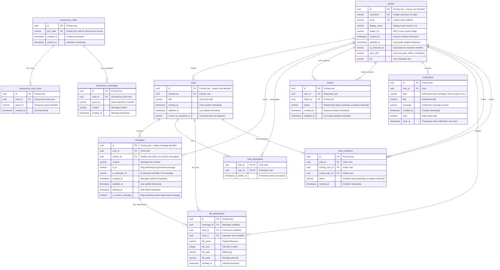

# Database Deliverable: db-1 - Chat/Messaging System

**Database:** db-1
**Type:** Chat/Messaging System
**Created:** 2026-02-03
**Status:** Complete

---

## Table of Contents

1. [Database Overview](#database-overview)
2. [Database Schema Documentation](#database-schema-documentation)
3. [SQL Queries](#sql-queries)
4. [Usage Instructions](#usage-instructions)

---

## Database Overview

### Description

This database implements a comprehensive chat/messaging system supporting user profiles, chat rooms, messages, friend networks, notifications, file attachments, anonymous chats, and chat invitations. The system is designed to work across PostgreSQL database platforms.

### Key Features

- **User Management**: User profiles with authentication, roles, and AI character associations
- **Chat System**: Multi-user chat rooms with participants and message threads
- **Social Network**: Friend connections with status tracking (accepted, pending, declined)
- **Notifications**: Real-time notification system for user events
- **File Attachments**: File sharing capabilities within chats
- **Anonymous Chats**: Temporary anonymous chat rooms with join codes
- **Chat Invitations**: Invitation system for chat room access

### Database Platforms Supported

- **PostgreSQL**: Full support with UUID types, arrays, and JSONB
- **Databricks**: Compatible with Delta Lake format
- **Databricks**: Full support with VARIANT types

---

## Database Schema Documentation

### Schema Overview

The database consists of **11 tables** organized into logical groups:

1. **User Management**: `profiles`
2. **Chat System**: `chats`, `chat_participants`, `messages`
3. **Social Network**: `friends`
4. **Notifications**: `notifications`
5. **File Management**: `file_attachments`
6. **Anonymous Features**: `anonymous_chats`, `anonymous_chat_users`, `anonymous_messages`
7. **Invitations**: `chat_invitations`

### Table Relationships

```
profiles (id)
    ├── chats (created_by)
    ├── chat_participants (user_id)
    ├── messages (sender_id)
    ├── friends (user_id, friend_id)
    ├── notifications (user_id)
    ├── file_attachments (user_id)
    └── chat_invitations (inviting_user_id, invited_user_id)

chats (id)
    ├── chat_participants (chat_id)
    ├── messages (chat_id)
    ├── file_attachments (chat_id)
    ├── anonymous_chat_users (chat_id) [via anonymous_chats]
    ├── anonymous_messages (chat_id) [via anonymous_chats]
    └── chat_invitations (chat_id)

messages (id)
    └── file_attachments (message_id)
```

### Entity-Relationship Diagram



---

### Detailed Table Documentation

#### 1. `profiles`

Stores user profile information including authentication details, preferences, and AI character associations.

| Column | Type | Nullable | Default | Description |
|--------|------|----------|---------|-------------|
| `id` | `UUID` | No | `gen_random_uuid()` | Primary key - unique user identifier |
| `username` | `VARCHAR(255)` | No | — | Unique username for login |
| `display_name` | `VARCHAR(255)` | No | — | Display name shown in UI |
| `avatar_url` | `VARCHAR(16777216)` | No | — | URL to user avatar image |
| `created_at` | `TIMESTAMP_NTZ` | No | `CURRENT_TIMESTAMP()` | Account creation timestamp |
| `updated_at` | `TIMESTAMP_NTZ` | No | `CURRENT_TIMESTAMP()` | Last profile update timestamp |
| `ai_character_id` | `VARCHAR(255)` | Yes | `NULL` | Associated AI character identifier |
| `user_role` | `VARCHAR(50)` | No | `'user'` | User role (user, admin, moderator) |
| `email` | `VARCHAR(255)` | No | — | User email address |
| `bio` | `VARCHAR(16777216)` | Yes | `NULL` | User biography text |
| `last_username_changed_at` | `TIMESTAMP_NTZ` | Yes | `NULL` | Timestamp of last username change |
| `prompt_username_setup` | `BOOLEAN` | No | `FALSE` | Flag indicating if username setup was prompted |

**Indexes:**
- Primary Key: `id`
- Unique Index: `username`
- Index: `email`
- Index: `created_at`

**Constraints:**
- `username` must be unique
- `email` must be unique

---

#### 2. `chats`

Stores chat room information including metadata and AI character associations.

| Column | Type | Nullable | Default | Description |
|--------|------|----------|---------|-------------|
| `id` | `UUID` | No | `gen_random_uuid()` | Primary key - unique chat identifier |
| `title` | `VARCHAR(255)` | No | — | Chat room title |
| `created_at` | `TIMESTAMP_NTZ` | No | `CURRENT_TIMESTAMP()` | Chat creation timestamp |
| `updated_at` | `TIMESTAMP_NTZ` | No | `CURRENT_TIMESTAMP()` | Last update timestamp |
| `current_ai_character_id` | `VARCHAR(255)` | Yes | `NULL` | Currently active AI character |
| `created_by` | `UUID` | No | — | Foreign key to `profiles.id` - creator |

**Indexes:**
- Primary Key: `id`
- Foreign Key: `created_by` → `profiles.id`
- Index: `created_at`
- Index: `updated_at`

---

#### 3. `chat_participants`

Junction table linking users to chat rooms they participate in.

| Column | Type | Nullable | Default | Description |
|--------|------|----------|---------|-------------|
| `chat_id` | `UUID` | No | — | Foreign key to `chats.id` |
| `user_id` | `UUID` | No | — | Foreign key to `profiles.id` |
| `joined_at` | `TIMESTAMP_NTZ` | No | `CURRENT_TIMESTAMP()` | Timestamp when user joined |

**Indexes:**
- Composite Primary Key: `(chat_id, user_id)`
- Foreign Key: `chat_id` → `chats.id`
- Foreign Key: `user_id` → `profiles.id`
- Index: `joined_at`

**Constraints:**
- Unique combination of `chat_id` and `user_id`

---

#### 4. `messages`

Stores individual messages within chat rooms, supporting both user and AI-generated messages.

| Column | Type | Nullable | Default | Description |
|--------|------|----------|---------|-------------|
| `id` | `UUID` | No | `gen_random_uuid()` | Primary key - unique message identifier |
| `chat_id` | `UUID` | No | — | Foreign key to `chats.id` |
| `sender_id` | `UUID` | Yes | `NULL` | Foreign key to `profiles.id` (NULL for system messages) |
| `content` | `VARCHAR(16777216)` | No | — | Message text content |
| `is_ai` | `BOOLEAN` | No | `FALSE` | Flag indicating AI-generated message |
| `ai_character_id` | `VARCHAR(255)` | Yes | `NULL` | AI character identifier if AI message |
| `created_at` | `TIMESTAMP_NTZ` | No | `CURRENT_TIMESTAMP()` | Message creation timestamp |
| `updated_at` | `TIMESTAMP_NTZ` | No | `CURRENT_TIMESTAMP()` | Last update timestamp |
| `deleted_at` | `TIMESTAMP_NTZ` | Yes | `NULL` | Soft delete timestamp |
| `mentioned_users` | `ARRAY(VARCHAR)` | Yes | `NULL` | Array of mentioned user IDs |
| `is_system_message` | `BOOLEAN` | No | `FALSE` | Flag indicating system-generated message |
| `mentions_data` | `VARIANT` | Yes | `NULL` | JSON data for mentions  |

**Indexes:**
- Primary Key: `id`
- Foreign Key: `chat_id` → `chats.id`
- Foreign Key: `sender_id` → `profiles.id`
- Index: `created_at`
- Index: `(chat_id, created_at)`
- Index: `deleted_at` WHERE `deleted_at IS NULL`

**Constraints:**
- `sender_id` must be NULL if `is_system_message` is TRUE
- `content` cannot be empty

---

#### 5. `friends`

Stores friend relationships between users with status tracking.

| Column | Type | Nullable | Default | Description |
|--------|------|----------|---------|-------------|
| `id` | `UUID` | No | `gen_random_uuid()` | Primary key |
| `user_id` | `UUID` | No | — | Foreign key to `profiles.id` - requester |
| `friend_id` | `UUID` | No | — | Foreign key to `profiles.id` - friend |
| `status` | `VARCHAR(20)` | No | `'pending'` | Relationship status (pending, accepted, declined) |
| `created_at` | `TIMESTAMP_NTZ` | No | `CURRENT_TIMESTAMP()` | Request creation timestamp |
| `updated_at` | `TIMESTAMP_NTZ` | No | `CURRENT_TIMESTAMP()` | Last status update timestamp |

**Indexes:**
- Primary Key: `id`
- Foreign Key: `user_id` → `profiles.id`
- Foreign Key: `friend_id` → `profiles.id`
- Unique Index: `(user_id, friend_id)`
- Index: `status`
- Index: `updated_at`

**Constraints:**
- `user_id` cannot equal `friend_id`
- Unique combination of `user_id` and `friend_id`

---

#### 6. `notifications`

Stores user notifications for various events.

| Column | Type | Nullable | Default | Description |
|--------|------|----------|---------|-------------|
| `id` | `UUID` | No | `gen_random_uuid()` | Primary key |
| `user_id` | `UUID` | No | — | Foreign key to `profiles.id` |
| `type` | `VARCHAR(50)` | No | — | Notification type (message, friend_request, etc.) |
| `title` | `VARCHAR(255)` | No | — | Notification title |
| `message` | `VARCHAR(16777216)` | No | — | Notification message content |
| `data` | `VARIANT` | Yes | `NULL` | Additional JSON data  |
| `created_at` | `TIMESTAMP_NTZ` | No | `CURRENT_TIMESTAMP()` | Creation timestamp |
| `read` | `BOOLEAN` | No | `FALSE` | Read status flag |
| `updated_at` | `TIMESTAMP_NTZ` | No | `CURRENT_TIMESTAMP()` | Last update timestamp |
| `seen_at` | `TIMESTAMP_NTZ` | Yes | `NULL` | Timestamp when notification was seen |

**Indexes:**
- Primary Key: `id`
- Foreign Key: `user_id` → `profiles.id`
- Index: `(user_id, read)`
- Index: `created_at`
- Index: `type`

---

#### 7. `file_attachments`

Stores file attachment metadata for messages.

| Column | Type | Nullable | Default | Description |
|--------|------|----------|---------|-------------|
| `id` | `UUID` | No | `gen_random_uuid()` | Primary key |
| `message_id` | `UUID` | Yes | `NULL` | Foreign key to `messages.id` |
| `chat_id` | `UUID` | Yes | `NULL` | Foreign key to `chats.id` |
| `user_id` | `UUID` | Yes | `NULL` | Foreign key to `profiles.id` - uploader |
| `file_name` | `VARCHAR(255)` | No | — | Original filename |
| `file_size` | `INTEGER` | No | — | File size in bytes |
| `file_type` | `VARCHAR(100)` | No | — | MIME type |
| `file_path` | `VARCHAR(16777216)` | No | — | Storage path/URL |
| `created_at` | `TIMESTAMP_NTZ` | No | `CURRENT_TIMESTAMP()` | Upload timestamp |

**Indexes:**
- Primary Key: `id`
- Foreign Key: `message_id` → `messages.id`
- Foreign Key: `chat_id` → `chats.id`
- Foreign Key: `user_id` → `profiles.id`
- Index: `created_at`

---

#### 8. `anonymous_chats`

Stores temporary anonymous chat rooms with join codes.

| Column | Type | Nullable | Default | Description |
|--------|------|----------|---------|-------------|
| `id` | `UUID` | No | `gen_random_uuid()` | Primary key |
| `join_code` | `VARCHAR(50)` | Yes | `NULL` | Unique join code for anonymous access |
| `created_at` | `TIMESTAMP_NTZ` | No | `CURRENT_TIMESTAMP()` | Creation timestamp |
| `expires_at` | `TIMESTAMP_NTZ` | Yes | `NULL` | Expiration timestamp |

**Indexes:**
- Primary Key: `id`
- Unique Index: `join_code`
- Index: `expires_at`

---

#### 9. `anonymous_chat_users`

Stores anonymous users participating in anonymous chats.

| Column | Type | Nullable | Default | Description |
|--------|------|----------|---------|-------------|
| `id` | `UUID` | No | `gen_random_uuid()` | Primary key |
| `chat_id` | `UUID` | No | — | Foreign key to `anonymous_chats.id` |
| `guest_id` | `VARCHAR(100)` | Yes | `NULL` | Temporary guest identifier |
| `created_at` | `TIMESTAMP_NTZ` | No | `CURRENT_TIMESTAMP()` | Join timestamp |

**Indexes:**
- Primary Key: `id`
- Foreign Key: `chat_id` → `anonymous_chats.id`
- Index: `guest_id`

---

#### 10. `anonymous_messages`

Stores messages in anonymous chat rooms.

| Column | Type | Nullable | Default | Description |
|--------|------|----------|---------|-------------|
| `id` | `UUID` | No | `gen_random_uuid()` | Primary key |
| `chat_id` | `UUID` | No | — | Foreign key to `anonymous_chats.id` |
| `guest_id` | `VARCHAR(100)` | Yes | `NULL` | Guest identifier of sender |
| `content` | `VARCHAR(16777216)` | No | — | Message content |
| `created_at` | `TIMESTAMP_NTZ` | No | `CURRENT_TIMESTAMP()` | Message timestamp |

**Indexes:**
- Primary Key: `id`
- Foreign Key: `chat_id` → `anonymous_chats.id`
- Index: `created_at`
- Index: `(chat_id, created_at)`

---

#### 11. `chat_invitations`

Stores chat room invitations sent between users.

| Column | Type | Nullable | Default | Description |
|--------|------|----------|---------|-------------|
| `id` | `UUID` | No | `gen_random_uuid()` | Primary key |
| `chat_id` | `UUID` | No | — | Foreign key to `chats.id` |
| `inviting_user_id` | `UUID` | No | — | Foreign key to `profiles.id` - inviter |
| `invited_user_id` | `UUID` | No | — | Foreign key to `profiles.id` - invitee |
| `status` | `VARCHAR(20)` | No | `'pending'` | Invitation status (pending, accepted, declined) |
| `created_at` | `TIMESTAMP_NTZ` | No | `CURRENT_TIMESTAMP()` | Invitation timestamp |

**Indexes:**
- Primary Key: `id`
- Foreign Key: `chat_id` → `chats.id`
- Foreign Key: `inviting_user_id` → `profiles.id`
- Foreign Key: `invited_user_id` → `profiles.id`
- Unique Index: `(chat_id, invited_user_id)`
- Index: `status`
- Index: `created_at`

---

## SQL Queries

This database includes **30 extremely complex SQL queries** designed for production use. All queries are:

- **Cross-database compatible**: Work on PostgreSQL
- **Production-grade**: Use advanced SQL patterns including CTEs, recursive CTEs, window functions, and complex aggregations
- **Fully runnable**: No placeholders - ready to execute
- **Well-documented**: Each query includes description, complexity notes, and expected output

### Query List

The complete list of 30 queries is available in `queries/queries.md`. Each query includes:

1. **Query Number and Title**
2. **Description**: What the query achieves
3. **Complexity**: Technical details (CTEs, window functions, etc.)
4. **SQL Code**: Complete, runnable SQL
5. **Expected Output**: Description of result set

### Query Categories

The queries cover the following use cases:

1. **User Activity Analysis** (Queries 1, 5, 9, 13, 17, 21, 25, 29)
   - Cohort analysis
   - Engagement metrics
   - Retention tracking
   - Activity patterns

2. **Social Network Analysis** (Queries 2, 4, 8, 12, 16, 20, 24, 28)
   - Friend network graphs
   - Connection paths
   - Centrality metrics
   - Community detection

3. **Conversation Analytics** (Queries 3, 7, 11, 15, 19, 23, 27)
   - Thread analysis
   - Turn-taking patterns
   - Engagement velocity
   - Conversation health

4. **Time-Series Analysis** (Queries 5, 10, 14, 18, 22, 26, 30)
   - Temporal patterns
   - Trend analysis
   - Activity forecasting
   - Historical comparisons

5. **Notification & Engagement** (Queries 6, 10, 14, 18, 22, 26)
   - Notification patterns
   - User engagement tracking
   - Activity correlation

### Accessing Queries

**Location**: `queries/queries.md`

**Format**: Each query is numbered sequentially (Query 1 through Query 30) and includes:
- Complete SQL code in code blocks
- Detailed descriptions
- Complexity annotations
- Expected output descriptions

**Example Query Structure**:

```markdown
## Query 1: Production-Grade User Activity Analysis with Deep CTE Nesting and Cohort Analytics

**Description:** Enterprise-level user activity analysis with cohort segmentation...

**Complexity:** Deep nested CTEs (5+ levels), cohort analysis...

```sql
WITH user_registration_cohorts AS (
    -- SQL code here
)
SELECT ...
```

**Expected Output:** Top 20 users ranked by message activity...
```

---

## Usage Instructions

### For Data Scientists

#### Prerequisites

1. **Database Access**: Ensure you have access to the database instance (PostgreSQL)
2. **Credentials**: Obtain database connection credentials
3. **Schema**: Ensure all tables are created and populated with data

#### Running Queries

1. **Open Query File**: Navigate to `queries/queries.md`
2. **Select Query**: Choose the query number you want to execute
3. **Copy SQL**: Copy the SQL code from the code block
4. **Execute**: Run the query in your database client:
   - **PostgreSQL**: Use `psql` or pgAdmin
   - **Databricks**: Use Databricks SQL editor or notebook
   - **Databricks**: Use Databricks web interface or SnowSQL

#### Understanding Results

- Each query includes an "Expected Output" section describing the result set
- Review the query description to understand what metrics are being calculated
- Check the complexity notes to understand the SQL patterns used

#### Notebook Integration (Databricks)

If using Databricks notebooks:

1. Create a new notebook
2. Set the language to SQL
3. Copy the query SQL into a cell
4. Add markdown cells above for context:
   ```markdown
   # Query 1: User Activity Analysis

   This query analyzes user engagement patterns...
   ```
5. Execute the cell to run the query
6. Review results and add visualization cells as needed

### For Database Administrators

#### Schema Setup

1. **Create Tables**: Execute the schema creation scripts
2. **Create Indexes**: Ensure all indexes are created for performance
3. **Load Data**: Populate tables with sample or production data
4. **Verify**: Run validation queries to ensure data integrity

#### Performance Considerations

- All queries are designed for distributed systems
- Indexes are critical for query performance
- Consider partitioning large tables (messages, notifications) by date
- Monitor query execution times and optimize as needed

#### Cross-Database Compatibility

- Queries use standard SQL syntax where possible
- Some database-specific features are abstracted:
  - PostgreSQL: Uses `ARRAY` types
  : Uses compatible array functions
  : Uses `VARIANT` for JSON data
- Test queries on your target database before production use

---

## Additional Resources

- **Schema Documentation**: See `docs/SCHEMA.md` (if available)
- **Validation Reports**: See `results/` directory
- **Query Metadata**: See `queries/queries.json` for programmatic access

---

**Last Updated**: 2026-02-03
**Version**: 1.0
