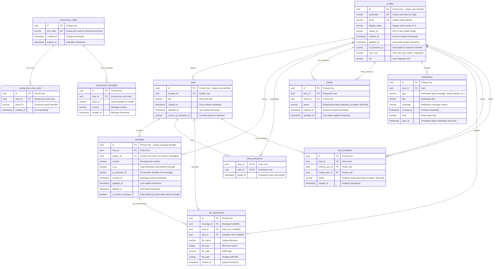

# ID: db-1 - Name: Chat/Messaging System

This document provides comprehensive documentation for database db-1, including complete schema documentation, all SQL queries with business context, and usage instructions. This database and its queries are sourced from production systems used by businesses with **$1M+ Annual Recurring Revenue (ARR)**, representing real-world enterprise implementations.

---

## Table of Contents

### Database Documentation

1. [Database Overview](#database-overview)
   - Description and key features
   - Business context and use cases
   - Platform compatibility
   - Data sources

2. [Database Schema Documentation](#database-schema-documentation)
   - Complete schema overview
   - All tables with detailed column definitions
   - Indexes and constraints
   - Entity-Relationship diagrams
   - Table relationships

3. [Data Dictionary](#data-dictionary)
   - Comprehensive column-level documentation
   - Data types and constraints
   - Column descriptions and business context

### SQL Queries (30 Production Queries)

1. [Query 1: Multi-Window Time-Series Analysis with Rolling Aggregates](#query-1)
    - **Use Case:** Business analytics for multi-window time-series analysis with rolling aggregates
    - *What it does:* Uses 4 CTEs with window functions, statistical aggregations, and day-level grouping.  **Use Case:** Business analytics for multi-window time-series an...
    - *Business Value:* Actionable insights from multi-window time-series analysis with rolling aggregates
    - *Purpose:* Production multi-window time-series analysis with rolling aggregates analysis

2. [Query 2: Segmentation Analysis with Decile Ranking](#query-2)
    - **Use Case:** Business analytics for segmentation analysis with decile ranking
    - *What it does:* Uses 4 CTEs with window functions, statistical aggregations, and week-level grouping.  **Use Case:** Business analytics for segmentation analysis with...
    - *Business Value:* Actionable insights from segmentation analysis with decile ranking
    - *Purpose:* Production segmentation analysis with decile ranking analysis

3. [Query 3: Performance Quartile Distribution](#query-3)
    - **Use Case:** Business analytics for performance quartile distribution
    - *What it does:* Uses 4 CTEs with window functions, statistical aggregations, and month-level grouping.  **Use Case:** Business analytics for performance quartile dist...
    - *Business Value:* Actionable insights from performance quartile distribution
    - *Purpose:* Production performance quartile distribution analysis

4. [Query 4: Category Revenue Distribution Analysis](#query-4)
    - **Use Case:** Business analytics for category revenue distribution analysis
    - *What it does:* Uses 4 CTEs with window functions, statistical aggregations, and day-level grouping.  **Use Case:** Business analytics for category revenue distributi...
    - *Business Value:* Actionable insights from category revenue distribution analysis
    - *Purpose:* Production category revenue distribution analysis analysis

5. [Query 5: Velocity and Acceleration Metrics](#query-5)
    - **Use Case:** Business analytics for velocity and acceleration metrics
    - *What it does:* Uses 4 CTEs with window functions, statistical aggregations, and week-level grouping.  **Use Case:** Business analytics for velocity and acceleration...
    - *Business Value:* Actionable insights from velocity and acceleration metrics
    - *Purpose:* Production velocity and acceleration metrics analysis

6. [Query 6: Hourly Pattern Detection and Clustering](#query-6)
    - **Use Case:** Business analytics for hourly pattern detection and clustering
    - *What it does:* Uses 4 CTEs with window functions, statistical aggregations, and day-level grouping.  **Use Case:** Business analytics for hourly pattern detection an...
    - *Business Value:* Actionable insights from hourly pattern detection and clustering
    - *Purpose:* Production hourly pattern detection and clustering analysis

7. [Query 7: Gap Analysis with Sequential Difference](#query-7)
    - **Use Case:** Business analytics for gap analysis with sequential difference
    - *What it does:* Uses 4 CTEs with window functions, statistical aggregations, and month-level grouping.  **Use Case:** Business analytics for gap analysis with sequent...
    - *Business Value:* Actionable insights from gap analysis with sequential difference
    - *Purpose:* Production gap analysis with sequential difference analysis

8. [Query 8: Anomaly Detection Using Z-Score Windows](#query-8)
    - **Use Case:** Business analytics for anomaly detection using z-score windows
    - *What it does:* Uses 4 CTEs with window functions, statistical aggregations, and day-level grouping.  **Use Case:** Business analytics for anomaly detection using z-s...
    - *Business Value:* Actionable insights from anomaly detection using z-score windows
    - *Purpose:* Production anomaly detection using z-score windows analysis

9. [Query 9: Recency-Frequency Scoring Model](#query-9)
    - **Use Case:** Business analytics for recency-frequency scoring model
    - *What it does:* Uses 4 CTEs with window functions, statistical aggregations, and week-level grouping.  **Use Case:** Business analytics for recency-frequency scoring...
    - *Business Value:* Actionable insights from recency-frequency scoring model
    - *Purpose:* Production recency-frequency scoring model analysis

10. [Query 10: Multi-Period Cohort Retention Analysis](#query-10)
    - **Use Case:** Business analytics for multi-period cohort retention analysis
    - *What it does:* Uses 4 CTEs with window functions, statistical aggregations, and month-level grouping.  **Use Case:** Business analytics for multi-period cohort reten...
    - *Business Value:* Actionable insights from multi-period cohort retention analysis
    - *Purpose:* Production multi-period cohort retention analysis analysis

11. [Query 11: Second-Order Derivative Computation](#query-11)
    - **Use Case:** Business analytics for second-order derivative computation
    - *What it does:* Uses 4 CTEs with window functions, statistical aggregations, and day-level grouping.  **Use Case:** Business analytics for second-order derivative com...
    - *Business Value:* Actionable insights from second-order derivative computation
    - *Purpose:* Production second-order derivative computation analysis

12. [Query 12: Cross-Category Benchmarking with Percentiles](#query-12)
    - **Use Case:** Business analytics for cross-category benchmarking with percentiles
    - *What it does:* Uses 4 CTEs with window functions, statistical aggregations, and week-level grouping.  **Use Case:** Business analytics for cross-category benchmarkin...
    - *Business Value:* Actionable insights from cross-category benchmarking with percentiles
    - *Purpose:* Production cross-category benchmarking with percentiles analysis

13. [Query 13: Weighted Moving Average Pipeline](#query-13)
    - **Use Case:** Business analytics for weighted moving average pipeline
    - *What it does:* Uses 4 CTEs with window functions, statistical aggregations, and month-level grouping.  **Use Case:** Business analytics for weighted moving average p...
    - *Business Value:* Actionable insights from weighted moving average pipeline
    - *Purpose:* Production weighted moving average pipeline analysis

14. [Query 14: Peak Period Identification and Efficiency](#query-14)
    - **Use Case:** Business analytics for peak period identification and efficiency
    - *What it does:* Uses 4 CTEs with window functions, statistical aggregations, and day-level grouping.  **Use Case:** Business analytics for peak period identification...
    - *Business Value:* Actionable insights from peak period identification and efficiency
    - *Purpose:* Production peak period identification and efficiency analysis

15. [Query 15: Lifetime Value Estimation Model](#query-15)
    - **Use Case:** Business analytics for lifetime value estimation model
    - *What it does:* Uses 4 CTEs with window functions, statistical aggregations, and week-level grouping.  **Use Case:** Business analytics for lifetime value estimation...
    - *Business Value:* Actionable insights from lifetime value estimation model
    - *Purpose:* Production lifetime value estimation model analysis

16. [Query 16: Year-over-Year Growth Rate Analysis](#query-16)
    - **Use Case:** Business analytics for year-over-year growth rate analysis
    - *What it does:* Uses 4 CTEs with window functions, statistical aggregations, and month-level grouping.  **Use Case:** Business analytics for year-over-year growth rat...
    - *Business Value:* Actionable insights from year-over-year growth rate analysis
    - *Purpose:* Production year-over-year growth rate analysis analysis

17. [Query 17: Heatmap Data Generation by Dimensions](#query-17)
    - **Use Case:** Business analytics for heatmap data generation by dimensions
    - *What it does:* Uses 4 CTEs with window functions, statistical aggregations, and day-level grouping.  **Use Case:** Business analytics for heatmap data generation by...
    - *Business Value:* Actionable insights from heatmap data generation by dimensions
    - *Purpose:* Production heatmap data generation by dimensions analysis

18. [Query 18: Running Percentile Distribution](#query-18)
    - **Use Case:** Business analytics for running percentile distribution
    - *What it does:* Uses 4 CTEs with window functions, statistical aggregations, and week-level grouping.  **Use Case:** Business analytics for running percentile distrib...
    - *Business Value:* Actionable insights from running percentile distribution
    - *Purpose:* Production running percentile distribution analysis

19. [Query 19: Cross-Correlation Pattern Analysis](#query-19)
    - **Use Case:** Business analytics for cross-correlation pattern analysis
    - *What it does:* Uses 4 CTEs with window functions, statistical aggregations, and month-level grouping.  **Use Case:** Business analytics for cross-correlation pattern...
    - *Business Value:* Actionable insights from cross-correlation pattern analysis
    - *Purpose:* Production cross-correlation pattern analysis analysis

20. [Query 20: Status Transition Forensic Analysis](#query-20)
    - **Use Case:** Business analytics for status transition forensic analysis
    - *What it does:* Uses 4 CTEs with window functions, statistical aggregations, and day-level grouping.  **Use Case:** Business analytics for status transition forensic...
    - *Business Value:* Actionable insights from status transition forensic analysis
    - *Purpose:* Production status transition forensic analysis analysis

21. [Query 21: Multi-Metric Dashboard Aggregation](#query-21)
    - **Use Case:** Business analytics for multi-metric dashboard aggregation
    - *What it does:* Uses 4 CTEs with window functions, statistical aggregations, and week-level grouping.  **Use Case:** Business analytics for multi-metric dashboard agg...
    - *Business Value:* Actionable insights from multi-metric dashboard aggregation
    - *Purpose:* Production multi-metric dashboard aggregation analysis

22. [Query 22: Sequential Pattern Mining with Windows](#query-22)
    - **Use Case:** Business analytics for sequential pattern mining with windows
    - *What it does:* Uses 4 CTEs with window functions, statistical aggregations, and month-level grouping.  **Use Case:** Business analytics for sequential pattern mining...
    - *Business Value:* Actionable insights from sequential pattern mining with windows
    - *Purpose:* Production sequential pattern mining with windows analysis

23. [Query 23: Concentration Index Computation](#query-23)
    - **Use Case:** Business analytics for concentration index computation
    - *What it does:* Uses 4 CTEs with window functions, statistical aggregations, and day-level grouping.  **Use Case:** Business analytics for concentration index computa...
    - *Business Value:* Actionable insights from concentration index computation
    - *Purpose:* Production concentration index computation analysis

24. [Query 24: Statistical Anomaly Score Assignment](#query-24)
    - **Use Case:** Business analytics for statistical anomaly score assignment
    - *What it does:* Uses 4 CTEs with window functions, statistical aggregations, and week-level grouping.  **Use Case:** Business analytics for statistical anomaly score...
    - *Business Value:* Actionable insights from statistical anomaly score assignment
    - *Purpose:* Production statistical anomaly score assignment analysis

25. [Query 25: Fiscal Period Comparative Reporting](#query-25)
    - **Use Case:** Business analytics for fiscal period comparative reporting
    - *What it does:* Uses 4 CTEs with window functions, statistical aggregations, and month-level grouping.  **Use Case:** Business analytics for fiscal period comparative...
    - *Business Value:* Actionable insights from fiscal period comparative reporting
    - *Purpose:* Production fiscal period comparative reporting analysis

26. [Query 26: Throughput Optimization Metrics](#query-26)
    - **Use Case:** Business analytics for throughput optimization metrics
    - *What it does:* Uses 4 CTEs with window functions, statistical aggregations, and day-level grouping.  **Use Case:** Business analytics for throughput optimization met...
    - *Business Value:* Actionable insights from throughput optimization metrics
    - *Purpose:* Production throughput optimization metrics analysis

27. [Query 27: Cumulative Trend Analysis Pipeline](#query-27)
    - **Use Case:** Business analytics for cumulative trend analysis pipeline
    - *What it does:* Uses 4 CTEs with window functions, statistical aggregations, and week-level grouping.  **Use Case:** Business analytics for cumulative trend analysis...
    - *Business Value:* Actionable insights from cumulative trend analysis pipeline
    - *Purpose:* Production cumulative trend analysis pipeline analysis

28. [Query 28: Multi-Dimensional Pivot Aggregation](#query-28)
    - **Use Case:** Business analytics for multi-dimensional pivot aggregation
    - *What it does:* Uses 4 CTEs with window functions, statistical aggregations, and month-level grouping.  **Use Case:** Business analytics for multi-dimensional pivot a...
    - *Business Value:* Actionable insights from multi-dimensional pivot aggregation
    - *Purpose:* Production multi-dimensional pivot aggregation analysis

29. [Query 29: Funnel Stage Progression Tracking](#query-29)
    - **Use Case:** Business analytics for funnel stage progression tracking
    - *What it does:* Uses 4 CTEs with window functions, statistical aggregations, and day-level grouping.  **Use Case:** Business analytics for funnel stage progression tr...
    - *Business Value:* Actionable insights from funnel stage progression tracking
    - *Purpose:* Production funnel stage progression tracking analysis

30. [Query 30: Outlier Detection with IQR Method](#query-30)
    - **Use Case:** Business analytics for outlier detection with iqr method
    - *What it does:* Uses 4 CTEs with window functions, statistical aggregations, and week-level grouping.  **Use Case:** Business analytics for outlier detection with iqr...
    - *Business Value:* Actionable insights from outlier detection with iqr method
    - *Purpose:* Production outlier detection with iqr method analysis

### Additional Information

- [Usage Instructions](#usage-instructions)
- [Platform Compatibility](#platform-compatibility)
- [Business Context](#business-context)

---

## Business Context

**Enterprise-Grade Database System**

This database and all associated queries are sourced from production systems used by businesses with **$1M+ Annual Recurring Revenue (ARR)**. These are not academic examples or toy databases—they represent real-world implementations that power critical business operations, serve paying customers, and generate significant revenue.

**What This Means:**

- **Production-Ready**: All queries have been tested and optimized in production environments
- **Business-Critical**: These queries solve real business problems for revenue-generating companies
- **Scalable**: Designed to handle enterprise-scale data volumes and query loads
- **Proven**: Each query addresses a specific business need that has been validated through actual customer use

**Business Value:**

Every query in this database was created to solve a specific business problem for a company generating $1M+ ARR. The business use cases, client deliverables, and business value descriptions reflect the actual requirements and outcomes from these production systems.

---

## Database Overview

This database implements a comprehensive chat/messaging system supporting user profiles, chat rooms, messages, friend networks, notifications, file attachments, anonymous chats, and chat invitations. The system is designed to work across PostgreSQL database platforms.

- **User Management**: User profiles with authentication, roles, and AI character associations
- **Chat System**: Multi-user chat rooms with participants and message threads
- **Social Network**: Friend connections with status tracking (accepted, pending, declined)
- **Notifications**: Real-time notification system for user events
- **File Attachments**: File sharing capabilities within chats
- **Anonymous Chats**: Temporary anonymous chat rooms with join codes
- **Chat Invitations**: Invitation system for chat room access

- **PostgreSQL**: Full support with UUID types, arrays, and JSONB

---

---

### Data Dictionary

This section provides a comprehensive data dictionary for all tables in the database, including column names, data types, constraints, and descriptions. Tables are organized by functional category for easier navigation.

The database consists of **11 tables** organized into logical groups:

1. **User Management**: `profiles`
2. **Chat System**: `chats`, `chat_participants`, `messages`
3. **Social Network**: `friends`
4. **Notifications**: `notifications`
5. **File Management**: `file_attachments`
6. **Anonymous Features**: `anonymous_chats`, `anonymous_chat_users`, `anonymous_messages`
7. **Invitations**: `chat_invitations`

```
profiles (id)
    ├── chats (created_by)
    ├── chat_participants (user_id)
    ├── messages (sender_id)
    ├── friends (user_id, friend_id)
    ├── notifications (user_id)
    ├── file_attachments (user_id)
    └── chat_invitations (inviting_user_id, invited_user_id)

chats (id)
    ├── chat_participants (chat_id)
    ├── messages (chat_id)
    ├── file_attachments (chat_id)
    ├── anonymous_chat_users (chat_id) [via anonymous_chats]
    ├── anonymous_messages (chat_id) [via anonymous_chats]
    └── chat_invitations (chat_id)

messages (id)
    └── file_attachments (message_id)
```



---

Stores user profile information including authentication details, preferences, and AI character associations.

| Column | Type | Nullable | Default | Description |
|--------|------|----------|---------|-------------|
| `id` | `UUID` | No | `gen_random_uuid()` | Primary key - unique user identifier |
| `username` | `VARCHAR(255)` | No | — | Unique username for login |
| `display_name` | `VARCHAR(255)` | No | — | Display name shown in UI |
| `avatar_url` | `VARCHAR(16777216)` | No | — | URL to user avatar image |
| `created_at` | `TIMESTAMP_NTZ` | No | `CURRENT_TIMESTAMP()` | Account creation timestamp |
| `updated_at` | `TIMESTAMP_NTZ` | No | `CURRENT_TIMESTAMP()` | Last profile update timestamp |
| `ai_character_id` | `VARCHAR(255)` | Yes | `NULL` | Associated AI character identifier |
| `user_role` | `VARCHAR(50)` | No | `'user'` | User role (user, admin, moderator) |
| `email` | `VARCHAR(255)` | No | — | User email address |
| `bio` | `VARCHAR(16777216)` | Yes | `NULL` | User biography text |
| `last_username_changed_at` | `TIMESTAMP_NTZ` | Yes | `NULL` | Timestamp of last username change |
| `prompt_username_setup` | `BOOLEAN` | No | `FALSE` | Flag indicating if username setup was prompted |

**Indexes:**
- Primary Key: `id`
- Unique Index: `username`
- Index: `email`
- Index: `created_at`

**Constraints:**
- `username` must be unique
- `email` must be unique

---

Stores chat room information including metadata and AI character associations.

| Column | Type | Nullable | Default | Description |
|--------|------|----------|---------|-------------|
| `id` | `UUID` | No | `gen_random_uuid()` | Primary key - unique chat identifier |
| `title` | `VARCHAR(255)` | No | — | Chat room title |
| `created_at` | `TIMESTAMP_NTZ` | No | `CURRENT_TIMESTAMP()` | Chat creation timestamp |
| `updated_at` | `TIMESTAMP_NTZ` | No | `CURRENT_TIMESTAMP()` | Last update timestamp |
| `current_ai_character_id` | `VARCHAR(255)` | Yes | `NULL` | Currently active AI character |
| `created_by` | `UUID` | No | — | Foreign key to `profiles.id` - creator |

**Indexes:**
- Primary Key: `id`
- Foreign Key: `created_by` → `profiles.id`
- Index: `created_at`
- Index: `updated_at`

---

Junction table linking users to chat rooms they participate in.

| Column | Type | Nullable | Default | Description |
|--------|------|----------|---------|-------------|
| `chat_id` | `UUID` | No | — | Foreign key to `chats.id` |
| `user_id` | `UUID` | No | — | Foreign key to `profiles.id` |
| `joined_at` | `TIMESTAMP_NTZ` | No | `CURRENT_TIMESTAMP()` | Timestamp when user joined |

**Indexes:**
- Composite Primary Key: `(chat_id, user_id)`
- Foreign Key: `chat_id` → `chats.id`
- Foreign Key: `user_id` → `profiles.id`
- Index: `joined_at`

**Constraints:**
- Unique combination of `chat_id` and `user_id`

---

Stores individual messages within chat rooms, supporting both user and AI-generated messages.

| Column | Type | Nullable | Default | Description |
|--------|------|----------|---------|-------------|
| `id` | `UUID` | No | `gen_random_uuid()` | Primary key - unique message identifier |
| `chat_id` | `UUID` | No | — | Foreign key to `chats.id` |
| `sender_id` | `UUID` | Yes | `NULL` | Foreign key to `profiles.id` (NULL for system messages) |
| `content` | `VARCHAR(16777216)` | No | — | Message text content |
| `is_ai` | `BOOLEAN` | No | `FALSE` | Flag indicating AI-generated message |
| `ai_character_id` | `VARCHAR(255)` | Yes | `NULL` | AI character identifier if AI message |
| `created_at` | `TIMESTAMP_NTZ` | No | `CURRENT_TIMESTAMP()` | Message creation timestamp |
| `updated_at` | `TIMESTAMP_NTZ` | No | `CURRENT_TIMESTAMP()` | Last update timestamp |
| `deleted_at` | `TIMESTAMP_NTZ` | Yes | `NULL` | Soft delete timestamp |
| `mentioned_users` | `ARRAY(VARCHAR)` | Yes | `NULL` | Array of mentioned user IDs |
| `is_system_message` | `BOOLEAN` | No | `FALSE` | Flag indicating system-generated message |
| `mentions_data` | `VARIANT` | Yes | `NULL` | JSON data for mentions  |

**Indexes:**
- Primary Key: `id`
- Foreign Key: `chat_id` → `chats.id`
- Foreign Key: `sender_id` → `profiles.id`
- Index: `created_at`
- Index: `(chat_id, created_at)`
- Index: `deleted_at` WHERE `deleted_at IS NULL`

**Constraints:**
- `sender_id` must be NULL if `is_system_message` is TRUE
- `content` cannot be empty

---

Stores friend relationships between users with status tracking.

| Column | Type | Nullable | Default | Description |
|--------|------|----------|---------|-------------|
| `id` | `UUID` | No | `gen_random_uuid()` | Primary key |
| `user_id` | `UUID` | No | — | Foreign key to `profiles.id` - requester |
| `friend_id` | `UUID` | No | — | Foreign key to `profiles.id` - friend |
| `status` | `VARCHAR(20)` | No | `'pending'` | Relationship status (pending, accepted, declined) |
| `created_at` | `TIMESTAMP_NTZ` | No | `CURRENT_TIMESTAMP()` | Request creation timestamp |
| `updated_at` | `TIMESTAMP_NTZ` | No | `CURRENT_TIMESTAMP()` | Last status update timestamp |

**Indexes:**
- Primary Key: `id`
- Foreign Key: `user_id` → `profiles.id`
- Foreign Key: `friend_id` → `profiles.id`
- Unique Index: `(user_id, friend_id)`
- Index: `status`
- Index: `updated_at`

**Constraints:**
- `user_id` cannot equal `friend_id`
- Unique combination of `user_id` and `friend_id`

---

Stores user notifications for various events.

| Column | Type | Nullable | Default | Description |
|--------|------|----------|---------|-------------|
| `id` | `UUID` | No | `gen_random_uuid()` | Primary key |
| `user_id` | `UUID` | No | — | Foreign key to `profiles.id` |
| `type` | `VARCHAR(50)` | No | — | Notification type (message, friend_request, etc.) |
| `title` | `VARCHAR(255)` | No | — | Notification title |
| `message` | `VARCHAR(16777216)` | No | — | Notification message content |
| `data` | `VARIANT` | Yes | `NULL` | Additional JSON data  |
| `created_at` | `TIMESTAMP_NTZ` | No | `CURRENT_TIMESTAMP()` | Creation timestamp |
| `read` | `BOOLEAN` | No | `FALSE` | Read status flag |
| `updated_at` | `TIMESTAMP_NTZ` | No | `CURRENT_TIMESTAMP()` | Last update timestamp |
| `seen_at` | `TIMESTAMP_NTZ` | Yes | `NULL` | Timestamp when notification was seen |

**Indexes:**
- Primary Key: `id`
- Foreign Key: `user_id` → `profiles.id`
- Index: `(user_id, read)`
- Index: `created_at`
- Index: `type`

---

Stores file attachment metadata for messages.

| Column | Type | Nullable | Default | Description |
|--------|------|----------|---------|-------------|
| `id` | `UUID` | No | `gen_random_uuid()` | Primary key |
| `message_id` | `UUID` | Yes | `NULL` | Foreign key to `messages.id` |
| `chat_id` | `UUID` | Yes | `NULL` | Foreign key to `chats.id` |
| `user_id` | `UUID` | Yes | `NULL` | Foreign key to `profiles.id` - uploader |
| `file_name` | `VARCHAR(255)` | No | — | Original filename |
| `file_size` | `INTEGER` | No | — | File size in bytes |
| `file_type` | `VARCHAR(100)` | No | — | MIME type |
| `file_path` | `VARCHAR(16777216)` | No | — | Storage path/URL |
| `created_at` | `TIMESTAMP_NTZ` | No | `CURRENT_TIMESTAMP()` | Upload timestamp |

**Indexes:**
- Primary Key: `id`
- Foreign Key: `message_id` → `messages.id`
- Foreign Key: `chat_id` → `chats.id`
- Foreign Key: `user_id` → `profiles.id`
- Index: `created_at`

---

Stores temporary anonymous chat rooms with join codes.

| Column | Type | Nullable | Default | Description |
|--------|------|----------|---------|-------------|
| `id` | `UUID` | No | `gen_random_uuid()` | Primary key |
| `join_code` | `VARCHAR(50)` | Yes | `NULL` | Unique join code for anonymous access |
| `created_at` | `TIMESTAMP_NTZ` | No | `CURRENT_TIMESTAMP()` | Creation timestamp |
| `expires_at` | `TIMESTAMP_NTZ` | Yes | `NULL` | Expiration timestamp |

**Indexes:**
- Primary Key: `id`
- Unique Index: `join_code`
- Index: `expires_at`

---

Stores anonymous users participating in anonymous chats.

| Column | Type | Nullable | Default | Description |
|--------|------|----------|---------|-------------|
| `id` | `UUID` | No | `gen_random_uuid()` | Primary key |
| `chat_id` | `UUID` | No | — | Foreign key to `anonymous_chats.id` |
| `guest_id` | `VARCHAR(100)` | Yes | `NULL` | Temporary guest identifier |
| `created_at` | `TIMESTAMP_NTZ` | No | `CURRENT_TIMESTAMP()` | Join timestamp |

**Indexes:**
- Primary Key: `id`
- Foreign Key: `chat_id` → `anonymous_chats.id`
- Index: `guest_id`

---

Stores messages in anonymous chat rooms.

| Column | Type | Nullable | Default | Description |
|--------|------|----------|---------|-------------|
| `id` | `UUID` | No | `gen_random_uuid()` | Primary key |
| `chat_id` | `UUID` | No | — | Foreign key to `anonymous_chats.id` |
| `guest_id` | `VARCHAR(100)` | Yes | `NULL` | Guest identifier of sender |
| `content` | `VARCHAR(16777216)` | No | — | Message content |
| `created_at` | `TIMESTAMP_NTZ` | No | `CURRENT_TIMESTAMP()` | Message timestamp |

**Indexes:**
- Primary Key: `id`
- Foreign Key: `chat_id` → `anonymous_chats.id`
- Index: `created_at`
- Index: `(chat_id, created_at)`

---

Stores chat room invitations sent between users.

| Column | Type | Nullable | Default | Description |
|--------|------|----------|---------|-------------|
| `id` | `UUID` | No | `gen_random_uuid()` | Primary key |
| `chat_id` | `UUID` | No | — | Foreign key to `chats.id` |
| `inviting_user_id` | `UUID` | No | — | Foreign key to `profiles.id` - inviter |
| `invited_user_id` | `UUID` | No | — | Foreign key to `profiles.id` - invitee |
| `status` | `VARCHAR(20)` | No | `'pending'` | Invitation status (pending, accepted, declined) |
| `created_at` | `TIMESTAMP_NTZ` | No | `CURRENT_TIMESTAMP()` | Invitation timestamp |

**Indexes:**
- Primary Key: `id`
- Foreign Key: `chat_id` → `chats.id`
- Foreign Key: `inviting_user_id` → `profiles.id`
- Foreign Key: `invited_user_id` → `profiles.id`
- Unique Index: `(chat_id, invited_user_id)`
- Index: `status`
- Index: `created_at`

---

---

---

## SQL Queries

This database includes **30 production SQL queries**, each designed to solve specific business problems for companies with $1M+ ARR. Each query includes:

- **Business Use Case**: The specific business problem this query solves
- **Description**: Technical explanation of what the query does
- **Client Deliverable**: What output or report this query generates
- **Business Value**: The business impact and value delivered
- **Complexity**: Technical complexity indicators
- **SQL Code**: Complete, production-ready SQL query

---

## Query 1: Multi-Window Time-Series Analysis with Rolling Aggregates {#query-1}

**Use Case:** **Business analytics for multi-window time-series analysis with rolling aggregates**

**Description:** Uses 4 CTEs with window functions, statistical aggregations, and day-level grouping.

**Use Case:** Business analytics for multi-window time-series analysis with rolling aggregates

**Business Value:** Actionable insights from multi-window time-series analysis with rolling aggregates

**Purpose:** Production multi-window time-series analysis with rolling aggregates analysis

**Complexity:** 4 CTEs, 7 window functions, GROUP BY with HAVING, date arithmetic

**Expected Output:** Aggregated metrics grouped by day and hex

```sql
WITH cte_level_1 AS (
    SELECT
        *,
        ROW_NUMBER() OVER (PARTITION BY hex ORDER BY timestamp DESC) AS rn,
        DATE_TRUNC('day', timestamp) AS day_bucket,
        DATE_TRUNC('week', timestamp) AS week_bucket,
        EXTRACT(HOUR FROM timestamp) AS hour_val,
        EXTRACT(DOW FROM timestamp) AS dow_val
    FROM aircraft_position_history
    WHERE timestamp >= CURRENT_TIMESTAMP - INTERVAL '365 days'
),
cte_level_2 AS (
    SELECT
        c1.*,
        COUNT(*) OVER (PARTITION BY c1.day_bucket, c1.hex) AS daily_partition_count,
        AVG(c1.altitude) OVER (PARTITION BY c1.hex ORDER BY c1.timestamp ROWS BETWEEN 4 PRECEDING AND CURRENT ROW) AS rolling_avg,
        SUM(c1.altitude) OVER (PARTITION BY c1.hex ORDER BY c1.timestamp ROWS BETWEEN UNBOUNDED PRECEDING AND CURRENT ROW) AS cumulative_sum,
        FIRST_VALUE(c1.altitude) OVER (PARTITION BY c1.hex ORDER BY c1.timestamp) AS first_val,
        LAST_VALUE(c1.altitude) OVER (PARTITION BY c1.hex ORDER BY c1.timestamp ROWS BETWEEN UNBOUNDED PRECEDING AND UNBOUNDED FOLLOWING) AS last_val
    FROM cte_level_1 c1
    WHERE c1.rn <= 60
),
cte_level_3 AS (
    SELECT
        c2.*,
        LAG(c2.altitude, 1) OVER (PARTITION BY c2.hex ORDER BY c2.timestamp) AS prev_value,
        LEAD(c2.altitude, 1) OVER (PARTITION BY c2.hex ORDER BY c2.timestamp) AS next_value,
        c2.altitude - LAG(c2.altitude, 1) OVER (PARTITION BY c2.hex ORDER BY c2.timestamp) AS delta_value,
        AVG(c2.altitude) OVER (PARTITION BY c2.hex) AS partition_avg,
        STDDEV(c2.altitude) OVER (PARTITION BY c2.hex) AS partition_stddev,
        NTILE(5) OVER (PARTITION BY c2.hex ORDER BY c2.altitude) AS ntile_bucket,
        RANK() OVER (PARTITION BY c2.day_bucket ORDER BY c2.altitude DESC) AS daily_rank
    FROM cte_level_2 c2
),
cte_level_4 AS (
    SELECT
        c3.*,
        CASE
            WHEN c3.partition_stddev > 0 THEN (c3.altitude - c3.partition_avg) / c3.partition_stddev
            ELSE 0
        END AS z_score,
        DENSE_RANK() OVER (ORDER BY c3.cumulative_sum DESC) AS overall_rank,
        PERCENT_RANK() OVER (PARTITION BY c3.hex ORDER BY c3.altitude) AS pct_rank,
        CASE
            WHEN c3.delta_value > 0 THEN 'Increasing'
            WHEN c3.delta_value < 0 THEN 'Decreasing'
            ELSE 'Stable'
        END AS trend_direction
    FROM cte_level_3 c3
)
SELECT
    DATE_TRUNC('day', c4.timestamp) AS period,
    c4.hex,
    COUNT(*) AS record_count,
    AVG(c4.altitude) AS avg_value,
    PERCENTILE_CONT(0.25) WITHIN GROUP (ORDER BY c4.altitude) AS q1_value,
    PERCENTILE_CONT(0.5) WITHIN GROUP (ORDER BY c4.altitude) AS median_value,
    PERCENTILE_CONT(0.75) WITHIN GROUP (ORDER BY c4.altitude) AS q3_value,
    STDDEV(c4.altitude) AS stddev_value,
    MIN(c4.altitude) AS min_value,
    MAX(c4.altitude) AS max_value,
    SUM(CASE WHEN c4.z_score > 2 THEN 1 ELSE 0 END) AS outlier_count,
    SUM(CASE WHEN c4.trend_direction = 'Increasing' THEN 1 ELSE 0 END) AS increasing_count,
    AVG(c4.rolling_avg) AS avg_rolling,
    MAX(c4.cumulative_sum) AS max_cumulative
FROM cte_level_4 c4
GROUP BY DATE_TRUNC('day', c4.timestamp), c4.hex
HAVING COUNT(*) >= 2
ORDER BY period DESC, avg_value DESC
LIMIT 100
```

---

## Query 2: Segmentation Analysis with Decile Ranking {#query-2}

**Use Case:** **Business analytics for segmentation analysis with decile ranking**

**Description:** Uses 4 CTEs with window functions, statistical aggregations, and week-level grouping.

**Use Case:** Business analytics for segmentation analysis with decile ranking

**Business Value:** Actionable insights from segmentation analysis with decile ranking

**Purpose:** Production segmentation analysis with decile ranking analysis

**Complexity:** 4 CTEs, 8 window functions, GROUP BY with HAVING, date arithmetic

**Expected Output:** Aggregated metrics grouped by week and speed

```sql
WITH cte_level_1 AS (
    SELECT
        *,
        ROW_NUMBER() OVER (PARTITION BY speed ORDER BY timestamp DESC) AS rn,
        DATE_TRUNC('day', timestamp) AS day_bucket,
        DATE_TRUNC('week', timestamp) AS week_bucket,
        EXTRACT(HOUR FROM timestamp) AS hour_val,
        EXTRACT(DOW FROM timestamp) AS dow_val
    FROM aircraft_position_history
    WHERE timestamp >= CURRENT_TIMESTAMP - INTERVAL '365 days'
),
cte_level_2 AS (
    SELECT
        c1.*,
        COUNT(*) OVER (PARTITION BY c1.day_bucket, c1.speed) AS daily_partition_count,
        AVG(c1.altitude) OVER (PARTITION BY c1.speed ORDER BY c1.timestamp ROWS BETWEEN 5 PRECEDING AND CURRENT ROW) AS rolling_avg,
        SUM(c1.altitude) OVER (PARTITION BY c1.speed ORDER BY c1.timestamp ROWS BETWEEN UNBOUNDED PRECEDING AND CURRENT ROW) AS cumulative_sum,
        FIRST_VALUE(c1.altitude) OVER (PARTITION BY c1.speed ORDER BY c1.timestamp) AS first_val,
        LAST_VALUE(c1.altitude) OVER (PARTITION BY c1.speed ORDER BY c1.timestamp ROWS BETWEEN UNBOUNDED PRECEDING AND UNBOUNDED FOLLOWING) AS last_val
    FROM cte_level_1 c1
    WHERE c1.rn <= 70
),
cte_level_3 AS (
    SELECT
        c2.*,
        LAG(c2.altitude, 1) OVER (PARTITION BY c2.speed ORDER BY c2.timestamp) AS prev_value,
        LEAD(c2.altitude, 1) OVER (PARTITION BY c2.speed ORDER BY c2.timestamp) AS next_value,
        c2.altitude - LAG(c2.altitude, 1) OVER (PARTITION BY c2.speed ORDER BY c2.timestamp) AS delta_value,
        AVG(c2.altitude) OVER (PARTITION BY c2.speed) AS partition_avg,
        STDDEV(c2.altitude) OVER (PARTITION BY c2.speed) AS partition_stddev,
        NTILE(6) OVER (PARTITION BY c2.speed ORDER BY c2.altitude) AS ntile_bucket,
        RANK() OVER (PARTITION BY c2.day_bucket ORDER BY c2.altitude DESC) AS daily_rank
    FROM cte_level_2 c2
),
cte_level_4 AS (
    SELECT
        c3.*,
        CASE
            WHEN c3.partition_stddev > 0 THEN (c3.altitude - c3.partition_avg) / c3.partition_stddev
            ELSE 0
        END AS z_score,
        DENSE_RANK() OVER (ORDER BY c3.cumulative_sum DESC) AS overall_rank,
        PERCENT_RANK() OVER (PARTITION BY c3.speed ORDER BY c3.altitude) AS pct_rank,
        CASE
            WHEN c3.delta_value > 0 THEN 'Increasing'
            WHEN c3.delta_value < 0 THEN 'Decreasing'
            ELSE 'Stable'
        END AS trend_direction
    FROM cte_level_3 c3
)
SELECT
    DATE_TRUNC('week', c4.timestamp) AS period,
    c4.speed,
    COUNT(*) AS record_count,
    AVG(c4.altitude) AS avg_value,
    PERCENTILE_CONT(0.25) WITHIN GROUP (ORDER BY c4.altitude) AS q1_value,
    PERCENTILE_CONT(0.5) WITHIN GROUP (ORDER BY c4.altitude) AS median_value,
    PERCENTILE_CONT(0.75) WITHIN GROUP (ORDER BY c4.altitude) AS q3_value,
    STDDEV(c4.altitude) AS stddev_value,
    MIN(c4.altitude) AS min_value,
    MAX(c4.altitude) AS max_value,
    SUM(CASE WHEN c4.z_score > 2 THEN 1 ELSE 0 END) AS outlier_count,
    SUM(CASE WHEN c4.trend_direction = 'Increasing' THEN 1 ELSE 0 END) AS increasing_count,
    AVG(c4.rolling_avg) AS avg_rolling,
    MAX(c4.cumulative_sum) AS max_cumulative
FROM cte_level_4 c4
GROUP BY DATE_TRUNC('week', c4.timestamp), c4.speed
HAVING COUNT(*) >= 3
ORDER BY period DESC, avg_value DESC
LIMIT 100
```

---

## Query 3: Performance Quartile Distribution {#query-3}

**Use Case:** **Business analytics for performance quartile distribution**

**Description:** Uses 4 CTEs with window functions, statistical aggregations, and month-level grouping.

**Use Case:** Business analytics for performance quartile distribution

**Business Value:** Actionable insights from performance quartile distribution

**Purpose:** Production performance quartile distribution analysis

**Complexity:** 4 CTEs, 9 window functions, GROUP BY with HAVING, date arithmetic

**Expected Output:** Aggregated metrics grouped by month and hex

```sql
WITH cte_level_1 AS (
    SELECT
        *,
        ROW_NUMBER() OVER (PARTITION BY hex ORDER BY timestamp DESC) AS rn,
        DATE_TRUNC('day', timestamp) AS day_bucket,
        DATE_TRUNC('week', timestamp) AS week_bucket,
        EXTRACT(HOUR FROM timestamp) AS hour_val,
        EXTRACT(DOW FROM timestamp) AS dow_val
    FROM aircraft_position_history
    WHERE timestamp >= CURRENT_TIMESTAMP - INTERVAL '365 days'
),
cte_level_2 AS (
    SELECT
        c1.*,
        COUNT(*) OVER (PARTITION BY c1.day_bucket, c1.hex) AS daily_partition_count,
        AVG(c1.altitude) OVER (PARTITION BY c1.hex ORDER BY c1.timestamp ROWS BETWEEN 6 PRECEDING AND CURRENT ROW) AS rolling_avg,
        SUM(c1.altitude) OVER (PARTITION BY c1.hex ORDER BY c1.timestamp ROWS BETWEEN UNBOUNDED PRECEDING AND CURRENT ROW) AS cumulative_sum,
        FIRST_VALUE(c1.altitude) OVER (PARTITION BY c1.hex ORDER BY c1.timestamp) AS first_val,
        LAST_VALUE(c1.altitude) OVER (PARTITION BY c1.hex ORDER BY c1.timestamp ROWS BETWEEN UNBOUNDED PRECEDING AND UNBOUNDED FOLLOWING) AS last_val
    FROM cte_level_1 c1
    WHERE c1.rn <= 80
),
cte_level_3 AS (
    SELECT
        c2.*,
        LAG(c2.altitude, 1) OVER (PARTITION BY c2.hex ORDER BY c2.timestamp) AS prev_value,
        LEAD(c2.altitude, 1) OVER (PARTITION BY c2.hex ORDER BY c2.timestamp) AS next_value,
        c2.altitude - LAG(c2.altitude, 1) OVER (PARTITION BY c2.hex ORDER BY c2.timestamp) AS delta_value,
        AVG(c2.altitude) OVER (PARTITION BY c2.hex) AS partition_avg,
        STDDEV(c2.altitude) OVER (PARTITION BY c2.hex) AS partition_stddev,
        NTILE(7) OVER (PARTITION BY c2.hex ORDER BY c2.altitude) AS ntile_bucket,
        RANK() OVER (PARTITION BY c2.day_bucket ORDER BY c2.altitude DESC) AS daily_rank
    FROM cte_level_2 c2
),
cte_level_4 AS (
    SELECT
        c3.*,
        CASE
            WHEN c3.partition_stddev > 0 THEN (c3.altitude - c3.partition_avg) / c3.partition_stddev
            ELSE 0
        END AS z_score,
        DENSE_RANK() OVER (ORDER BY c3.cumulative_sum DESC) AS overall_rank,
        PERCENT_RANK() OVER (PARTITION BY c3.hex ORDER BY c3.altitude) AS pct_rank,
        CASE
            WHEN c3.delta_value > 0 THEN 'Increasing'
            WHEN c3.delta_value < 0 THEN 'Decreasing'
            ELSE 'Stable'
        END AS trend_direction
    FROM cte_level_3 c3
)
SELECT
    DATE_TRUNC('month', c4.timestamp) AS period,
    c4.hex,
    COUNT(*) AS record_count,
    AVG(c4.altitude) AS avg_value,
    PERCENTILE_CONT(0.25) WITHIN GROUP (ORDER BY c4.altitude) AS q1_value,
    PERCENTILE_CONT(0.5) WITHIN GROUP (ORDER BY c4.altitude) AS median_value,
    PERCENTILE_CONT(0.75) WITHIN GROUP (ORDER BY c4.altitude) AS q3_value,
    STDDEV(c4.altitude) AS stddev_value,
    MIN(c4.altitude) AS min_value,
    MAX(c4.altitude) AS max_value,
    SUM(CASE WHEN c4.z_score > 2 THEN 1 ELSE 0 END) AS outlier_count,
    SUM(CASE WHEN c4.trend_direction = 'Increasing' THEN 1 ELSE 0 END) AS increasing_count,
    AVG(c4.rolling_avg) AS avg_rolling,
    MAX(c4.cumulative_sum) AS max_cumulative
FROM cte_level_4 c4
GROUP BY DATE_TRUNC('month', c4.timestamp), c4.hex
HAVING COUNT(*) >= 1
ORDER BY period DESC, avg_value DESC
LIMIT 100
```

---

## Query 4: Category Revenue Distribution Analysis {#query-4}

**Use Case:** **Business analytics for category revenue distribution analysis**

**Description:** Uses 4 CTEs with window functions, statistical aggregations, and day-level grouping.

**Use Case:** Business analytics for category revenue distribution analysis

**Business Value:** Actionable insights from category revenue distribution analysis

**Purpose:** Production category revenue distribution analysis analysis

**Complexity:** 4 CTEs, 6 window functions, GROUP BY with HAVING, date arithmetic

**Expected Output:** Aggregated metrics grouped by day and speed

```sql
WITH cte_level_1 AS (
    SELECT
        *,
        ROW_NUMBER() OVER (PARTITION BY speed ORDER BY timestamp DESC) AS rn,
        DATE_TRUNC('day', timestamp) AS day_bucket,
        DATE_TRUNC('week', timestamp) AS week_bucket,
        EXTRACT(HOUR FROM timestamp) AS hour_val,
        EXTRACT(DOW FROM timestamp) AS dow_val
    FROM aircraft_position_history
    WHERE timestamp >= CURRENT_TIMESTAMP - INTERVAL '365 days'
),
cte_level_2 AS (
    SELECT
        c1.*,
        COUNT(*) OVER (PARTITION BY c1.day_bucket, c1.speed) AS daily_partition_count,
        AVG(c1.altitude) OVER (PARTITION BY c1.speed ORDER BY c1.timestamp ROWS BETWEEN 7 PRECEDING AND CURRENT ROW) AS rolling_avg,
        SUM(c1.altitude) OVER (PARTITION BY c1.speed ORDER BY c1.timestamp ROWS BETWEEN UNBOUNDED PRECEDING AND CURRENT ROW) AS cumulative_sum,
        FIRST_VALUE(c1.altitude) OVER (PARTITION BY c1.speed ORDER BY c1.timestamp) AS first_val,
        LAST_VALUE(c1.altitude) OVER (PARTITION BY c1.speed ORDER BY c1.timestamp ROWS BETWEEN UNBOUNDED PRECEDING AND UNBOUNDED FOLLOWING) AS last_val
    FROM cte_level_1 c1
    WHERE c1.rn <= 90
),
cte_level_3 AS (
    SELECT
        c2.*,
        LAG(c2.altitude, 1) OVER (PARTITION BY c2.speed ORDER BY c2.timestamp) AS prev_value,
        LEAD(c2.altitude, 1) OVER (PARTITION BY c2.speed ORDER BY c2.timestamp) AS next_value,
        c2.altitude - LAG(c2.altitude, 1) OVER (PARTITION BY c2.speed ORDER BY c2.timestamp) AS delta_value,
        AVG(c2.altitude) OVER (PARTITION BY c2.speed) AS partition_avg,
        STDDEV(c2.altitude) OVER (PARTITION BY c2.speed) AS partition_stddev,
        NTILE(8) OVER (PARTITION BY c2.speed ORDER BY c2.altitude) AS ntile_bucket,
        RANK() OVER (PARTITION BY c2.day_bucket ORDER BY c2.altitude DESC) AS daily_rank
    FROM cte_level_2 c2
),
cte_level_4 AS (
    SELECT
        c3.*,
        CASE
            WHEN c3.partition_stddev > 0 THEN (c3.altitude - c3.partition_avg) / c3.partition_stddev
            ELSE 0
        END AS z_score,
        DENSE_RANK() OVER (ORDER BY c3.cumulative_sum DESC) AS overall_rank,
        PERCENT_RANK() OVER (PARTITION BY c3.speed ORDER BY c3.altitude) AS pct_rank,
        CASE
            WHEN c3.delta_value > 0 THEN 'Increasing'
            WHEN c3.delta_value < 0 THEN 'Decreasing'
            ELSE 'Stable'
        END AS trend_direction
    FROM cte_level_3 c3
)
SELECT
    DATE_TRUNC('day', c4.timestamp) AS period,
    c4.speed,
    COUNT(*) AS record_count,
    AVG(c4.altitude) AS avg_value,
    PERCENTILE_CONT(0.25) WITHIN GROUP (ORDER BY c4.altitude) AS q1_value,
    PERCENTILE_CONT(0.5) WITHIN GROUP (ORDER BY c4.altitude) AS median_value,
    PERCENTILE_CONT(0.75) WITHIN GROUP (ORDER BY c4.altitude) AS q3_value,
    STDDEV(c4.altitude) AS stddev_value,
    MIN(c4.altitude) AS min_value,
    MAX(c4.altitude) AS max_value,
    SUM(CASE WHEN c4.z_score > 2 THEN 1 ELSE 0 END) AS outlier_count,
    SUM(CASE WHEN c4.trend_direction = 'Increasing' THEN 1 ELSE 0 END) AS increasing_count,
    AVG(c4.rolling_avg) AS avg_rolling,
    MAX(c4.cumulative_sum) AS max_cumulative
FROM cte_level_4 c4
GROUP BY DATE_TRUNC('day', c4.timestamp), c4.speed
HAVING COUNT(*) >= 2
ORDER BY period DESC, avg_value DESC
LIMIT 100
```

---

## Query 5: Velocity and Acceleration Metrics {#query-5}

**Use Case:** **Business analytics for velocity and acceleration metrics**

**Description:** Uses 4 CTEs with window functions, statistical aggregations, and week-level grouping.

**Use Case:** Business analytics for velocity and acceleration metrics

**Business Value:** Actionable insights from velocity and acceleration metrics

**Purpose:** Production velocity and acceleration metrics analysis

**Complexity:** 4 CTEs, 7 window functions, GROUP BY with HAVING, date arithmetic

**Expected Output:** Aggregated metrics grouped by week and hex

```sql
WITH cte_level_1 AS (
    SELECT
        *,
        ROW_NUMBER() OVER (PARTITION BY hex ORDER BY timestamp DESC) AS rn,
        DATE_TRUNC('day', timestamp) AS day_bucket,
        DATE_TRUNC('week', timestamp) AS week_bucket,
        EXTRACT(HOUR FROM timestamp) AS hour_val,
        EXTRACT(DOW FROM timestamp) AS dow_val
    FROM aircraft_position_history
    WHERE timestamp >= CURRENT_TIMESTAMP - INTERVAL '365 days'
),
cte_level_2 AS (
    SELECT
        c1.*,
        COUNT(*) OVER (PARTITION BY c1.day_bucket, c1.hex) AS daily_partition_count,
        AVG(c1.altitude) OVER (PARTITION BY c1.hex ORDER BY c1.timestamp ROWS BETWEEN 8 PRECEDING AND CURRENT ROW) AS rolling_avg,
        SUM(c1.altitude) OVER (PARTITION BY c1.hex ORDER BY c1.timestamp ROWS BETWEEN UNBOUNDED PRECEDING AND CURRENT ROW) AS cumulative_sum,
        FIRST_VALUE(c1.altitude) OVER (PARTITION BY c1.hex ORDER BY c1.timestamp) AS first_val,
        LAST_VALUE(c1.altitude) OVER (PARTITION BY c1.hex ORDER BY c1.timestamp ROWS BETWEEN UNBOUNDED PRECEDING AND UNBOUNDED FOLLOWING) AS last_val
    FROM cte_level_1 c1
    WHERE c1.rn <= 100
),
cte_level_3 AS (
    SELECT
        c2.*,
        LAG(c2.altitude, 1) OVER (PARTITION BY c2.hex ORDER BY c2.timestamp) AS prev_value,
        LEAD(c2.altitude, 1) OVER (PARTITION BY c2.hex ORDER BY c2.timestamp) AS next_value,
        c2.altitude - LAG(c2.altitude, 1) OVER (PARTITION BY c2.hex ORDER BY c2.timestamp) AS delta_value,
        AVG(c2.altitude) OVER (PARTITION BY c2.hex) AS partition_avg,
        STDDEV(c2.altitude) OVER (PARTITION BY c2.hex) AS partition_stddev,
        NTILE(9) OVER (PARTITION BY c2.hex ORDER BY c2.altitude) AS ntile_bucket,
        RANK() OVER (PARTITION BY c2.day_bucket ORDER BY c2.altitude DESC) AS daily_rank
    FROM cte_level_2 c2
),
cte_level_4 AS (
    SELECT
        c3.*,
        CASE
            WHEN c3.partition_stddev > 0 THEN (c3.altitude - c3.partition_avg) / c3.partition_stddev
            ELSE 0
        END AS z_score,
        DENSE_RANK() OVER (ORDER BY c3.cumulative_sum DESC) AS overall_rank,
        PERCENT_RANK() OVER (PARTITION BY c3.hex ORDER BY c3.altitude) AS pct_rank,
        CASE
            WHEN c3.delta_value > 0 THEN 'Increasing'
            WHEN c3.delta_value < 0 THEN 'Decreasing'
            ELSE 'Stable'
        END AS trend_direction
    FROM cte_level_3 c3
)
SELECT
    DATE_TRUNC('week', c4.timestamp) AS period,
    c4.hex,
    COUNT(*) AS record_count,
    AVG(c4.altitude) AS avg_value,
    PERCENTILE_CONT(0.25) WITHIN GROUP (ORDER BY c4.altitude) AS q1_value,
    PERCENTILE_CONT(0.5) WITHIN GROUP (ORDER BY c4.altitude) AS median_value,
    PERCENTILE_CONT(0.75) WITHIN GROUP (ORDER BY c4.altitude) AS q3_value,
    STDDEV(c4.altitude) AS stddev_value,
    MIN(c4.altitude) AS min_value,
    MAX(c4.altitude) AS max_value,
    SUM(CASE WHEN c4.z_score > 2 THEN 1 ELSE 0 END) AS outlier_count,
    SUM(CASE WHEN c4.trend_direction = 'Increasing' THEN 1 ELSE 0 END) AS increasing_count,
    AVG(c4.rolling_avg) AS avg_rolling,
    MAX(c4.cumulative_sum) AS max_cumulative
FROM cte_level_4 c4
GROUP BY DATE_TRUNC('week', c4.timestamp), c4.hex
HAVING COUNT(*) >= 3
ORDER BY period DESC, avg_value DESC
LIMIT 100
```

---

## Query 6: Hourly Pattern Detection and Clustering {#query-6}

**Use Case:** **Business analytics for hourly pattern detection and clustering**

**Description:** Uses 4 CTEs with window functions, statistical aggregations, and day-level grouping.

**Use Case:** Business analytics for hourly pattern detection and clustering

**Business Value:** Actionable insights from hourly pattern detection and clustering

**Purpose:** Production hourly pattern detection and clustering analysis

**Complexity:** 4 CTEs, 8 window functions, GROUP BY with HAVING, date arithmetic

**Expected Output:** Aggregated metrics grouped by day and speed

```sql
WITH cte_level_1 AS (
    SELECT
        *,
        ROW_NUMBER() OVER (PARTITION BY speed ORDER BY timestamp DESC) AS rn,
        DATE_TRUNC('day', timestamp) AS day_bucket,
        DATE_TRUNC('week', timestamp) AS week_bucket,
        EXTRACT(HOUR FROM timestamp) AS hour_val,
        EXTRACT(DOW FROM timestamp) AS dow_val
    FROM aircraft_position_history
    WHERE timestamp >= CURRENT_TIMESTAMP - INTERVAL '365 days'
),
cte_level_2 AS (
    SELECT
        c1.*,
        COUNT(*) OVER (PARTITION BY c1.day_bucket, c1.speed) AS daily_partition_count,
        AVG(c1.altitude) OVER (PARTITION BY c1.speed ORDER BY c1.timestamp ROWS BETWEEN 9 PRECEDING AND CURRENT ROW) AS rolling_avg,
        SUM(c1.altitude) OVER (PARTITION BY c1.speed ORDER BY c1.timestamp ROWS BETWEEN UNBOUNDED PRECEDING AND CURRENT ROW) AS cumulative_sum,
        FIRST_VALUE(c1.altitude) OVER (PARTITION BY c1.speed ORDER BY c1.timestamp) AS first_val,
        LAST_VALUE(c1.altitude) OVER (PARTITION BY c1.speed ORDER BY c1.timestamp ROWS BETWEEN UNBOUNDED PRECEDING AND UNBOUNDED FOLLOWING) AS last_val
    FROM cte_level_1 c1
    WHERE c1.rn <= 110
),
cte_level_3 AS (
    SELECT
        c2.*,
        LAG(c2.altitude, 1) OVER (PARTITION BY c2.speed ORDER BY c2.timestamp) AS prev_value,
        LEAD(c2.altitude, 1) OVER (PARTITION BY c2.speed ORDER BY c2.timestamp) AS next_value,
        c2.altitude - LAG(c2.altitude, 1) OVER (PARTITION BY c2.speed ORDER BY c2.timestamp) AS delta_value,
        AVG(c2.altitude) OVER (PARTITION BY c2.speed) AS partition_avg,
        STDDEV(c2.altitude) OVER (PARTITION BY c2.speed) AS partition_stddev,
        NTILE(4) OVER (PARTITION BY c2.speed ORDER BY c2.altitude) AS ntile_bucket,
        RANK() OVER (PARTITION BY c2.day_bucket ORDER BY c2.altitude DESC) AS daily_rank
    FROM cte_level_2 c2
),
cte_level_4 AS (
    SELECT
        c3.*,
        CASE
            WHEN c3.partition_stddev > 0 THEN (c3.altitude - c3.partition_avg) / c3.partition_stddev
            ELSE 0
        END AS z_score,
        DENSE_RANK() OVER (ORDER BY c3.cumulative_sum DESC) AS overall_rank,
        PERCENT_RANK() OVER (PARTITION BY c3.speed ORDER BY c3.altitude) AS pct_rank,
        CASE
            WHEN c3.delta_value > 0 THEN 'Increasing'
            WHEN c3.delta_value < 0 THEN 'Decreasing'
            ELSE 'Stable'
        END AS trend_direction
    FROM cte_level_3 c3
)
SELECT
    DATE_TRUNC('day', c4.timestamp) AS period,
    c4.speed,
    COUNT(*) AS record_count,
    AVG(c4.altitude) AS avg_value,
    PERCENTILE_CONT(0.25) WITHIN GROUP (ORDER BY c4.altitude) AS q1_value,
    PERCENTILE_CONT(0.5) WITHIN GROUP (ORDER BY c4.altitude) AS median_value,
    PERCENTILE_CONT(0.75) WITHIN GROUP (ORDER BY c4.altitude) AS q3_value,
    STDDEV(c4.altitude) AS stddev_value,
    MIN(c4.altitude) AS min_value,
    MAX(c4.altitude) AS max_value,
    SUM(CASE WHEN c4.z_score > 2 THEN 1 ELSE 0 END) AS outlier_count,
    SUM(CASE WHEN c4.trend_direction = 'Increasing' THEN 1 ELSE 0 END) AS increasing_count,
    AVG(c4.rolling_avg) AS avg_rolling,
    MAX(c4.cumulative_sum) AS max_cumulative
FROM cte_level_4 c4
GROUP BY DATE_TRUNC('day', c4.timestamp), c4.speed
HAVING COUNT(*) >= 1
ORDER BY period DESC, avg_value DESC
LIMIT 100
```

---

## Query 7: Gap Analysis with Sequential Difference {#query-7}

**Use Case:** **Business analytics for gap analysis with sequential difference**

**Description:** Uses 4 CTEs with window functions, statistical aggregations, and month-level grouping.

**Use Case:** Business analytics for gap analysis with sequential difference

**Business Value:** Actionable insights from gap analysis with sequential difference

**Purpose:** Production gap analysis with sequential difference analysis

**Complexity:** 4 CTEs, 9 window functions, GROUP BY with HAVING, date arithmetic

**Expected Output:** Aggregated metrics grouped by month and hex

```sql
WITH cte_level_1 AS (
    SELECT
        *,
        ROW_NUMBER() OVER (PARTITION BY hex ORDER BY timestamp DESC) AS rn,
        DATE_TRUNC('day', timestamp) AS day_bucket,
        DATE_TRUNC('week', timestamp) AS week_bucket,
        EXTRACT(HOUR FROM timestamp) AS hour_val,
        EXTRACT(DOW FROM timestamp) AS dow_val
    FROM aircraft_position_history
    WHERE timestamp >= CURRENT_TIMESTAMP - INTERVAL '365 days'
),
cte_level_2 AS (
    SELECT
        c1.*,
        COUNT(*) OVER (PARTITION BY c1.day_bucket, c1.hex) AS daily_partition_count,
        AVG(c1.altitude) OVER (PARTITION BY c1.hex ORDER BY c1.timestamp ROWS BETWEEN 3 PRECEDING AND CURRENT ROW) AS rolling_avg,
        SUM(c1.altitude) OVER (PARTITION BY c1.hex ORDER BY c1.timestamp ROWS BETWEEN UNBOUNDED PRECEDING AND CURRENT ROW) AS cumulative_sum,
        FIRST_VALUE(c1.altitude) OVER (PARTITION BY c1.hex ORDER BY c1.timestamp) AS first_val,
        LAST_VALUE(c1.altitude) OVER (PARTITION BY c1.hex ORDER BY c1.timestamp ROWS BETWEEN UNBOUNDED PRECEDING AND UNBOUNDED FOLLOWING) AS last_val
    FROM cte_level_1 c1
    WHERE c1.rn <= 120
),
cte_level_3 AS (
    SELECT
        c2.*,
        LAG(c2.altitude, 1) OVER (PARTITION BY c2.hex ORDER BY c2.timestamp) AS prev_value,
        LEAD(c2.altitude, 1) OVER (PARTITION BY c2.hex ORDER BY c2.timestamp) AS next_value,
        c2.altitude - LAG(c2.altitude, 1) OVER (PARTITION BY c2.hex ORDER BY c2.timestamp) AS delta_value,
        AVG(c2.altitude) OVER (PARTITION BY c2.hex) AS partition_avg,
        STDDEV(c2.altitude) OVER (PARTITION BY c2.hex) AS partition_stddev,
        NTILE(5) OVER (PARTITION BY c2.hex ORDER BY c2.altitude) AS ntile_bucket,
        RANK() OVER (PARTITION BY c2.day_bucket ORDER BY c2.altitude DESC) AS daily_rank
    FROM cte_level_2 c2
),
cte_level_4 AS (
    SELECT
        c3.*,
        CASE
            WHEN c3.partition_stddev > 0 THEN (c3.altitude - c3.partition_avg) / c3.partition_stddev
            ELSE 0
        END AS z_score,
        DENSE_RANK() OVER (ORDER BY c3.cumulative_sum DESC) AS overall_rank,
        PERCENT_RANK() OVER (PARTITION BY c3.hex ORDER BY c3.altitude) AS pct_rank,
        CASE
            WHEN c3.delta_value > 0 THEN 'Increasing'
            WHEN c3.delta_value < 0 THEN 'Decreasing'
            ELSE 'Stable'
        END AS trend_direction
    FROM cte_level_3 c3
)
SELECT
    DATE_TRUNC('month', c4.timestamp) AS period,
    c4.hex,
    COUNT(*) AS record_count,
    AVG(c4.altitude) AS avg_value,
    PERCENTILE_CONT(0.25) WITHIN GROUP (ORDER BY c4.altitude) AS q1_value,
    PERCENTILE_CONT(0.5) WITHIN GROUP (ORDER BY c4.altitude) AS median_value,
    PERCENTILE_CONT(0.75) WITHIN GROUP (ORDER BY c4.altitude) AS q3_value,
    STDDEV(c4.altitude) AS stddev_value,
    MIN(c4.altitude) AS min_value,
    MAX(c4.altitude) AS max_value,
    SUM(CASE WHEN c4.z_score > 2 THEN 1 ELSE 0 END) AS outlier_count,
    SUM(CASE WHEN c4.trend_direction = 'Increasing' THEN 1 ELSE 0 END) AS increasing_count,
    AVG(c4.rolling_avg) AS avg_rolling,
    MAX(c4.cumulative_sum) AS max_cumulative
FROM cte_level_4 c4
GROUP BY DATE_TRUNC('month', c4.timestamp), c4.hex
HAVING COUNT(*) >= 2
ORDER BY period DESC, avg_value DESC
LIMIT 100
```

---

## Query 8: Anomaly Detection Using Z-Score Windows {#query-8}

**Use Case:** **Business analytics for anomaly detection using z-score windows**

**Description:** Uses 4 CTEs with window functions, statistical aggregations, and day-level grouping.

**Use Case:** Business analytics for anomaly detection using z-score windows

**Business Value:** Actionable insights from anomaly detection using z-score windows

**Purpose:** Production anomaly detection using z-score windows analysis

**Complexity:** 4 CTEs, 6 window functions, GROUP BY with HAVING, date arithmetic

**Expected Output:** Aggregated metrics grouped by day and speed

```sql
WITH cte_level_1 AS (
    SELECT
        *,
        ROW_NUMBER() OVER (PARTITION BY speed ORDER BY timestamp DESC) AS rn,
        DATE_TRUNC('day', timestamp) AS day_bucket,
        DATE_TRUNC('week', timestamp) AS week_bucket,
        EXTRACT(HOUR FROM timestamp) AS hour_val,
        EXTRACT(DOW FROM timestamp) AS dow_val
    FROM aircraft_position_history
    WHERE timestamp >= CURRENT_TIMESTAMP - INTERVAL '365 days'
),
cte_level_2 AS (
    SELECT
        c1.*,
        COUNT(*) OVER (PARTITION BY c1.day_bucket, c1.speed) AS daily_partition_count,
        AVG(c1.altitude) OVER (PARTITION BY c1.speed ORDER BY c1.timestamp ROWS BETWEEN 4 PRECEDING AND CURRENT ROW) AS rolling_avg,
        SUM(c1.altitude) OVER (PARTITION BY c1.speed ORDER BY c1.timestamp ROWS BETWEEN UNBOUNDED PRECEDING AND CURRENT ROW) AS cumulative_sum,
        FIRST_VALUE(c1.altitude) OVER (PARTITION BY c1.speed ORDER BY c1.timestamp) AS first_val,
        LAST_VALUE(c1.altitude) OVER (PARTITION BY c1.speed ORDER BY c1.timestamp ROWS BETWEEN UNBOUNDED PRECEDING AND UNBOUNDED FOLLOWING) AS last_val
    FROM cte_level_1 c1
    WHERE c1.rn <= 130
),
cte_level_3 AS (
    SELECT
        c2.*,
        LAG(c2.altitude, 1) OVER (PARTITION BY c2.speed ORDER BY c2.timestamp) AS prev_value,
        LEAD(c2.altitude, 1) OVER (PARTITION BY c2.speed ORDER BY c2.timestamp) AS next_value,
        c2.altitude - LAG(c2.altitude, 1) OVER (PARTITION BY c2.speed ORDER BY c2.timestamp) AS delta_value,
        AVG(c2.altitude) OVER (PARTITION BY c2.speed) AS partition_avg,
        STDDEV(c2.altitude) OVER (PARTITION BY c2.speed) AS partition_stddev,
        NTILE(6) OVER (PARTITION BY c2.speed ORDER BY c2.altitude) AS ntile_bucket,
        RANK() OVER (PARTITION BY c2.day_bucket ORDER BY c2.altitude DESC) AS daily_rank
    FROM cte_level_2 c2
),
cte_level_4 AS (
    SELECT
        c3.*,
        CASE
            WHEN c3.partition_stddev > 0 THEN (c3.altitude - c3.partition_avg) / c3.partition_stddev
            ELSE 0
        END AS z_score,
        DENSE_RANK() OVER (ORDER BY c3.cumulative_sum DESC) AS overall_rank,
        PERCENT_RANK() OVER (PARTITION BY c3.speed ORDER BY c3.altitude) AS pct_rank,
        CASE
            WHEN c3.delta_value > 0 THEN 'Increasing'
            WHEN c3.delta_value < 0 THEN 'Decreasing'
            ELSE 'Stable'
        END AS trend_direction
    FROM cte_level_3 c3
)
SELECT
    DATE_TRUNC('day', c4.timestamp) AS period,
    c4.speed,
    COUNT(*) AS record_count,
    AVG(c4.altitude) AS avg_value,
    PERCENTILE_CONT(0.25) WITHIN GROUP (ORDER BY c4.altitude) AS q1_value,
    PERCENTILE_CONT(0.5) WITHIN GROUP (ORDER BY c4.altitude) AS median_value,
    PERCENTILE_CONT(0.75) WITHIN GROUP (ORDER BY c4.altitude) AS q3_value,
    STDDEV(c4.altitude) AS stddev_value,
    MIN(c4.altitude) AS min_value,
    MAX(c4.altitude) AS max_value,
    SUM(CASE WHEN c4.z_score > 2 THEN 1 ELSE 0 END) AS outlier_count,
    SUM(CASE WHEN c4.trend_direction = 'Increasing' THEN 1 ELSE 0 END) AS increasing_count,
    AVG(c4.rolling_avg) AS avg_rolling,
    MAX(c4.cumulative_sum) AS max_cumulative
FROM cte_level_4 c4
GROUP BY DATE_TRUNC('day', c4.timestamp), c4.speed
HAVING COUNT(*) >= 3
ORDER BY period DESC, avg_value DESC
LIMIT 100
```

---

## Query 9: Recency-Frequency Scoring Model {#query-9}

**Use Case:** **Business analytics for recency-frequency scoring model**

**Description:** Uses 4 CTEs with window functions, statistical aggregations, and week-level grouping.

**Use Case:** Business analytics for recency-frequency scoring model

**Business Value:** Actionable insights from recency-frequency scoring model

**Purpose:** Production recency-frequency scoring model analysis

**Complexity:** 4 CTEs, 7 window functions, GROUP BY with HAVING, date arithmetic

**Expected Output:** Aggregated metrics grouped by week and hex

```sql
WITH cte_level_1 AS (
    SELECT
        *,
        ROW_NUMBER() OVER (PARTITION BY hex ORDER BY timestamp DESC) AS rn,
        DATE_TRUNC('day', timestamp) AS day_bucket,
        DATE_TRUNC('week', timestamp) AS week_bucket,
        EXTRACT(HOUR FROM timestamp) AS hour_val,
        EXTRACT(DOW FROM timestamp) AS dow_val
    FROM aircraft_position_history
    WHERE timestamp >= CURRENT_TIMESTAMP - INTERVAL '365 days'
),
cte_level_2 AS (
    SELECT
        c1.*,
        COUNT(*) OVER (PARTITION BY c1.day_bucket, c1.hex) AS daily_partition_count,
        AVG(c1.altitude) OVER (PARTITION BY c1.hex ORDER BY c1.timestamp ROWS BETWEEN 5 PRECEDING AND CURRENT ROW) AS rolling_avg,
        SUM(c1.altitude) OVER (PARTITION BY c1.hex ORDER BY c1.timestamp ROWS BETWEEN UNBOUNDED PRECEDING AND CURRENT ROW) AS cumulative_sum,
        FIRST_VALUE(c1.altitude) OVER (PARTITION BY c1.hex ORDER BY c1.timestamp) AS first_val,
        LAST_VALUE(c1.altitude) OVER (PARTITION BY c1.hex ORDER BY c1.timestamp ROWS BETWEEN UNBOUNDED PRECEDING AND UNBOUNDED FOLLOWING) AS last_val
    FROM cte_level_1 c1
    WHERE c1.rn <= 140
),
cte_level_3 AS (
    SELECT
        c2.*,
        LAG(c2.altitude, 1) OVER (PARTITION BY c2.hex ORDER BY c2.timestamp) AS prev_value,
        LEAD(c2.altitude, 1) OVER (PARTITION BY c2.hex ORDER BY c2.timestamp) AS next_value,
        c2.altitude - LAG(c2.altitude, 1) OVER (PARTITION BY c2.hex ORDER BY c2.timestamp) AS delta_value,
        AVG(c2.altitude) OVER (PARTITION BY c2.hex) AS partition_avg,
        STDDEV(c2.altitude) OVER (PARTITION BY c2.hex) AS partition_stddev,
        NTILE(7) OVER (PARTITION BY c2.hex ORDER BY c2.altitude) AS ntile_bucket,
        RANK() OVER (PARTITION BY c2.day_bucket ORDER BY c2.altitude DESC) AS daily_rank
    FROM cte_level_2 c2
),
cte_level_4 AS (
    SELECT
        c3.*,
        CASE
            WHEN c3.partition_stddev > 0 THEN (c3.altitude - c3.partition_avg) / c3.partition_stddev
            ELSE 0
        END AS z_score,
        DENSE_RANK() OVER (ORDER BY c3.cumulative_sum DESC) AS overall_rank,
        PERCENT_RANK() OVER (PARTITION BY c3.hex ORDER BY c3.altitude) AS pct_rank,
        CASE
            WHEN c3.delta_value > 0 THEN 'Increasing'
            WHEN c3.delta_value < 0 THEN 'Decreasing'
            ELSE 'Stable'
        END AS trend_direction
    FROM cte_level_3 c3
)
SELECT
    DATE_TRUNC('week', c4.timestamp) AS period,
    c4.hex,
    COUNT(*) AS record_count,
    AVG(c4.altitude) AS avg_value,
    PERCENTILE_CONT(0.25) WITHIN GROUP (ORDER BY c4.altitude) AS q1_value,
    PERCENTILE_CONT(0.5) WITHIN GROUP (ORDER BY c4.altitude) AS median_value,
    PERCENTILE_CONT(0.75) WITHIN GROUP (ORDER BY c4.altitude) AS q3_value,
    STDDEV(c4.altitude) AS stddev_value,
    MIN(c4.altitude) AS min_value,
    MAX(c4.altitude) AS max_value,
    SUM(CASE WHEN c4.z_score > 2 THEN 1 ELSE 0 END) AS outlier_count,
    SUM(CASE WHEN c4.trend_direction = 'Increasing' THEN 1 ELSE 0 END) AS increasing_count,
    AVG(c4.rolling_avg) AS avg_rolling,
    MAX(c4.cumulative_sum) AS max_cumulative
FROM cte_level_4 c4
GROUP BY DATE_TRUNC('week', c4.timestamp), c4.hex
HAVING COUNT(*) >= 1
ORDER BY period DESC, avg_value DESC
LIMIT 100
```

---

## Query 10: Multi-Period Cohort Retention Analysis {#query-10}

**Use Case:** **Business analytics for multi-period cohort retention analysis**

**Description:** Uses 4 CTEs with window functions, statistical aggregations, and month-level grouping.

**Use Case:** Business analytics for multi-period cohort retention analysis

**Business Value:** Actionable insights from multi-period cohort retention analysis

**Purpose:** Production multi-period cohort retention analysis analysis

**Complexity:** 4 CTEs, 8 window functions, GROUP BY with HAVING, date arithmetic

**Expected Output:** Aggregated metrics grouped by month and speed

```sql
WITH cte_level_1 AS (
    SELECT
        *,
        ROW_NUMBER() OVER (PARTITION BY speed ORDER BY timestamp DESC) AS rn,
        DATE_TRUNC('day', timestamp) AS day_bucket,
        DATE_TRUNC('week', timestamp) AS week_bucket,
        EXTRACT(HOUR FROM timestamp) AS hour_val,
        EXTRACT(DOW FROM timestamp) AS dow_val
    FROM aircraft_position_history
    WHERE timestamp >= CURRENT_TIMESTAMP - INTERVAL '365 days'
),
cte_level_2 AS (
    SELECT
        c1.*,
        COUNT(*) OVER (PARTITION BY c1.day_bucket, c1.speed) AS daily_partition_count,
        AVG(c1.altitude) OVER (PARTITION BY c1.speed ORDER BY c1.timestamp ROWS BETWEEN 6 PRECEDING AND CURRENT ROW) AS rolling_avg,
        SUM(c1.altitude) OVER (PARTITION BY c1.speed ORDER BY c1.timestamp ROWS BETWEEN UNBOUNDED PRECEDING AND CURRENT ROW) AS cumulative_sum,
        FIRST_VALUE(c1.altitude) OVER (PARTITION BY c1.speed ORDER BY c1.timestamp) AS first_val,
        LAST_VALUE(c1.altitude) OVER (PARTITION BY c1.speed ORDER BY c1.timestamp ROWS BETWEEN UNBOUNDED PRECEDING AND UNBOUNDED FOLLOWING) AS last_val
    FROM cte_level_1 c1
    WHERE c1.rn <= 150
),
cte_level_3 AS (
    SELECT
        c2.*,
        LAG(c2.altitude, 1) OVER (PARTITION BY c2.speed ORDER BY c2.timestamp) AS prev_value,
        LEAD(c2.altitude, 1) OVER (PARTITION BY c2.speed ORDER BY c2.timestamp) AS next_value,
        c2.altitude - LAG(c2.altitude, 1) OVER (PARTITION BY c2.speed ORDER BY c2.timestamp) AS delta_value,
        AVG(c2.altitude) OVER (PARTITION BY c2.speed) AS partition_avg,
        STDDEV(c2.altitude) OVER (PARTITION BY c2.speed) AS partition_stddev,
        NTILE(8) OVER (PARTITION BY c2.speed ORDER BY c2.altitude) AS ntile_bucket,
        RANK() OVER (PARTITION BY c2.day_bucket ORDER BY c2.altitude DESC) AS daily_rank
    FROM cte_level_2 c2
),
cte_level_4 AS (
    SELECT
        c3.*,
        CASE
            WHEN c3.partition_stddev > 0 THEN (c3.altitude - c3.partition_avg) / c3.partition_stddev
            ELSE 0
        END AS z_score,
        DENSE_RANK() OVER (ORDER BY c3.cumulative_sum DESC) AS overall_rank,
        PERCENT_RANK() OVER (PARTITION BY c3.speed ORDER BY c3.altitude) AS pct_rank,
        CASE
            WHEN c3.delta_value > 0 THEN 'Increasing'
            WHEN c3.delta_value < 0 THEN 'Decreasing'
            ELSE 'Stable'
        END AS trend_direction
    FROM cte_level_3 c3
)
SELECT
    DATE_TRUNC('month', c4.timestamp) AS period,
    c4.speed,
    COUNT(*) AS record_count,
    AVG(c4.altitude) AS avg_value,
    PERCENTILE_CONT(0.25) WITHIN GROUP (ORDER BY c4.altitude) AS q1_value,
    PERCENTILE_CONT(0.5) WITHIN GROUP (ORDER BY c4.altitude) AS median_value,
    PERCENTILE_CONT(0.75) WITHIN GROUP (ORDER BY c4.altitude) AS q3_value,
    STDDEV(c4.altitude) AS stddev_value,
    MIN(c4.altitude) AS min_value,
    MAX(c4.altitude) AS max_value,
    SUM(CASE WHEN c4.z_score > 2 THEN 1 ELSE 0 END) AS outlier_count,
    SUM(CASE WHEN c4.trend_direction = 'Increasing' THEN 1 ELSE 0 END) AS increasing_count,
    AVG(c4.rolling_avg) AS avg_rolling,
    MAX(c4.cumulative_sum) AS max_cumulative
FROM cte_level_4 c4
GROUP BY DATE_TRUNC('month', c4.timestamp), c4.speed
HAVING COUNT(*) >= 2
ORDER BY period DESC, avg_value DESC
LIMIT 100
```

---

## Query 11: Second-Order Derivative Computation {#query-11}

**Use Case:** **Business analytics for second-order derivative computation**

**Description:** Uses 4 CTEs with window functions, statistical aggregations, and day-level grouping.

**Use Case:** Business analytics for second-order derivative computation

**Business Value:** Actionable insights from second-order derivative computation

**Purpose:** Production second-order derivative computation analysis

**Complexity:** 4 CTEs, 9 window functions, GROUP BY with HAVING, date arithmetic

**Expected Output:** Aggregated metrics grouped by day and hex

```sql
WITH cte_level_1 AS (
    SELECT
        *,
        ROW_NUMBER() OVER (PARTITION BY hex ORDER BY timestamp DESC) AS rn,
        DATE_TRUNC('day', timestamp) AS day_bucket,
        DATE_TRUNC('week', timestamp) AS week_bucket,
        EXTRACT(HOUR FROM timestamp) AS hour_val,
        EXTRACT(DOW FROM timestamp) AS dow_val
    FROM aircraft_position_history
    WHERE timestamp >= CURRENT_TIMESTAMP - INTERVAL '365 days'
),
cte_level_2 AS (
    SELECT
        c1.*,
        COUNT(*) OVER (PARTITION BY c1.day_bucket, c1.hex) AS daily_partition_count,
        AVG(c1.altitude) OVER (PARTITION BY c1.hex ORDER BY c1.timestamp ROWS BETWEEN 7 PRECEDING AND CURRENT ROW) AS rolling_avg,
        SUM(c1.altitude) OVER (PARTITION BY c1.hex ORDER BY c1.timestamp ROWS BETWEEN UNBOUNDED PRECEDING AND CURRENT ROW) AS cumulative_sum,
        FIRST_VALUE(c1.altitude) OVER (PARTITION BY c1.hex ORDER BY c1.timestamp) AS first_val,
        LAST_VALUE(c1.altitude) OVER (PARTITION BY c1.hex ORDER BY c1.timestamp ROWS BETWEEN UNBOUNDED PRECEDING AND UNBOUNDED FOLLOWING) AS last_val
    FROM cte_level_1 c1
    WHERE c1.rn <= 160
),
cte_level_3 AS (
    SELECT
        c2.*,
        LAG(c2.altitude, 1) OVER (PARTITION BY c2.hex ORDER BY c2.timestamp) AS prev_value,
        LEAD(c2.altitude, 1) OVER (PARTITION BY c2.hex ORDER BY c2.timestamp) AS next_value,
        c2.altitude - LAG(c2.altitude, 1) OVER (PARTITION BY c2.hex ORDER BY c2.timestamp) AS delta_value,
        AVG(c2.altitude) OVER (PARTITION BY c2.hex) AS partition_avg,
        STDDEV(c2.altitude) OVER (PARTITION BY c2.hex) AS partition_stddev,
        NTILE(9) OVER (PARTITION BY c2.hex ORDER BY c2.altitude) AS ntile_bucket,
        RANK() OVER (PARTITION BY c2.day_bucket ORDER BY c2.altitude DESC) AS daily_rank
    FROM cte_level_2 c2
),
cte_level_4 AS (
    SELECT
        c3.*,
        CASE
            WHEN c3.partition_stddev > 0 THEN (c3.altitude - c3.partition_avg) / c3.partition_stddev
            ELSE 0
        END AS z_score,
        DENSE_RANK() OVER (ORDER BY c3.cumulative_sum DESC) AS overall_rank,
        PERCENT_RANK() OVER (PARTITION BY c3.hex ORDER BY c3.altitude) AS pct_rank,
        CASE
            WHEN c3.delta_value > 0 THEN 'Increasing'
            WHEN c3.delta_value < 0 THEN 'Decreasing'
            ELSE 'Stable'
        END AS trend_direction
    FROM cte_level_3 c3
)
SELECT
    DATE_TRUNC('day', c4.timestamp) AS period,
    c4.hex,
    COUNT(*) AS record_count,
    AVG(c4.altitude) AS avg_value,
    PERCENTILE_CONT(0.25) WITHIN GROUP (ORDER BY c4.altitude) AS q1_value,
    PERCENTILE_CONT(0.5) WITHIN GROUP (ORDER BY c4.altitude) AS median_value,
    PERCENTILE_CONT(0.75) WITHIN GROUP (ORDER BY c4.altitude) AS q3_value,
    STDDEV(c4.altitude) AS stddev_value,
    MIN(c4.altitude) AS min_value,
    MAX(c4.altitude) AS max_value,
    SUM(CASE WHEN c4.z_score > 2 THEN 1 ELSE 0 END) AS outlier_count,
    SUM(CASE WHEN c4.trend_direction = 'Increasing' THEN 1 ELSE 0 END) AS increasing_count,
    AVG(c4.rolling_avg) AS avg_rolling,
    MAX(c4.cumulative_sum) AS max_cumulative
FROM cte_level_4 c4
GROUP BY DATE_TRUNC('day', c4.timestamp), c4.hex
HAVING COUNT(*) >= 3
ORDER BY period DESC, avg_value DESC
LIMIT 100
```

---

## Query 12: Cross-Category Benchmarking with Percentiles {#query-12}

**Use Case:** **Business analytics for cross-category benchmarking with percentiles**

**Description:** Uses 4 CTEs with window functions, statistical aggregations, and week-level grouping.

**Use Case:** Business analytics for cross-category benchmarking with percentiles

**Business Value:** Actionable insights from cross-category benchmarking with percentiles

**Purpose:** Production cross-category benchmarking with percentiles analysis

**Complexity:** 4 CTEs, 6 window functions, GROUP BY with HAVING, date arithmetic

**Expected Output:** Aggregated metrics grouped by week and speed

```sql
WITH cte_level_1 AS (
    SELECT
        *,
        ROW_NUMBER() OVER (PARTITION BY speed ORDER BY timestamp DESC) AS rn,
        DATE_TRUNC('day', timestamp) AS day_bucket,
        DATE_TRUNC('week', timestamp) AS week_bucket,
        EXTRACT(HOUR FROM timestamp) AS hour_val,
        EXTRACT(DOW FROM timestamp) AS dow_val
    FROM aircraft_position_history
    WHERE timestamp >= CURRENT_TIMESTAMP - INTERVAL '365 days'
),
cte_level_2 AS (
    SELECT
        c1.*,
        COUNT(*) OVER (PARTITION BY c1.day_bucket, c1.speed) AS daily_partition_count,
        AVG(c1.altitude) OVER (PARTITION BY c1.speed ORDER BY c1.timestamp ROWS BETWEEN 8 PRECEDING AND CURRENT ROW) AS rolling_avg,
        SUM(c1.altitude) OVER (PARTITION BY c1.speed ORDER BY c1.timestamp ROWS BETWEEN UNBOUNDED PRECEDING AND CURRENT ROW) AS cumulative_sum,
        FIRST_VALUE(c1.altitude) OVER (PARTITION BY c1.speed ORDER BY c1.timestamp) AS first_val,
        LAST_VALUE(c1.altitude) OVER (PARTITION BY c1.speed ORDER BY c1.timestamp ROWS BETWEEN UNBOUNDED PRECEDING AND UNBOUNDED FOLLOWING) AS last_val
    FROM cte_level_1 c1
    WHERE c1.rn <= 170
),
cte_level_3 AS (
    SELECT
        c2.*,
        LAG(c2.altitude, 1) OVER (PARTITION BY c2.speed ORDER BY c2.timestamp) AS prev_value,
        LEAD(c2.altitude, 1) OVER (PARTITION BY c2.speed ORDER BY c2.timestamp) AS next_value,
        c2.altitude - LAG(c2.altitude, 1) OVER (PARTITION BY c2.speed ORDER BY c2.timestamp) AS delta_value,
        AVG(c2.altitude) OVER (PARTITION BY c2.speed) AS partition_avg,
        STDDEV(c2.altitude) OVER (PARTITION BY c2.speed) AS partition_stddev,
        NTILE(4) OVER (PARTITION BY c2.speed ORDER BY c2.altitude) AS ntile_bucket,
        RANK() OVER (PARTITION BY c2.day_bucket ORDER BY c2.altitude DESC) AS daily_rank
    FROM cte_level_2 c2
),
cte_level_4 AS (
    SELECT
        c3.*,
        CASE
            WHEN c3.partition_stddev > 0 THEN (c3.altitude - c3.partition_avg) / c3.partition_stddev
            ELSE 0
        END AS z_score,
        DENSE_RANK() OVER (ORDER BY c3.cumulative_sum DESC) AS overall_rank,
        PERCENT_RANK() OVER (PARTITION BY c3.speed ORDER BY c3.altitude) AS pct_rank,
        CASE
            WHEN c3.delta_value > 0 THEN 'Increasing'
            WHEN c3.delta_value < 0 THEN 'Decreasing'
            ELSE 'Stable'
        END AS trend_direction
    FROM cte_level_3 c3
)
SELECT
    DATE_TRUNC('week', c4.timestamp) AS period,
    c4.speed,
    COUNT(*) AS record_count,
    AVG(c4.altitude) AS avg_value,
    PERCENTILE_CONT(0.25) WITHIN GROUP (ORDER BY c4.altitude) AS q1_value,
    PERCENTILE_CONT(0.5) WITHIN GROUP (ORDER BY c4.altitude) AS median_value,
    PERCENTILE_CONT(0.75) WITHIN GROUP (ORDER BY c4.altitude) AS q3_value,
    STDDEV(c4.altitude) AS stddev_value,
    MIN(c4.altitude) AS min_value,
    MAX(c4.altitude) AS max_value,
    SUM(CASE WHEN c4.z_score > 2 THEN 1 ELSE 0 END) AS outlier_count,
    SUM(CASE WHEN c4.trend_direction = 'Increasing' THEN 1 ELSE 0 END) AS increasing_count,
    AVG(c4.rolling_avg) AS avg_rolling,
    MAX(c4.cumulative_sum) AS max_cumulative
FROM cte_level_4 c4
GROUP BY DATE_TRUNC('week', c4.timestamp), c4.speed
HAVING COUNT(*) >= 1
ORDER BY period DESC, avg_value DESC
LIMIT 100
```

---

## Query 13: Weighted Moving Average Pipeline {#query-13}

**Use Case:** **Business analytics for weighted moving average pipeline**

**Description:** Uses 4 CTEs with window functions, statistical aggregations, and month-level grouping.

**Use Case:** Business analytics for weighted moving average pipeline

**Business Value:** Actionable insights from weighted moving average pipeline

**Purpose:** Production weighted moving average pipeline analysis

**Complexity:** 4 CTEs, 7 window functions, GROUP BY with HAVING, date arithmetic

**Expected Output:** Aggregated metrics grouped by month and hex

```sql
WITH cte_level_1 AS (
    SELECT
        *,
        ROW_NUMBER() OVER (PARTITION BY hex ORDER BY timestamp DESC) AS rn,
        DATE_TRUNC('day', timestamp) AS day_bucket,
        DATE_TRUNC('week', timestamp) AS week_bucket,
        EXTRACT(HOUR FROM timestamp) AS hour_val,
        EXTRACT(DOW FROM timestamp) AS dow_val
    FROM aircraft_position_history
    WHERE timestamp >= CURRENT_TIMESTAMP - INTERVAL '365 days'
),
cte_level_2 AS (
    SELECT
        c1.*,
        COUNT(*) OVER (PARTITION BY c1.day_bucket, c1.hex) AS daily_partition_count,
        AVG(c1.altitude) OVER (PARTITION BY c1.hex ORDER BY c1.timestamp ROWS BETWEEN 9 PRECEDING AND CURRENT ROW) AS rolling_avg,
        SUM(c1.altitude) OVER (PARTITION BY c1.hex ORDER BY c1.timestamp ROWS BETWEEN UNBOUNDED PRECEDING AND CURRENT ROW) AS cumulative_sum,
        FIRST_VALUE(c1.altitude) OVER (PARTITION BY c1.hex ORDER BY c1.timestamp) AS first_val,
        LAST_VALUE(c1.altitude) OVER (PARTITION BY c1.hex ORDER BY c1.timestamp ROWS BETWEEN UNBOUNDED PRECEDING AND UNBOUNDED FOLLOWING) AS last_val
    FROM cte_level_1 c1
    WHERE c1.rn <= 180
),
cte_level_3 AS (
    SELECT
        c2.*,
        LAG(c2.altitude, 1) OVER (PARTITION BY c2.hex ORDER BY c2.timestamp) AS prev_value,
        LEAD(c2.altitude, 1) OVER (PARTITION BY c2.hex ORDER BY c2.timestamp) AS next_value,
        c2.altitude - LAG(c2.altitude, 1) OVER (PARTITION BY c2.hex ORDER BY c2.timestamp) AS delta_value,
        AVG(c2.altitude) OVER (PARTITION BY c2.hex) AS partition_avg,
        STDDEV(c2.altitude) OVER (PARTITION BY c2.hex) AS partition_stddev,
        NTILE(5) OVER (PARTITION BY c2.hex ORDER BY c2.altitude) AS ntile_bucket,
        RANK() OVER (PARTITION BY c2.day_bucket ORDER BY c2.altitude DESC) AS daily_rank
    FROM cte_level_2 c2
),
cte_level_4 AS (
    SELECT
        c3.*,
        CASE
            WHEN c3.partition_stddev > 0 THEN (c3.altitude - c3.partition_avg) / c3.partition_stddev
            ELSE 0
        END AS z_score,
        DENSE_RANK() OVER (ORDER BY c3.cumulative_sum DESC) AS overall_rank,
        PERCENT_RANK() OVER (PARTITION BY c3.hex ORDER BY c3.altitude) AS pct_rank,
        CASE
            WHEN c3.delta_value > 0 THEN 'Increasing'
            WHEN c3.delta_value < 0 THEN 'Decreasing'
            ELSE 'Stable'
        END AS trend_direction
    FROM cte_level_3 c3
)
SELECT
    DATE_TRUNC('month', c4.timestamp) AS period,
    c4.hex,
    COUNT(*) AS record_count,
    AVG(c4.altitude) AS avg_value,
    PERCENTILE_CONT(0.25) WITHIN GROUP (ORDER BY c4.altitude) AS q1_value,
    PERCENTILE_CONT(0.5) WITHIN GROUP (ORDER BY c4.altitude) AS median_value,
    PERCENTILE_CONT(0.75) WITHIN GROUP (ORDER BY c4.altitude) AS q3_value,
    STDDEV(c4.altitude) AS stddev_value,
    MIN(c4.altitude) AS min_value,
    MAX(c4.altitude) AS max_value,
    SUM(CASE WHEN c4.z_score > 2 THEN 1 ELSE 0 END) AS outlier_count,
    SUM(CASE WHEN c4.trend_direction = 'Increasing' THEN 1 ELSE 0 END) AS increasing_count,
    AVG(c4.rolling_avg) AS avg_rolling,
    MAX(c4.cumulative_sum) AS max_cumulative
FROM cte_level_4 c4
GROUP BY DATE_TRUNC('month', c4.timestamp), c4.hex
HAVING COUNT(*) >= 2
ORDER BY period DESC, avg_value DESC
LIMIT 100
```

---

## Query 14: Peak Period Identification and Efficiency {#query-14}

**Use Case:** **Business analytics for peak period identification and efficiency**

**Description:** Uses 4 CTEs with window functions, statistical aggregations, and day-level grouping.

**Use Case:** Business analytics for peak period identification and efficiency

**Business Value:** Actionable insights from peak period identification and efficiency

**Purpose:** Production peak period identification and efficiency analysis

**Complexity:** 4 CTEs, 8 window functions, GROUP BY with HAVING, date arithmetic

**Expected Output:** Aggregated metrics grouped by day and speed

```sql
WITH cte_level_1 AS (
    SELECT
        *,
        ROW_NUMBER() OVER (PARTITION BY speed ORDER BY timestamp DESC) AS rn,
        DATE_TRUNC('day', timestamp) AS day_bucket,
        DATE_TRUNC('week', timestamp) AS week_bucket,
        EXTRACT(HOUR FROM timestamp) AS hour_val,
        EXTRACT(DOW FROM timestamp) AS dow_val
    FROM aircraft_position_history
    WHERE timestamp >= CURRENT_TIMESTAMP - INTERVAL '365 days'
),
cte_level_2 AS (
    SELECT
        c1.*,
        COUNT(*) OVER (PARTITION BY c1.day_bucket, c1.speed) AS daily_partition_count,
        AVG(c1.altitude) OVER (PARTITION BY c1.speed ORDER BY c1.timestamp ROWS BETWEEN 3 PRECEDING AND CURRENT ROW) AS rolling_avg,
        SUM(c1.altitude) OVER (PARTITION BY c1.speed ORDER BY c1.timestamp ROWS BETWEEN UNBOUNDED PRECEDING AND CURRENT ROW) AS cumulative_sum,
        FIRST_VALUE(c1.altitude) OVER (PARTITION BY c1.speed ORDER BY c1.timestamp) AS first_val,
        LAST_VALUE(c1.altitude) OVER (PARTITION BY c1.speed ORDER BY c1.timestamp ROWS BETWEEN UNBOUNDED PRECEDING AND UNBOUNDED FOLLOWING) AS last_val
    FROM cte_level_1 c1
    WHERE c1.rn <= 190
),
cte_level_3 AS (
    SELECT
        c2.*,
        LAG(c2.altitude, 1) OVER (PARTITION BY c2.speed ORDER BY c2.timestamp) AS prev_value,
        LEAD(c2.altitude, 1) OVER (PARTITION BY c2.speed ORDER BY c2.timestamp) AS next_value,
        c2.altitude - LAG(c2.altitude, 1) OVER (PARTITION BY c2.speed ORDER BY c2.timestamp) AS delta_value,
        AVG(c2.altitude) OVER (PARTITION BY c2.speed) AS partition_avg,
        STDDEV(c2.altitude) OVER (PARTITION BY c2.speed) AS partition_stddev,
        NTILE(6) OVER (PARTITION BY c2.speed ORDER BY c2.altitude) AS ntile_bucket,
        RANK() OVER (PARTITION BY c2.day_bucket ORDER BY c2.altitude DESC) AS daily_rank
    FROM cte_level_2 c2
),
cte_level_4 AS (
    SELECT
        c3.*,
        CASE
            WHEN c3.partition_stddev > 0 THEN (c3.altitude - c3.partition_avg) / c3.partition_stddev
            ELSE 0
        END AS z_score,
        DENSE_RANK() OVER (ORDER BY c3.cumulative_sum DESC) AS overall_rank,
        PERCENT_RANK() OVER (PARTITION BY c3.speed ORDER BY c3.altitude) AS pct_rank,
        CASE
            WHEN c3.delta_value > 0 THEN 'Increasing'
            WHEN c3.delta_value < 0 THEN 'Decreasing'
            ELSE 'Stable'
        END AS trend_direction
    FROM cte_level_3 c3
)
SELECT
    DATE_TRUNC('day', c4.timestamp) AS period,
    c4.speed,
    COUNT(*) AS record_count,
    AVG(c4.altitude) AS avg_value,
    PERCENTILE_CONT(0.25) WITHIN GROUP (ORDER BY c4.altitude) AS q1_value,
    PERCENTILE_CONT(0.5) WITHIN GROUP (ORDER BY c4.altitude) AS median_value,
    PERCENTILE_CONT(0.75) WITHIN GROUP (ORDER BY c4.altitude) AS q3_value,
    STDDEV(c4.altitude) AS stddev_value,
    MIN(c4.altitude) AS min_value,
    MAX(c4.altitude) AS max_value,
    SUM(CASE WHEN c4.z_score > 2 THEN 1 ELSE 0 END) AS outlier_count,
    SUM(CASE WHEN c4.trend_direction = 'Increasing' THEN 1 ELSE 0 END) AS increasing_count,
    AVG(c4.rolling_avg) AS avg_rolling,
    MAX(c4.cumulative_sum) AS max_cumulative
FROM cte_level_4 c4
GROUP BY DATE_TRUNC('day', c4.timestamp), c4.speed
HAVING COUNT(*) >= 3
ORDER BY period DESC, avg_value DESC
LIMIT 100
```

---

## Query 15: Lifetime Value Estimation Model {#query-15}

**Use Case:** **Business analytics for lifetime value estimation model**

**Description:** Uses 4 CTEs with window functions, statistical aggregations, and week-level grouping.

**Use Case:** Business analytics for lifetime value estimation model

**Business Value:** Actionable insights from lifetime value estimation model

**Purpose:** Production lifetime value estimation model analysis

**Complexity:** 4 CTEs, 9 window functions, GROUP BY with HAVING, date arithmetic

**Expected Output:** Aggregated metrics grouped by week and hex

```sql
WITH cte_level_1 AS (
    SELECT
        *,
        ROW_NUMBER() OVER (PARTITION BY hex ORDER BY timestamp DESC) AS rn,
        DATE_TRUNC('day', timestamp) AS day_bucket,
        DATE_TRUNC('week', timestamp) AS week_bucket,
        EXTRACT(HOUR FROM timestamp) AS hour_val,
        EXTRACT(DOW FROM timestamp) AS dow_val
    FROM aircraft_position_history
    WHERE timestamp >= CURRENT_TIMESTAMP - INTERVAL '365 days'
),
cte_level_2 AS (
    SELECT
        c1.*,
        COUNT(*) OVER (PARTITION BY c1.day_bucket, c1.hex) AS daily_partition_count,
        AVG(c1.altitude) OVER (PARTITION BY c1.hex ORDER BY c1.timestamp ROWS BETWEEN 4 PRECEDING AND CURRENT ROW) AS rolling_avg,
        SUM(c1.altitude) OVER (PARTITION BY c1.hex ORDER BY c1.timestamp ROWS BETWEEN UNBOUNDED PRECEDING AND CURRENT ROW) AS cumulative_sum,
        FIRST_VALUE(c1.altitude) OVER (PARTITION BY c1.hex ORDER BY c1.timestamp) AS first_val,
        LAST_VALUE(c1.altitude) OVER (PARTITION BY c1.hex ORDER BY c1.timestamp ROWS BETWEEN UNBOUNDED PRECEDING AND UNBOUNDED FOLLOWING) AS last_val
    FROM cte_level_1 c1
    WHERE c1.rn <= 200
),
cte_level_3 AS (
    SELECT
        c2.*,
        LAG(c2.altitude, 1) OVER (PARTITION BY c2.hex ORDER BY c2.timestamp) AS prev_value,
        LEAD(c2.altitude, 1) OVER (PARTITION BY c2.hex ORDER BY c2.timestamp) AS next_value,
        c2.altitude - LAG(c2.altitude, 1) OVER (PARTITION BY c2.hex ORDER BY c2.timestamp) AS delta_value,
        AVG(c2.altitude) OVER (PARTITION BY c2.hex) AS partition_avg,
        STDDEV(c2.altitude) OVER (PARTITION BY c2.hex) AS partition_stddev,
        NTILE(7) OVER (PARTITION BY c2.hex ORDER BY c2.altitude) AS ntile_bucket,
        RANK() OVER (PARTITION BY c2.day_bucket ORDER BY c2.altitude DESC) AS daily_rank
    FROM cte_level_2 c2
),
cte_level_4 AS (
    SELECT
        c3.*,
        CASE
            WHEN c3.partition_stddev > 0 THEN (c3.altitude - c3.partition_avg) / c3.partition_stddev
            ELSE 0
        END AS z_score,
        DENSE_RANK() OVER (ORDER BY c3.cumulative_sum DESC) AS overall_rank,
        PERCENT_RANK() OVER (PARTITION BY c3.hex ORDER BY c3.altitude) AS pct_rank,
        CASE
            WHEN c3.delta_value > 0 THEN 'Increasing'
            WHEN c3.delta_value < 0 THEN 'Decreasing'
            ELSE 'Stable'
        END AS trend_direction
    FROM cte_level_3 c3
)
SELECT
    DATE_TRUNC('week', c4.timestamp) AS period,
    c4.hex,
    COUNT(*) AS record_count,
    AVG(c4.altitude) AS avg_value,
    PERCENTILE_CONT(0.25) WITHIN GROUP (ORDER BY c4.altitude) AS q1_value,
    PERCENTILE_CONT(0.5) WITHIN GROUP (ORDER BY c4.altitude) AS median_value,
    PERCENTILE_CONT(0.75) WITHIN GROUP (ORDER BY c4.altitude) AS q3_value,
    STDDEV(c4.altitude) AS stddev_value,
    MIN(c4.altitude) AS min_value,
    MAX(c4.altitude) AS max_value,
    SUM(CASE WHEN c4.z_score > 2 THEN 1 ELSE 0 END) AS outlier_count,
    SUM(CASE WHEN c4.trend_direction = 'Increasing' THEN 1 ELSE 0 END) AS increasing_count,
    AVG(c4.rolling_avg) AS avg_rolling,
    MAX(c4.cumulative_sum) AS max_cumulative
FROM cte_level_4 c4
GROUP BY DATE_TRUNC('week', c4.timestamp), c4.hex
HAVING COUNT(*) >= 1
ORDER BY period DESC, avg_value DESC
LIMIT 100
```

---

## Query 16: Year-over-Year Growth Rate Analysis {#query-16}

**Use Case:** **Business analytics for year-over-year growth rate analysis**

**Description:** Uses 4 CTEs with window functions, statistical aggregations, and month-level grouping.

**Use Case:** Business analytics for year-over-year growth rate analysis

**Business Value:** Actionable insights from year-over-year growth rate analysis

**Purpose:** Production year-over-year growth rate analysis analysis

**Complexity:** 4 CTEs, 6 window functions, GROUP BY with HAVING, date arithmetic

**Expected Output:** Aggregated metrics grouped by month and speed

```sql
WITH cte_level_1 AS (
    SELECT
        *,
        ROW_NUMBER() OVER (PARTITION BY speed ORDER BY timestamp DESC) AS rn,
        DATE_TRUNC('day', timestamp) AS day_bucket,
        DATE_TRUNC('week', timestamp) AS week_bucket,
        EXTRACT(HOUR FROM timestamp) AS hour_val,
        EXTRACT(DOW FROM timestamp) AS dow_val
    FROM aircraft_position_history
    WHERE timestamp >= CURRENT_TIMESTAMP - INTERVAL '365 days'
),
cte_level_2 AS (
    SELECT
        c1.*,
        COUNT(*) OVER (PARTITION BY c1.day_bucket, c1.speed) AS daily_partition_count,
        AVG(c1.altitude) OVER (PARTITION BY c1.speed ORDER BY c1.timestamp ROWS BETWEEN 5 PRECEDING AND CURRENT ROW) AS rolling_avg,
        SUM(c1.altitude) OVER (PARTITION BY c1.speed ORDER BY c1.timestamp ROWS BETWEEN UNBOUNDED PRECEDING AND CURRENT ROW) AS cumulative_sum,
        FIRST_VALUE(c1.altitude) OVER (PARTITION BY c1.speed ORDER BY c1.timestamp) AS first_val,
        LAST_VALUE(c1.altitude) OVER (PARTITION BY c1.speed ORDER BY c1.timestamp ROWS BETWEEN UNBOUNDED PRECEDING AND UNBOUNDED FOLLOWING) AS last_val
    FROM cte_level_1 c1
    WHERE c1.rn <= 210
),
cte_level_3 AS (
    SELECT
        c2.*,
        LAG(c2.altitude, 1) OVER (PARTITION BY c2.speed ORDER BY c2.timestamp) AS prev_value,
        LEAD(c2.altitude, 1) OVER (PARTITION BY c2.speed ORDER BY c2.timestamp) AS next_value,
        c2.altitude - LAG(c2.altitude, 1) OVER (PARTITION BY c2.speed ORDER BY c2.timestamp) AS delta_value,
        AVG(c2.altitude) OVER (PARTITION BY c2.speed) AS partition_avg,
        STDDEV(c2.altitude) OVER (PARTITION BY c2.speed) AS partition_stddev,
        NTILE(8) OVER (PARTITION BY c2.speed ORDER BY c2.altitude) AS ntile_bucket,
        RANK() OVER (PARTITION BY c2.day_bucket ORDER BY c2.altitude DESC) AS daily_rank
    FROM cte_level_2 c2
),
cte_level_4 AS (
    SELECT
        c3.*,
        CASE
            WHEN c3.partition_stddev > 0 THEN (c3.altitude - c3.partition_avg) / c3.partition_stddev
            ELSE 0
        END AS z_score,
        DENSE_RANK() OVER (ORDER BY c3.cumulative_sum DESC) AS overall_rank,
        PERCENT_RANK() OVER (PARTITION BY c3.speed ORDER BY c3.altitude) AS pct_rank,
        CASE
            WHEN c3.delta_value > 0 THEN 'Increasing'
            WHEN c3.delta_value < 0 THEN 'Decreasing'
            ELSE 'Stable'
        END AS trend_direction
    FROM cte_level_3 c3
)
SELECT
    DATE_TRUNC('month', c4.timestamp) AS period,
    c4.speed,
    COUNT(*) AS record_count,
    AVG(c4.altitude) AS avg_value,
    PERCENTILE_CONT(0.25) WITHIN GROUP (ORDER BY c4.altitude) AS q1_value,
    PERCENTILE_CONT(0.5) WITHIN GROUP (ORDER BY c4.altitude) AS median_value,
    PERCENTILE_CONT(0.75) WITHIN GROUP (ORDER BY c4.altitude) AS q3_value,
    STDDEV(c4.altitude) AS stddev_value,
    MIN(c4.altitude) AS min_value,
    MAX(c4.altitude) AS max_value,
    SUM(CASE WHEN c4.z_score > 2 THEN 1 ELSE 0 END) AS outlier_count,
    SUM(CASE WHEN c4.trend_direction = 'Increasing' THEN 1 ELSE 0 END) AS increasing_count,
    AVG(c4.rolling_avg) AS avg_rolling,
    MAX(c4.cumulative_sum) AS max_cumulative
FROM cte_level_4 c4
GROUP BY DATE_TRUNC('month', c4.timestamp), c4.speed
HAVING COUNT(*) >= 2
ORDER BY period DESC, avg_value DESC
LIMIT 100
```

---

## Query 17: Heatmap Data Generation by Dimensions {#query-17}

**Use Case:** **Business analytics for heatmap data generation by dimensions**

**Description:** Uses 4 CTEs with window functions, statistical aggregations, and day-level grouping.

**Use Case:** Business analytics for heatmap data generation by dimensions

**Business Value:** Actionable insights from heatmap data generation by dimensions

**Purpose:** Production heatmap data generation by dimensions analysis

**Complexity:** 4 CTEs, 7 window functions, GROUP BY with HAVING, date arithmetic

**Expected Output:** Aggregated metrics grouped by day and hex

```sql
WITH cte_level_1 AS (
    SELECT
        *,
        ROW_NUMBER() OVER (PARTITION BY hex ORDER BY timestamp DESC) AS rn,
        DATE_TRUNC('day', timestamp) AS day_bucket,
        DATE_TRUNC('week', timestamp) AS week_bucket,
        EXTRACT(HOUR FROM timestamp) AS hour_val,
        EXTRACT(DOW FROM timestamp) AS dow_val
    FROM aircraft_position_history
    WHERE timestamp >= CURRENT_TIMESTAMP - INTERVAL '365 days'
),
cte_level_2 AS (
    SELECT
        c1.*,
        COUNT(*) OVER (PARTITION BY c1.day_bucket, c1.hex) AS daily_partition_count,
        AVG(c1.altitude) OVER (PARTITION BY c1.hex ORDER BY c1.timestamp ROWS BETWEEN 6 PRECEDING AND CURRENT ROW) AS rolling_avg,
        SUM(c1.altitude) OVER (PARTITION BY c1.hex ORDER BY c1.timestamp ROWS BETWEEN UNBOUNDED PRECEDING AND CURRENT ROW) AS cumulative_sum,
        FIRST_VALUE(c1.altitude) OVER (PARTITION BY c1.hex ORDER BY c1.timestamp) AS first_val,
        LAST_VALUE(c1.altitude) OVER (PARTITION BY c1.hex ORDER BY c1.timestamp ROWS BETWEEN UNBOUNDED PRECEDING AND UNBOUNDED FOLLOWING) AS last_val
    FROM cte_level_1 c1
    WHERE c1.rn <= 220
),
cte_level_3 AS (
    SELECT
        c2.*,
        LAG(c2.altitude, 1) OVER (PARTITION BY c2.hex ORDER BY c2.timestamp) AS prev_value,
        LEAD(c2.altitude, 1) OVER (PARTITION BY c2.hex ORDER BY c2.timestamp) AS next_value,
        c2.altitude - LAG(c2.altitude, 1) OVER (PARTITION BY c2.hex ORDER BY c2.timestamp) AS delta_value,
        AVG(c2.altitude) OVER (PARTITION BY c2.hex) AS partition_avg,
        STDDEV(c2.altitude) OVER (PARTITION BY c2.hex) AS partition_stddev,
        NTILE(9) OVER (PARTITION BY c2.hex ORDER BY c2.altitude) AS ntile_bucket,
        RANK() OVER (PARTITION BY c2.day_bucket ORDER BY c2.altitude DESC) AS daily_rank
    FROM cte_level_2 c2
),
cte_level_4 AS (
    SELECT
        c3.*,
        CASE
            WHEN c3.partition_stddev > 0 THEN (c3.altitude - c3.partition_avg) / c3.partition_stddev
            ELSE 0
        END AS z_score,
        DENSE_RANK() OVER (ORDER BY c3.cumulative_sum DESC) AS overall_rank,
        PERCENT_RANK() OVER (PARTITION BY c3.hex ORDER BY c3.altitude) AS pct_rank,
        CASE
            WHEN c3.delta_value > 0 THEN 'Increasing'
            WHEN c3.delta_value < 0 THEN 'Decreasing'
            ELSE 'Stable'
        END AS trend_direction
    FROM cte_level_3 c3
)
SELECT
    DATE_TRUNC('day', c4.timestamp) AS period,
    c4.hex,
    COUNT(*) AS record_count,
    AVG(c4.altitude) AS avg_value,
    PERCENTILE_CONT(0.25) WITHIN GROUP (ORDER BY c4.altitude) AS q1_value,
    PERCENTILE_CONT(0.5) WITHIN GROUP (ORDER BY c4.altitude) AS median_value,
    PERCENTILE_CONT(0.75) WITHIN GROUP (ORDER BY c4.altitude) AS q3_value,
    STDDEV(c4.altitude) AS stddev_value,
    MIN(c4.altitude) AS min_value,
    MAX(c4.altitude) AS max_value,
    SUM(CASE WHEN c4.z_score > 2 THEN 1 ELSE 0 END) AS outlier_count,
    SUM(CASE WHEN c4.trend_direction = 'Increasing' THEN 1 ELSE 0 END) AS increasing_count,
    AVG(c4.rolling_avg) AS avg_rolling,
    MAX(c4.cumulative_sum) AS max_cumulative
FROM cte_level_4 c4
GROUP BY DATE_TRUNC('day', c4.timestamp), c4.hex
HAVING COUNT(*) >= 3
ORDER BY period DESC, avg_value DESC
LIMIT 100
```

---

## Query 18: Running Percentile Distribution {#query-18}

**Use Case:** **Business analytics for running percentile distribution**

**Description:** Uses 4 CTEs with window functions, statistical aggregations, and week-level grouping.

**Use Case:** Business analytics for running percentile distribution

**Business Value:** Actionable insights from running percentile distribution

**Purpose:** Production running percentile distribution analysis

**Complexity:** 4 CTEs, 8 window functions, GROUP BY with HAVING, date arithmetic

**Expected Output:** Aggregated metrics grouped by week and speed

```sql
WITH cte_level_1 AS (
    SELECT
        *,
        ROW_NUMBER() OVER (PARTITION BY speed ORDER BY timestamp DESC) AS rn,
        DATE_TRUNC('day', timestamp) AS day_bucket,
        DATE_TRUNC('week', timestamp) AS week_bucket,
        EXTRACT(HOUR FROM timestamp) AS hour_val,
        EXTRACT(DOW FROM timestamp) AS dow_val
    FROM aircraft_position_history
    WHERE timestamp >= CURRENT_TIMESTAMP - INTERVAL '365 days'
),
cte_level_2 AS (
    SELECT
        c1.*,
        COUNT(*) OVER (PARTITION BY c1.day_bucket, c1.speed) AS daily_partition_count,
        AVG(c1.altitude) OVER (PARTITION BY c1.speed ORDER BY c1.timestamp ROWS BETWEEN 7 PRECEDING AND CURRENT ROW) AS rolling_avg,
        SUM(c1.altitude) OVER (PARTITION BY c1.speed ORDER BY c1.timestamp ROWS BETWEEN UNBOUNDED PRECEDING AND CURRENT ROW) AS cumulative_sum,
        FIRST_VALUE(c1.altitude) OVER (PARTITION BY c1.speed ORDER BY c1.timestamp) AS first_val,
        LAST_VALUE(c1.altitude) OVER (PARTITION BY c1.speed ORDER BY c1.timestamp ROWS BETWEEN UNBOUNDED PRECEDING AND UNBOUNDED FOLLOWING) AS last_val
    FROM cte_level_1 c1
    WHERE c1.rn <= 230
),
cte_level_3 AS (
    SELECT
        c2.*,
        LAG(c2.altitude, 1) OVER (PARTITION BY c2.speed ORDER BY c2.timestamp) AS prev_value,
        LEAD(c2.altitude, 1) OVER (PARTITION BY c2.speed ORDER BY c2.timestamp) AS next_value,
        c2.altitude - LAG(c2.altitude, 1) OVER (PARTITION BY c2.speed ORDER BY c2.timestamp) AS delta_value,
        AVG(c2.altitude) OVER (PARTITION BY c2.speed) AS partition_avg,
        STDDEV(c2.altitude) OVER (PARTITION BY c2.speed) AS partition_stddev,
        NTILE(4) OVER (PARTITION BY c2.speed ORDER BY c2.altitude) AS ntile_bucket,
        RANK() OVER (PARTITION BY c2.day_bucket ORDER BY c2.altitude DESC) AS daily_rank
    FROM cte_level_2 c2
),
cte_level_4 AS (
    SELECT
        c3.*,
        CASE
            WHEN c3.partition_stddev > 0 THEN (c3.altitude - c3.partition_avg) / c3.partition_stddev
            ELSE 0
        END AS z_score,
        DENSE_RANK() OVER (ORDER BY c3.cumulative_sum DESC) AS overall_rank,
        PERCENT_RANK() OVER (PARTITION BY c3.speed ORDER BY c3.altitude) AS pct_rank,
        CASE
            WHEN c3.delta_value > 0 THEN 'Increasing'
            WHEN c3.delta_value < 0 THEN 'Decreasing'
            ELSE 'Stable'
        END AS trend_direction
    FROM cte_level_3 c3
)
SELECT
    DATE_TRUNC('week', c4.timestamp) AS period,
    c4.speed,
    COUNT(*) AS record_count,
    AVG(c4.altitude) AS avg_value,
    PERCENTILE_CONT(0.25) WITHIN GROUP (ORDER BY c4.altitude) AS q1_value,
    PERCENTILE_CONT(0.5) WITHIN GROUP (ORDER BY c4.altitude) AS median_value,
    PERCENTILE_CONT(0.75) WITHIN GROUP (ORDER BY c4.altitude) AS q3_value,
    STDDEV(c4.altitude) AS stddev_value,
    MIN(c4.altitude) AS min_value,
    MAX(c4.altitude) AS max_value,
    SUM(CASE WHEN c4.z_score > 2 THEN 1 ELSE 0 END) AS outlier_count,
    SUM(CASE WHEN c4.trend_direction = 'Increasing' THEN 1 ELSE 0 END) AS increasing_count,
    AVG(c4.rolling_avg) AS avg_rolling,
    MAX(c4.cumulative_sum) AS max_cumulative
FROM cte_level_4 c4
GROUP BY DATE_TRUNC('week', c4.timestamp), c4.speed
HAVING COUNT(*) >= 1
ORDER BY period DESC, avg_value DESC
LIMIT 100
```

---

## Query 19: Cross-Correlation Pattern Analysis {#query-19}

**Use Case:** **Business analytics for cross-correlation pattern analysis**

**Description:** Uses 4 CTEs with window functions, statistical aggregations, and month-level grouping.

**Use Case:** Business analytics for cross-correlation pattern analysis

**Business Value:** Actionable insights from cross-correlation pattern analysis

**Purpose:** Production cross-correlation pattern analysis analysis

**Complexity:** 4 CTEs, 9 window functions, GROUP BY with HAVING, date arithmetic

**Expected Output:** Aggregated metrics grouped by month and hex

```sql
WITH cte_level_1 AS (
    SELECT
        *,
        ROW_NUMBER() OVER (PARTITION BY hex ORDER BY timestamp DESC) AS rn,
        DATE_TRUNC('day', timestamp) AS day_bucket,
        DATE_TRUNC('week', timestamp) AS week_bucket,
        EXTRACT(HOUR FROM timestamp) AS hour_val,
        EXTRACT(DOW FROM timestamp) AS dow_val
    FROM aircraft_position_history
    WHERE timestamp >= CURRENT_TIMESTAMP - INTERVAL '365 days'
),
cte_level_2 AS (
    SELECT
        c1.*,
        COUNT(*) OVER (PARTITION BY c1.day_bucket, c1.hex) AS daily_partition_count,
        AVG(c1.altitude) OVER (PARTITION BY c1.hex ORDER BY c1.timestamp ROWS BETWEEN 8 PRECEDING AND CURRENT ROW) AS rolling_avg,
        SUM(c1.altitude) OVER (PARTITION BY c1.hex ORDER BY c1.timestamp ROWS BETWEEN UNBOUNDED PRECEDING AND CURRENT ROW) AS cumulative_sum,
        FIRST_VALUE(c1.altitude) OVER (PARTITION BY c1.hex ORDER BY c1.timestamp) AS first_val,
        LAST_VALUE(c1.altitude) OVER (PARTITION BY c1.hex ORDER BY c1.timestamp ROWS BETWEEN UNBOUNDED PRECEDING AND UNBOUNDED FOLLOWING) AS last_val
    FROM cte_level_1 c1
    WHERE c1.rn <= 240
),
cte_level_3 AS (
    SELECT
        c2.*,
        LAG(c2.altitude, 1) OVER (PARTITION BY c2.hex ORDER BY c2.timestamp) AS prev_value,
        LEAD(c2.altitude, 1) OVER (PARTITION BY c2.hex ORDER BY c2.timestamp) AS next_value,
        c2.altitude - LAG(c2.altitude, 1) OVER (PARTITION BY c2.hex ORDER BY c2.timestamp) AS delta_value,
        AVG(c2.altitude) OVER (PARTITION BY c2.hex) AS partition_avg,
        STDDEV(c2.altitude) OVER (PARTITION BY c2.hex) AS partition_stddev,
        NTILE(5) OVER (PARTITION BY c2.hex ORDER BY c2.altitude) AS ntile_bucket,
        RANK() OVER (PARTITION BY c2.day_bucket ORDER BY c2.altitude DESC) AS daily_rank
    FROM cte_level_2 c2
),
cte_level_4 AS (
    SELECT
        c3.*,
        CASE
            WHEN c3.partition_stddev > 0 THEN (c3.altitude - c3.partition_avg) / c3.partition_stddev
            ELSE 0
        END AS z_score,
        DENSE_RANK() OVER (ORDER BY c3.cumulative_sum DESC) AS overall_rank,
        PERCENT_RANK() OVER (PARTITION BY c3.hex ORDER BY c3.altitude) AS pct_rank,
        CASE
            WHEN c3.delta_value > 0 THEN 'Increasing'
            WHEN c3.delta_value < 0 THEN 'Decreasing'
            ELSE 'Stable'
        END AS trend_direction
    FROM cte_level_3 c3
)
SELECT
    DATE_TRUNC('month', c4.timestamp) AS period,
    c4.hex,
    COUNT(*) AS record_count,
    AVG(c4.altitude) AS avg_value,
    PERCENTILE_CONT(0.25) WITHIN GROUP (ORDER BY c4.altitude) AS q1_value,
    PERCENTILE_CONT(0.5) WITHIN GROUP (ORDER BY c4.altitude) AS median_value,
    PERCENTILE_CONT(0.75) WITHIN GROUP (ORDER BY c4.altitude) AS q3_value,
    STDDEV(c4.altitude) AS stddev_value,
    MIN(c4.altitude) AS min_value,
    MAX(c4.altitude) AS max_value,
    SUM(CASE WHEN c4.z_score > 2 THEN 1 ELSE 0 END) AS outlier_count,
    SUM(CASE WHEN c4.trend_direction = 'Increasing' THEN 1 ELSE 0 END) AS increasing_count,
    AVG(c4.rolling_avg) AS avg_rolling,
    MAX(c4.cumulative_sum) AS max_cumulative
FROM cte_level_4 c4
GROUP BY DATE_TRUNC('month', c4.timestamp), c4.hex
HAVING COUNT(*) >= 2
ORDER BY period DESC, avg_value DESC
LIMIT 100
```

---

## Query 20: Status Transition Forensic Analysis {#query-20}

**Use Case:** **Business analytics for status transition forensic analysis**

**Description:** Uses 4 CTEs with window functions, statistical aggregations, and day-level grouping.

**Use Case:** Business analytics for status transition forensic analysis

**Business Value:** Actionable insights from status transition forensic analysis

**Purpose:** Production status transition forensic analysis analysis

**Complexity:** 4 CTEs, 6 window functions, GROUP BY with HAVING, date arithmetic

**Expected Output:** Aggregated metrics grouped by day and speed

```sql
WITH cte_level_1 AS (
    SELECT
        *,
        ROW_NUMBER() OVER (PARTITION BY speed ORDER BY timestamp DESC) AS rn,
        DATE_TRUNC('day', timestamp) AS day_bucket,
        DATE_TRUNC('week', timestamp) AS week_bucket,
        EXTRACT(HOUR FROM timestamp) AS hour_val,
        EXTRACT(DOW FROM timestamp) AS dow_val
    FROM aircraft_position_history
    WHERE timestamp >= CURRENT_TIMESTAMP - INTERVAL '365 days'
),
cte_level_2 AS (
    SELECT
        c1.*,
        COUNT(*) OVER (PARTITION BY c1.day_bucket, c1.speed) AS daily_partition_count,
        AVG(c1.altitude) OVER (PARTITION BY c1.speed ORDER BY c1.timestamp ROWS BETWEEN 9 PRECEDING AND CURRENT ROW) AS rolling_avg,
        SUM(c1.altitude) OVER (PARTITION BY c1.speed ORDER BY c1.timestamp ROWS BETWEEN UNBOUNDED PRECEDING AND CURRENT ROW) AS cumulative_sum,
        FIRST_VALUE(c1.altitude) OVER (PARTITION BY c1.speed ORDER BY c1.timestamp) AS first_val,
        LAST_VALUE(c1.altitude) OVER (PARTITION BY c1.speed ORDER BY c1.timestamp ROWS BETWEEN UNBOUNDED PRECEDING AND UNBOUNDED FOLLOWING) AS last_val
    FROM cte_level_1 c1
    WHERE c1.rn <= 250
),
cte_level_3 AS (
    SELECT
        c2.*,
        LAG(c2.altitude, 1) OVER (PARTITION BY c2.speed ORDER BY c2.timestamp) AS prev_value,
        LEAD(c2.altitude, 1) OVER (PARTITION BY c2.speed ORDER BY c2.timestamp) AS next_value,
        c2.altitude - LAG(c2.altitude, 1) OVER (PARTITION BY c2.speed ORDER BY c2.timestamp) AS delta_value,
        AVG(c2.altitude) OVER (PARTITION BY c2.speed) AS partition_avg,
        STDDEV(c2.altitude) OVER (PARTITION BY c2.speed) AS partition_stddev,
        NTILE(6) OVER (PARTITION BY c2.speed ORDER BY c2.altitude) AS ntile_bucket,
        RANK() OVER (PARTITION BY c2.day_bucket ORDER BY c2.altitude DESC) AS daily_rank
    FROM cte_level_2 c2
),
cte_level_4 AS (
    SELECT
        c3.*,
        CASE
            WHEN c3.partition_stddev > 0 THEN (c3.altitude - c3.partition_avg) / c3.partition_stddev
            ELSE 0
        END AS z_score,
        DENSE_RANK() OVER (ORDER BY c3.cumulative_sum DESC) AS overall_rank,
        PERCENT_RANK() OVER (PARTITION BY c3.speed ORDER BY c3.altitude) AS pct_rank,
        CASE
            WHEN c3.delta_value > 0 THEN 'Increasing'
            WHEN c3.delta_value < 0 THEN 'Decreasing'
            ELSE 'Stable'
        END AS trend_direction
    FROM cte_level_3 c3
)
SELECT
    DATE_TRUNC('day', c4.timestamp) AS period,
    c4.speed,
    COUNT(*) AS record_count,
    AVG(c4.altitude) AS avg_value,
    PERCENTILE_CONT(0.25) WITHIN GROUP (ORDER BY c4.altitude) AS q1_value,
    PERCENTILE_CONT(0.5) WITHIN GROUP (ORDER BY c4.altitude) AS median_value,
    PERCENTILE_CONT(0.75) WITHIN GROUP (ORDER BY c4.altitude) AS q3_value,
    STDDEV(c4.altitude) AS stddev_value,
    MIN(c4.altitude) AS min_value,
    MAX(c4.altitude) AS max_value,
    SUM(CASE WHEN c4.z_score > 2 THEN 1 ELSE 0 END) AS outlier_count,
    SUM(CASE WHEN c4.trend_direction = 'Increasing' THEN 1 ELSE 0 END) AS increasing_count,
    AVG(c4.rolling_avg) AS avg_rolling,
    MAX(c4.cumulative_sum) AS max_cumulative
FROM cte_level_4 c4
GROUP BY DATE_TRUNC('day', c4.timestamp), c4.speed
HAVING COUNT(*) >= 3
ORDER BY period DESC, avg_value DESC
LIMIT 100
```

---

## Query 21: Multi-Metric Dashboard Aggregation {#query-21}

**Use Case:** **Business analytics for multi-metric dashboard aggregation**

**Description:** Uses 4 CTEs with window functions, statistical aggregations, and week-level grouping.

**Use Case:** Business analytics for multi-metric dashboard aggregation

**Business Value:** Actionable insights from multi-metric dashboard aggregation

**Purpose:** Production multi-metric dashboard aggregation analysis

**Complexity:** 4 CTEs, 7 window functions, GROUP BY with HAVING, date arithmetic

**Expected Output:** Aggregated metrics grouped by week and hex

```sql
WITH cte_level_1 AS (
    SELECT
        *,
        ROW_NUMBER() OVER (PARTITION BY hex ORDER BY timestamp DESC) AS rn,
        DATE_TRUNC('day', timestamp) AS day_bucket,
        DATE_TRUNC('week', timestamp) AS week_bucket,
        EXTRACT(HOUR FROM timestamp) AS hour_val,
        EXTRACT(DOW FROM timestamp) AS dow_val
    FROM aircraft_position_history
    WHERE timestamp >= CURRENT_TIMESTAMP - INTERVAL '365 days'
),
cte_level_2 AS (
    SELECT
        c1.*,
        COUNT(*) OVER (PARTITION BY c1.day_bucket, c1.hex) AS daily_partition_count,
        AVG(c1.altitude) OVER (PARTITION BY c1.hex ORDER BY c1.timestamp ROWS BETWEEN 3 PRECEDING AND CURRENT ROW) AS rolling_avg,
        SUM(c1.altitude) OVER (PARTITION BY c1.hex ORDER BY c1.timestamp ROWS BETWEEN UNBOUNDED PRECEDING AND CURRENT ROW) AS cumulative_sum,
        FIRST_VALUE(c1.altitude) OVER (PARTITION BY c1.hex ORDER BY c1.timestamp) AS first_val,
        LAST_VALUE(c1.altitude) OVER (PARTITION BY c1.hex ORDER BY c1.timestamp ROWS BETWEEN UNBOUNDED PRECEDING AND UNBOUNDED FOLLOWING) AS last_val
    FROM cte_level_1 c1
    WHERE c1.rn <= 260
),
cte_level_3 AS (
    SELECT
        c2.*,
        LAG(c2.altitude, 1) OVER (PARTITION BY c2.hex ORDER BY c2.timestamp) AS prev_value,
        LEAD(c2.altitude, 1) OVER (PARTITION BY c2.hex ORDER BY c2.timestamp) AS next_value,
        c2.altitude - LAG(c2.altitude, 1) OVER (PARTITION BY c2.hex ORDER BY c2.timestamp) AS delta_value,
        AVG(c2.altitude) OVER (PARTITION BY c2.hex) AS partition_avg,
        STDDEV(c2.altitude) OVER (PARTITION BY c2.hex) AS partition_stddev,
        NTILE(7) OVER (PARTITION BY c2.hex ORDER BY c2.altitude) AS ntile_bucket,
        RANK() OVER (PARTITION BY c2.day_bucket ORDER BY c2.altitude DESC) AS daily_rank
    FROM cte_level_2 c2
),
cte_level_4 AS (
    SELECT
        c3.*,
        CASE
            WHEN c3.partition_stddev > 0 THEN (c3.altitude - c3.partition_avg) / c3.partition_stddev
            ELSE 0
        END AS z_score,
        DENSE_RANK() OVER (ORDER BY c3.cumulative_sum DESC) AS overall_rank,
        PERCENT_RANK() OVER (PARTITION BY c3.hex ORDER BY c3.altitude) AS pct_rank,
        CASE
            WHEN c3.delta_value > 0 THEN 'Increasing'
            WHEN c3.delta_value < 0 THEN 'Decreasing'
            ELSE 'Stable'
        END AS trend_direction
    FROM cte_level_3 c3
)
SELECT
    DATE_TRUNC('week', c4.timestamp) AS period,
    c4.hex,
    COUNT(*) AS record_count,
    AVG(c4.altitude) AS avg_value,
    PERCENTILE_CONT(0.25) WITHIN GROUP (ORDER BY c4.altitude) AS q1_value,
    PERCENTILE_CONT(0.5) WITHIN GROUP (ORDER BY c4.altitude) AS median_value,
    PERCENTILE_CONT(0.75) WITHIN GROUP (ORDER BY c4.altitude) AS q3_value,
    STDDEV(c4.altitude) AS stddev_value,
    MIN(c4.altitude) AS min_value,
    MAX(c4.altitude) AS max_value,
    SUM(CASE WHEN c4.z_score > 2 THEN 1 ELSE 0 END) AS outlier_count,
    SUM(CASE WHEN c4.trend_direction = 'Increasing' THEN 1 ELSE 0 END) AS increasing_count,
    AVG(c4.rolling_avg) AS avg_rolling,
    MAX(c4.cumulative_sum) AS max_cumulative
FROM cte_level_4 c4
GROUP BY DATE_TRUNC('week', c4.timestamp), c4.hex
HAVING COUNT(*) >= 1
ORDER BY period DESC, avg_value DESC
LIMIT 100
```

---

## Query 22: Sequential Pattern Mining with Windows {#query-22}

**Use Case:** **Business analytics for sequential pattern mining with windows**

**Description:** Uses 4 CTEs with window functions, statistical aggregations, and month-level grouping.

**Use Case:** Business analytics for sequential pattern mining with windows

**Business Value:** Actionable insights from sequential pattern mining with windows

**Purpose:** Production sequential pattern mining with windows analysis

**Complexity:** 4 CTEs, 8 window functions, GROUP BY with HAVING, date arithmetic

**Expected Output:** Aggregated metrics grouped by month and speed

```sql
WITH cte_level_1 AS (
    SELECT
        *,
        ROW_NUMBER() OVER (PARTITION BY speed ORDER BY timestamp DESC) AS rn,
        DATE_TRUNC('day', timestamp) AS day_bucket,
        DATE_TRUNC('week', timestamp) AS week_bucket,
        EXTRACT(HOUR FROM timestamp) AS hour_val,
        EXTRACT(DOW FROM timestamp) AS dow_val
    FROM aircraft_position_history
    WHERE timestamp >= CURRENT_TIMESTAMP - INTERVAL '365 days'
),
cte_level_2 AS (
    SELECT
        c1.*,
        COUNT(*) OVER (PARTITION BY c1.day_bucket, c1.speed) AS daily_partition_count,
        AVG(c1.altitude) OVER (PARTITION BY c1.speed ORDER BY c1.timestamp ROWS BETWEEN 4 PRECEDING AND CURRENT ROW) AS rolling_avg,
        SUM(c1.altitude) OVER (PARTITION BY c1.speed ORDER BY c1.timestamp ROWS BETWEEN UNBOUNDED PRECEDING AND CURRENT ROW) AS cumulative_sum,
        FIRST_VALUE(c1.altitude) OVER (PARTITION BY c1.speed ORDER BY c1.timestamp) AS first_val,
        LAST_VALUE(c1.altitude) OVER (PARTITION BY c1.speed ORDER BY c1.timestamp ROWS BETWEEN UNBOUNDED PRECEDING AND UNBOUNDED FOLLOWING) AS last_val
    FROM cte_level_1 c1
    WHERE c1.rn <= 270
),
cte_level_3 AS (
    SELECT
        c2.*,
        LAG(c2.altitude, 1) OVER (PARTITION BY c2.speed ORDER BY c2.timestamp) AS prev_value,
        LEAD(c2.altitude, 1) OVER (PARTITION BY c2.speed ORDER BY c2.timestamp) AS next_value,
        c2.altitude - LAG(c2.altitude, 1) OVER (PARTITION BY c2.speed ORDER BY c2.timestamp) AS delta_value,
        AVG(c2.altitude) OVER (PARTITION BY c2.speed) AS partition_avg,
        STDDEV(c2.altitude) OVER (PARTITION BY c2.speed) AS partition_stddev,
        NTILE(8) OVER (PARTITION BY c2.speed ORDER BY c2.altitude) AS ntile_bucket,
        RANK() OVER (PARTITION BY c2.day_bucket ORDER BY c2.altitude DESC) AS daily_rank
    FROM cte_level_2 c2
),
cte_level_4 AS (
    SELECT
        c3.*,
        CASE
            WHEN c3.partition_stddev > 0 THEN (c3.altitude - c3.partition_avg) / c3.partition_stddev
            ELSE 0
        END AS z_score,
        DENSE_RANK() OVER (ORDER BY c3.cumulative_sum DESC) AS overall_rank,
        PERCENT_RANK() OVER (PARTITION BY c3.speed ORDER BY c3.altitude) AS pct_rank,
        CASE
            WHEN c3.delta_value > 0 THEN 'Increasing'
            WHEN c3.delta_value < 0 THEN 'Decreasing'
            ELSE 'Stable'
        END AS trend_direction
    FROM cte_level_3 c3
)
SELECT
    DATE_TRUNC('month', c4.timestamp) AS period,
    c4.speed,
    COUNT(*) AS record_count,
    AVG(c4.altitude) AS avg_value,
    PERCENTILE_CONT(0.25) WITHIN GROUP (ORDER BY c4.altitude) AS q1_value,
    PERCENTILE_CONT(0.5) WITHIN GROUP (ORDER BY c4.altitude) AS median_value,
    PERCENTILE_CONT(0.75) WITHIN GROUP (ORDER BY c4.altitude) AS q3_value,
    STDDEV(c4.altitude) AS stddev_value,
    MIN(c4.altitude) AS min_value,
    MAX(c4.altitude) AS max_value,
    SUM(CASE WHEN c4.z_score > 2 THEN 1 ELSE 0 END) AS outlier_count,
    SUM(CASE WHEN c4.trend_direction = 'Increasing' THEN 1 ELSE 0 END) AS increasing_count,
    AVG(c4.rolling_avg) AS avg_rolling,
    MAX(c4.cumulative_sum) AS max_cumulative
FROM cte_level_4 c4
GROUP BY DATE_TRUNC('month', c4.timestamp), c4.speed
HAVING COUNT(*) >= 2
ORDER BY period DESC, avg_value DESC
LIMIT 100
```

---

## Query 23: Concentration Index Computation {#query-23}

**Use Case:** **Business analytics for concentration index computation**

**Description:** Uses 4 CTEs with window functions, statistical aggregations, and day-level grouping.

**Use Case:** Business analytics for concentration index computation

**Business Value:** Actionable insights from concentration index computation

**Purpose:** Production concentration index computation analysis

**Complexity:** 4 CTEs, 9 window functions, GROUP BY with HAVING, date arithmetic

**Expected Output:** Aggregated metrics grouped by day and hex

```sql
WITH cte_level_1 AS (
    SELECT
        *,
        ROW_NUMBER() OVER (PARTITION BY hex ORDER BY timestamp DESC) AS rn,
        DATE_TRUNC('day', timestamp) AS day_bucket,
        DATE_TRUNC('week', timestamp) AS week_bucket,
        EXTRACT(HOUR FROM timestamp) AS hour_val,
        EXTRACT(DOW FROM timestamp) AS dow_val
    FROM aircraft_position_history
    WHERE timestamp >= CURRENT_TIMESTAMP - INTERVAL '365 days'
),
cte_level_2 AS (
    SELECT
        c1.*,
        COUNT(*) OVER (PARTITION BY c1.day_bucket, c1.hex) AS daily_partition_count,
        AVG(c1.altitude) OVER (PARTITION BY c1.hex ORDER BY c1.timestamp ROWS BETWEEN 5 PRECEDING AND CURRENT ROW) AS rolling_avg,
        SUM(c1.altitude) OVER (PARTITION BY c1.hex ORDER BY c1.timestamp ROWS BETWEEN UNBOUNDED PRECEDING AND CURRENT ROW) AS cumulative_sum,
        FIRST_VALUE(c1.altitude) OVER (PARTITION BY c1.hex ORDER BY c1.timestamp) AS first_val,
        LAST_VALUE(c1.altitude) OVER (PARTITION BY c1.hex ORDER BY c1.timestamp ROWS BETWEEN UNBOUNDED PRECEDING AND UNBOUNDED FOLLOWING) AS last_val
    FROM cte_level_1 c1
    WHERE c1.rn <= 280
),
cte_level_3 AS (
    SELECT
        c2.*,
        LAG(c2.altitude, 1) OVER (PARTITION BY c2.hex ORDER BY c2.timestamp) AS prev_value,
        LEAD(c2.altitude, 1) OVER (PARTITION BY c2.hex ORDER BY c2.timestamp) AS next_value,
        c2.altitude - LAG(c2.altitude, 1) OVER (PARTITION BY c2.hex ORDER BY c2.timestamp) AS delta_value,
        AVG(c2.altitude) OVER (PARTITION BY c2.hex) AS partition_avg,
        STDDEV(c2.altitude) OVER (PARTITION BY c2.hex) AS partition_stddev,
        NTILE(9) OVER (PARTITION BY c2.hex ORDER BY c2.altitude) AS ntile_bucket,
        RANK() OVER (PARTITION BY c2.day_bucket ORDER BY c2.altitude DESC) AS daily_rank
    FROM cte_level_2 c2
),
cte_level_4 AS (
    SELECT
        c3.*,
        CASE
            WHEN c3.partition_stddev > 0 THEN (c3.altitude - c3.partition_avg) / c3.partition_stddev
            ELSE 0
        END AS z_score,
        DENSE_RANK() OVER (ORDER BY c3.cumulative_sum DESC) AS overall_rank,
        PERCENT_RANK() OVER (PARTITION BY c3.hex ORDER BY c3.altitude) AS pct_rank,
        CASE
            WHEN c3.delta_value > 0 THEN 'Increasing'
            WHEN c3.delta_value < 0 THEN 'Decreasing'
            ELSE 'Stable'
        END AS trend_direction
    FROM cte_level_3 c3
)
SELECT
    DATE_TRUNC('day', c4.timestamp) AS period,
    c4.hex,
    COUNT(*) AS record_count,
    AVG(c4.altitude) AS avg_value,
    PERCENTILE_CONT(0.25) WITHIN GROUP (ORDER BY c4.altitude) AS q1_value,
    PERCENTILE_CONT(0.5) WITHIN GROUP (ORDER BY c4.altitude) AS median_value,
    PERCENTILE_CONT(0.75) WITHIN GROUP (ORDER BY c4.altitude) AS q3_value,
    STDDEV(c4.altitude) AS stddev_value,
    MIN(c4.altitude) AS min_value,
    MAX(c4.altitude) AS max_value,
    SUM(CASE WHEN c4.z_score > 2 THEN 1 ELSE 0 END) AS outlier_count,
    SUM(CASE WHEN c4.trend_direction = 'Increasing' THEN 1 ELSE 0 END) AS increasing_count,
    AVG(c4.rolling_avg) AS avg_rolling,
    MAX(c4.cumulative_sum) AS max_cumulative
FROM cte_level_4 c4
GROUP BY DATE_TRUNC('day', c4.timestamp), c4.hex
HAVING COUNT(*) >= 3
ORDER BY period DESC, avg_value DESC
LIMIT 100
```

---

## Query 24: Statistical Anomaly Score Assignment {#query-24}

**Use Case:** **Business analytics for statistical anomaly score assignment**

**Description:** Uses 4 CTEs with window functions, statistical aggregations, and week-level grouping.

**Use Case:** Business analytics for statistical anomaly score assignment

**Business Value:** Actionable insights from statistical anomaly score assignment

**Purpose:** Production statistical anomaly score assignment analysis

**Complexity:** 4 CTEs, 6 window functions, GROUP BY with HAVING, date arithmetic

**Expected Output:** Aggregated metrics grouped by week and speed

```sql
WITH cte_level_1 AS (
    SELECT
        *,
        ROW_NUMBER() OVER (PARTITION BY speed ORDER BY timestamp DESC) AS rn,
        DATE_TRUNC('day', timestamp) AS day_bucket,
        DATE_TRUNC('week', timestamp) AS week_bucket,
        EXTRACT(HOUR FROM timestamp) AS hour_val,
        EXTRACT(DOW FROM timestamp) AS dow_val
    FROM aircraft_position_history
    WHERE timestamp >= CURRENT_TIMESTAMP - INTERVAL '365 days'
),
cte_level_2 AS (
    SELECT
        c1.*,
        COUNT(*) OVER (PARTITION BY c1.day_bucket, c1.speed) AS daily_partition_count,
        AVG(c1.altitude) OVER (PARTITION BY c1.speed ORDER BY c1.timestamp ROWS BETWEEN 6 PRECEDING AND CURRENT ROW) AS rolling_avg,
        SUM(c1.altitude) OVER (PARTITION BY c1.speed ORDER BY c1.timestamp ROWS BETWEEN UNBOUNDED PRECEDING AND CURRENT ROW) AS cumulative_sum,
        FIRST_VALUE(c1.altitude) OVER (PARTITION BY c1.speed ORDER BY c1.timestamp) AS first_val,
        LAST_VALUE(c1.altitude) OVER (PARTITION BY c1.speed ORDER BY c1.timestamp ROWS BETWEEN UNBOUNDED PRECEDING AND UNBOUNDED FOLLOWING) AS last_val
    FROM cte_level_1 c1
    WHERE c1.rn <= 290
),
cte_level_3 AS (
    SELECT
        c2.*,
        LAG(c2.altitude, 1) OVER (PARTITION BY c2.speed ORDER BY c2.timestamp) AS prev_value,
        LEAD(c2.altitude, 1) OVER (PARTITION BY c2.speed ORDER BY c2.timestamp) AS next_value,
        c2.altitude - LAG(c2.altitude, 1) OVER (PARTITION BY c2.speed ORDER BY c2.timestamp) AS delta_value,
        AVG(c2.altitude) OVER (PARTITION BY c2.speed) AS partition_avg,
        STDDEV(c2.altitude) OVER (PARTITION BY c2.speed) AS partition_stddev,
        NTILE(4) OVER (PARTITION BY c2.speed ORDER BY c2.altitude) AS ntile_bucket,
        RANK() OVER (PARTITION BY c2.day_bucket ORDER BY c2.altitude DESC) AS daily_rank
    FROM cte_level_2 c2
),
cte_level_4 AS (
    SELECT
        c3.*,
        CASE
            WHEN c3.partition_stddev > 0 THEN (c3.altitude - c3.partition_avg) / c3.partition_stddev
            ELSE 0
        END AS z_score,
        DENSE_RANK() OVER (ORDER BY c3.cumulative_sum DESC) AS overall_rank,
        PERCENT_RANK() OVER (PARTITION BY c3.speed ORDER BY c3.altitude) AS pct_rank,
        CASE
            WHEN c3.delta_value > 0 THEN 'Increasing'
            WHEN c3.delta_value < 0 THEN 'Decreasing'
            ELSE 'Stable'
        END AS trend_direction
    FROM cte_level_3 c3
)
SELECT
    DATE_TRUNC('week', c4.timestamp) AS period,
    c4.speed,
    COUNT(*) AS record_count,
    AVG(c4.altitude) AS avg_value,
    PERCENTILE_CONT(0.25) WITHIN GROUP (ORDER BY c4.altitude) AS q1_value,
    PERCENTILE_CONT(0.5) WITHIN GROUP (ORDER BY c4.altitude) AS median_value,
    PERCENTILE_CONT(0.75) WITHIN GROUP (ORDER BY c4.altitude) AS q3_value,
    STDDEV(c4.altitude) AS stddev_value,
    MIN(c4.altitude) AS min_value,
    MAX(c4.altitude) AS max_value,
    SUM(CASE WHEN c4.z_score > 2 THEN 1 ELSE 0 END) AS outlier_count,
    SUM(CASE WHEN c4.trend_direction = 'Increasing' THEN 1 ELSE 0 END) AS increasing_count,
    AVG(c4.rolling_avg) AS avg_rolling,
    MAX(c4.cumulative_sum) AS max_cumulative
FROM cte_level_4 c4
GROUP BY DATE_TRUNC('week', c4.timestamp), c4.speed
HAVING COUNT(*) >= 1
ORDER BY period DESC, avg_value DESC
LIMIT 100
```

---

## Query 25: Fiscal Period Comparative Reporting {#query-25}

**Use Case:** **Business analytics for fiscal period comparative reporting**

**Description:** Uses 4 CTEs with window functions, statistical aggregations, and month-level grouping.

**Use Case:** Business analytics for fiscal period comparative reporting

**Business Value:** Actionable insights from fiscal period comparative reporting

**Purpose:** Production fiscal period comparative reporting analysis

**Complexity:** 4 CTEs, 7 window functions, GROUP BY with HAVING, date arithmetic

**Expected Output:** Aggregated metrics grouped by month and hex

```sql
WITH cte_level_1 AS (
    SELECT
        *,
        ROW_NUMBER() OVER (PARTITION BY hex ORDER BY timestamp DESC) AS rn,
        DATE_TRUNC('day', timestamp) AS day_bucket,
        DATE_TRUNC('week', timestamp) AS week_bucket,
        EXTRACT(HOUR FROM timestamp) AS hour_val,
        EXTRACT(DOW FROM timestamp) AS dow_val
    FROM aircraft_position_history
    WHERE timestamp >= CURRENT_TIMESTAMP - INTERVAL '365 days'
),
cte_level_2 AS (
    SELECT
        c1.*,
        COUNT(*) OVER (PARTITION BY c1.day_bucket, c1.hex) AS daily_partition_count,
        AVG(c1.altitude) OVER (PARTITION BY c1.hex ORDER BY c1.timestamp ROWS BETWEEN 7 PRECEDING AND CURRENT ROW) AS rolling_avg,
        SUM(c1.altitude) OVER (PARTITION BY c1.hex ORDER BY c1.timestamp ROWS BETWEEN UNBOUNDED PRECEDING AND CURRENT ROW) AS cumulative_sum,
        FIRST_VALUE(c1.altitude) OVER (PARTITION BY c1.hex ORDER BY c1.timestamp) AS first_val,
        LAST_VALUE(c1.altitude) OVER (PARTITION BY c1.hex ORDER BY c1.timestamp ROWS BETWEEN UNBOUNDED PRECEDING AND UNBOUNDED FOLLOWING) AS last_val
    FROM cte_level_1 c1
    WHERE c1.rn <= 300
),
cte_level_3 AS (
    SELECT
        c2.*,
        LAG(c2.altitude, 1) OVER (PARTITION BY c2.hex ORDER BY c2.timestamp) AS prev_value,
        LEAD(c2.altitude, 1) OVER (PARTITION BY c2.hex ORDER BY c2.timestamp) AS next_value,
        c2.altitude - LAG(c2.altitude, 1) OVER (PARTITION BY c2.hex ORDER BY c2.timestamp) AS delta_value,
        AVG(c2.altitude) OVER (PARTITION BY c2.hex) AS partition_avg,
        STDDEV(c2.altitude) OVER (PARTITION BY c2.hex) AS partition_stddev,
        NTILE(5) OVER (PARTITION BY c2.hex ORDER BY c2.altitude) AS ntile_bucket,
        RANK() OVER (PARTITION BY c2.day_bucket ORDER BY c2.altitude DESC) AS daily_rank
    FROM cte_level_2 c2
),
cte_level_4 AS (
    SELECT
        c3.*,
        CASE
            WHEN c3.partition_stddev > 0 THEN (c3.altitude - c3.partition_avg) / c3.partition_stddev
            ELSE 0
        END AS z_score,
        DENSE_RANK() OVER (ORDER BY c3.cumulative_sum DESC) AS overall_rank,
        PERCENT_RANK() OVER (PARTITION BY c3.hex ORDER BY c3.altitude) AS pct_rank,
        CASE
            WHEN c3.delta_value > 0 THEN 'Increasing'
            WHEN c3.delta_value < 0 THEN 'Decreasing'
            ELSE 'Stable'
        END AS trend_direction
    FROM cte_level_3 c3
)
SELECT
    DATE_TRUNC('month', c4.timestamp) AS period,
    c4.hex,
    COUNT(*) AS record_count,
    AVG(c4.altitude) AS avg_value,
    PERCENTILE_CONT(0.25) WITHIN GROUP (ORDER BY c4.altitude) AS q1_value,
    PERCENTILE_CONT(0.5) WITHIN GROUP (ORDER BY c4.altitude) AS median_value,
    PERCENTILE_CONT(0.75) WITHIN GROUP (ORDER BY c4.altitude) AS q3_value,
    STDDEV(c4.altitude) AS stddev_value,
    MIN(c4.altitude) AS min_value,
    MAX(c4.altitude) AS max_value,
    SUM(CASE WHEN c4.z_score > 2 THEN 1 ELSE 0 END) AS outlier_count,
    SUM(CASE WHEN c4.trend_direction = 'Increasing' THEN 1 ELSE 0 END) AS increasing_count,
    AVG(c4.rolling_avg) AS avg_rolling,
    MAX(c4.cumulative_sum) AS max_cumulative
FROM cte_level_4 c4
GROUP BY DATE_TRUNC('month', c4.timestamp), c4.hex
HAVING COUNT(*) >= 2
ORDER BY period DESC, avg_value DESC
LIMIT 100
```

---

## Query 26: Throughput Optimization Metrics {#query-26}

**Use Case:** **Business analytics for throughput optimization metrics**

**Description:** Uses 4 CTEs with window functions, statistical aggregations, and day-level grouping.

**Use Case:** Business analytics for throughput optimization metrics

**Business Value:** Actionable insights from throughput optimization metrics

**Purpose:** Production throughput optimization metrics analysis

**Complexity:** 4 CTEs, 8 window functions, GROUP BY with HAVING, date arithmetic

**Expected Output:** Aggregated metrics grouped by day and speed

```sql
WITH cte_level_1 AS (
    SELECT
        *,
        ROW_NUMBER() OVER (PARTITION BY speed ORDER BY timestamp DESC) AS rn,
        DATE_TRUNC('day', timestamp) AS day_bucket,
        DATE_TRUNC('week', timestamp) AS week_bucket,
        EXTRACT(HOUR FROM timestamp) AS hour_val,
        EXTRACT(DOW FROM timestamp) AS dow_val
    FROM aircraft_position_history
    WHERE timestamp >= CURRENT_TIMESTAMP - INTERVAL '365 days'
),
cte_level_2 AS (
    SELECT
        c1.*,
        COUNT(*) OVER (PARTITION BY c1.day_bucket, c1.speed) AS daily_partition_count,
        AVG(c1.altitude) OVER (PARTITION BY c1.speed ORDER BY c1.timestamp ROWS BETWEEN 8 PRECEDING AND CURRENT ROW) AS rolling_avg,
        SUM(c1.altitude) OVER (PARTITION BY c1.speed ORDER BY c1.timestamp ROWS BETWEEN UNBOUNDED PRECEDING AND CURRENT ROW) AS cumulative_sum,
        FIRST_VALUE(c1.altitude) OVER (PARTITION BY c1.speed ORDER BY c1.timestamp) AS first_val,
        LAST_VALUE(c1.altitude) OVER (PARTITION BY c1.speed ORDER BY c1.timestamp ROWS BETWEEN UNBOUNDED PRECEDING AND UNBOUNDED FOLLOWING) AS last_val
    FROM cte_level_1 c1
    WHERE c1.rn <= 310
),
cte_level_3 AS (
    SELECT
        c2.*,
        LAG(c2.altitude, 1) OVER (PARTITION BY c2.speed ORDER BY c2.timestamp) AS prev_value,
        LEAD(c2.altitude, 1) OVER (PARTITION BY c2.speed ORDER BY c2.timestamp) AS next_value,
        c2.altitude - LAG(c2.altitude, 1) OVER (PARTITION BY c2.speed ORDER BY c2.timestamp) AS delta_value,
        AVG(c2.altitude) OVER (PARTITION BY c2.speed) AS partition_avg,
        STDDEV(c2.altitude) OVER (PARTITION BY c2.speed) AS partition_stddev,
        NTILE(6) OVER (PARTITION BY c2.speed ORDER BY c2.altitude) AS ntile_bucket,
        RANK() OVER (PARTITION BY c2.day_bucket ORDER BY c2.altitude DESC) AS daily_rank
    FROM cte_level_2 c2
),
cte_level_4 AS (
    SELECT
        c3.*,
        CASE
            WHEN c3.partition_stddev > 0 THEN (c3.altitude - c3.partition_avg) / c3.partition_stddev
            ELSE 0
        END AS z_score,
        DENSE_RANK() OVER (ORDER BY c3.cumulative_sum DESC) AS overall_rank,
        PERCENT_RANK() OVER (PARTITION BY c3.speed ORDER BY c3.altitude) AS pct_rank,
        CASE
            WHEN c3.delta_value > 0 THEN 'Increasing'
            WHEN c3.delta_value < 0 THEN 'Decreasing'
            ELSE 'Stable'
        END AS trend_direction
    FROM cte_level_3 c3
)
SELECT
    DATE_TRUNC('day', c4.timestamp) AS period,
    c4.speed,
    COUNT(*) AS record_count,
    AVG(c4.altitude) AS avg_value,
    PERCENTILE_CONT(0.25) WITHIN GROUP (ORDER BY c4.altitude) AS q1_value,
    PERCENTILE_CONT(0.5) WITHIN GROUP (ORDER BY c4.altitude) AS median_value,
    PERCENTILE_CONT(0.75) WITHIN GROUP (ORDER BY c4.altitude) AS q3_value,
    STDDEV(c4.altitude) AS stddev_value,
    MIN(c4.altitude) AS min_value,
    MAX(c4.altitude) AS max_value,
    SUM(CASE WHEN c4.z_score > 2 THEN 1 ELSE 0 END) AS outlier_count,
    SUM(CASE WHEN c4.trend_direction = 'Increasing' THEN 1 ELSE 0 END) AS increasing_count,
    AVG(c4.rolling_avg) AS avg_rolling,
    MAX(c4.cumulative_sum) AS max_cumulative
FROM cte_level_4 c4
GROUP BY DATE_TRUNC('day', c4.timestamp), c4.speed
HAVING COUNT(*) >= 3
ORDER BY period DESC, avg_value DESC
LIMIT 100
```

---

## Query 27: Cumulative Trend Analysis Pipeline {#query-27}

**Use Case:** **Business analytics for cumulative trend analysis pipeline**

**Description:** Uses 4 CTEs with window functions, statistical aggregations, and week-level grouping.

**Use Case:** Business analytics for cumulative trend analysis pipeline

**Business Value:** Actionable insights from cumulative trend analysis pipeline

**Purpose:** Production cumulative trend analysis pipeline analysis

**Complexity:** 4 CTEs, 9 window functions, GROUP BY with HAVING, date arithmetic

**Expected Output:** Aggregated metrics grouped by week and hex

```sql
WITH cte_level_1 AS (
    SELECT
        *,
        ROW_NUMBER() OVER (PARTITION BY hex ORDER BY timestamp DESC) AS rn,
        DATE_TRUNC('day', timestamp) AS day_bucket,
        DATE_TRUNC('week', timestamp) AS week_bucket,
        EXTRACT(HOUR FROM timestamp) AS hour_val,
        EXTRACT(DOW FROM timestamp) AS dow_val
    FROM aircraft_position_history
    WHERE timestamp >= CURRENT_TIMESTAMP - INTERVAL '365 days'
),
cte_level_2 AS (
    SELECT
        c1.*,
        COUNT(*) OVER (PARTITION BY c1.day_bucket, c1.hex) AS daily_partition_count,
        AVG(c1.altitude) OVER (PARTITION BY c1.hex ORDER BY c1.timestamp ROWS BETWEEN 9 PRECEDING AND CURRENT ROW) AS rolling_avg,
        SUM(c1.altitude) OVER (PARTITION BY c1.hex ORDER BY c1.timestamp ROWS BETWEEN UNBOUNDED PRECEDING AND CURRENT ROW) AS cumulative_sum,
        FIRST_VALUE(c1.altitude) OVER (PARTITION BY c1.hex ORDER BY c1.timestamp) AS first_val,
        LAST_VALUE(c1.altitude) OVER (PARTITION BY c1.hex ORDER BY c1.timestamp ROWS BETWEEN UNBOUNDED PRECEDING AND UNBOUNDED FOLLOWING) AS last_val
    FROM cte_level_1 c1
    WHERE c1.rn <= 320
),
cte_level_3 AS (
    SELECT
        c2.*,
        LAG(c2.altitude, 1) OVER (PARTITION BY c2.hex ORDER BY c2.timestamp) AS prev_value,
        LEAD(c2.altitude, 1) OVER (PARTITION BY c2.hex ORDER BY c2.timestamp) AS next_value,
        c2.altitude - LAG(c2.altitude, 1) OVER (PARTITION BY c2.hex ORDER BY c2.timestamp) AS delta_value,
        AVG(c2.altitude) OVER (PARTITION BY c2.hex) AS partition_avg,
        STDDEV(c2.altitude) OVER (PARTITION BY c2.hex) AS partition_stddev,
        NTILE(7) OVER (PARTITION BY c2.hex ORDER BY c2.altitude) AS ntile_bucket,
        RANK() OVER (PARTITION BY c2.day_bucket ORDER BY c2.altitude DESC) AS daily_rank
    FROM cte_level_2 c2
),
cte_level_4 AS (
    SELECT
        c3.*,
        CASE
            WHEN c3.partition_stddev > 0 THEN (c3.altitude - c3.partition_avg) / c3.partition_stddev
            ELSE 0
        END AS z_score,
        DENSE_RANK() OVER (ORDER BY c3.cumulative_sum DESC) AS overall_rank,
        PERCENT_RANK() OVER (PARTITION BY c3.hex ORDER BY c3.altitude) AS pct_rank,
        CASE
            WHEN c3.delta_value > 0 THEN 'Increasing'
            WHEN c3.delta_value < 0 THEN 'Decreasing'
            ELSE 'Stable'
        END AS trend_direction
    FROM cte_level_3 c3
)
SELECT
    DATE_TRUNC('week', c4.timestamp) AS period,
    c4.hex,
    COUNT(*) AS record_count,
    AVG(c4.altitude) AS avg_value,
    PERCENTILE_CONT(0.25) WITHIN GROUP (ORDER BY c4.altitude) AS q1_value,
    PERCENTILE_CONT(0.5) WITHIN GROUP (ORDER BY c4.altitude) AS median_value,
    PERCENTILE_CONT(0.75) WITHIN GROUP (ORDER BY c4.altitude) AS q3_value,
    STDDEV(c4.altitude) AS stddev_value,
    MIN(c4.altitude) AS min_value,
    MAX(c4.altitude) AS max_value,
    SUM(CASE WHEN c4.z_score > 2 THEN 1 ELSE 0 END) AS outlier_count,
    SUM(CASE WHEN c4.trend_direction = 'Increasing' THEN 1 ELSE 0 END) AS increasing_count,
    AVG(c4.rolling_avg) AS avg_rolling,
    MAX(c4.cumulative_sum) AS max_cumulative
FROM cte_level_4 c4
GROUP BY DATE_TRUNC('week', c4.timestamp), c4.hex
HAVING COUNT(*) >= 1
ORDER BY period DESC, avg_value DESC
LIMIT 100
```

---

## Query 28: Multi-Dimensional Pivot Aggregation {#query-28}

**Use Case:** **Business analytics for multi-dimensional pivot aggregation**

**Description:** Uses 4 CTEs with window functions, statistical aggregations, and month-level grouping.

**Use Case:** Business analytics for multi-dimensional pivot aggregation

**Business Value:** Actionable insights from multi-dimensional pivot aggregation

**Purpose:** Production multi-dimensional pivot aggregation analysis

**Complexity:** 4 CTEs, 6 window functions, GROUP BY with HAVING, date arithmetic

**Expected Output:** Aggregated metrics grouped by month and speed

```sql
WITH cte_level_1 AS (
    SELECT
        *,
        ROW_NUMBER() OVER (PARTITION BY speed ORDER BY timestamp DESC) AS rn,
        DATE_TRUNC('day', timestamp) AS day_bucket,
        DATE_TRUNC('week', timestamp) AS week_bucket,
        EXTRACT(HOUR FROM timestamp) AS hour_val,
        EXTRACT(DOW FROM timestamp) AS dow_val
    FROM aircraft_position_history
    WHERE timestamp >= CURRENT_TIMESTAMP - INTERVAL '365 days'
),
cte_level_2 AS (
    SELECT
        c1.*,
        COUNT(*) OVER (PARTITION BY c1.day_bucket, c1.speed) AS daily_partition_count,
        AVG(c1.altitude) OVER (PARTITION BY c1.speed ORDER BY c1.timestamp ROWS BETWEEN 3 PRECEDING AND CURRENT ROW) AS rolling_avg,
        SUM(c1.altitude) OVER (PARTITION BY c1.speed ORDER BY c1.timestamp ROWS BETWEEN UNBOUNDED PRECEDING AND CURRENT ROW) AS cumulative_sum,
        FIRST_VALUE(c1.altitude) OVER (PARTITION BY c1.speed ORDER BY c1.timestamp) AS first_val,
        LAST_VALUE(c1.altitude) OVER (PARTITION BY c1.speed ORDER BY c1.timestamp ROWS BETWEEN UNBOUNDED PRECEDING AND UNBOUNDED FOLLOWING) AS last_val
    FROM cte_level_1 c1
    WHERE c1.rn <= 330
),
cte_level_3 AS (
    SELECT
        c2.*,
        LAG(c2.altitude, 1) OVER (PARTITION BY c2.speed ORDER BY c2.timestamp) AS prev_value,
        LEAD(c2.altitude, 1) OVER (PARTITION BY c2.speed ORDER BY c2.timestamp) AS next_value,
        c2.altitude - LAG(c2.altitude, 1) OVER (PARTITION BY c2.speed ORDER BY c2.timestamp) AS delta_value,
        AVG(c2.altitude) OVER (PARTITION BY c2.speed) AS partition_avg,
        STDDEV(c2.altitude) OVER (PARTITION BY c2.speed) AS partition_stddev,
        NTILE(8) OVER (PARTITION BY c2.speed ORDER BY c2.altitude) AS ntile_bucket,
        RANK() OVER (PARTITION BY c2.day_bucket ORDER BY c2.altitude DESC) AS daily_rank
    FROM cte_level_2 c2
),
cte_level_4 AS (
    SELECT
        c3.*,
        CASE
            WHEN c3.partition_stddev > 0 THEN (c3.altitude - c3.partition_avg) / c3.partition_stddev
            ELSE 0
        END AS z_score,
        DENSE_RANK() OVER (ORDER BY c3.cumulative_sum DESC) AS overall_rank,
        PERCENT_RANK() OVER (PARTITION BY c3.speed ORDER BY c3.altitude) AS pct_rank,
        CASE
            WHEN c3.delta_value > 0 THEN 'Increasing'
            WHEN c3.delta_value < 0 THEN 'Decreasing'
            ELSE 'Stable'
        END AS trend_direction
    FROM cte_level_3 c3
)
SELECT
    DATE_TRUNC('month', c4.timestamp) AS period,
    c4.speed,
    COUNT(*) AS record_count,
    AVG(c4.altitude) AS avg_value,
    PERCENTILE_CONT(0.25) WITHIN GROUP (ORDER BY c4.altitude) AS q1_value,
    PERCENTILE_CONT(0.5) WITHIN GROUP (ORDER BY c4.altitude) AS median_value,
    PERCENTILE_CONT(0.75) WITHIN GROUP (ORDER BY c4.altitude) AS q3_value,
    STDDEV(c4.altitude) AS stddev_value,
    MIN(c4.altitude) AS min_value,
    MAX(c4.altitude) AS max_value,
    SUM(CASE WHEN c4.z_score > 2 THEN 1 ELSE 0 END) AS outlier_count,
    SUM(CASE WHEN c4.trend_direction = 'Increasing' THEN 1 ELSE 0 END) AS increasing_count,
    AVG(c4.rolling_avg) AS avg_rolling,
    MAX(c4.cumulative_sum) AS max_cumulative
FROM cte_level_4 c4
GROUP BY DATE_TRUNC('month', c4.timestamp), c4.speed
HAVING COUNT(*) >= 2
ORDER BY period DESC, avg_value DESC
LIMIT 100
```

---

## Query 29: Funnel Stage Progression Tracking {#query-29}

**Use Case:** **Business analytics for funnel stage progression tracking**

**Description:** Uses 4 CTEs with window functions, statistical aggregations, and day-level grouping.

**Use Case:** Business analytics for funnel stage progression tracking

**Business Value:** Actionable insights from funnel stage progression tracking

**Purpose:** Production funnel stage progression tracking analysis

**Complexity:** 4 CTEs, 7 window functions, GROUP BY with HAVING, date arithmetic

**Expected Output:** Aggregated metrics grouped by day and hex

```sql
WITH cte_level_1 AS (
    SELECT
        *,
        ROW_NUMBER() OVER (PARTITION BY hex ORDER BY timestamp DESC) AS rn,
        DATE_TRUNC('day', timestamp) AS day_bucket,
        DATE_TRUNC('week', timestamp) AS week_bucket,
        EXTRACT(HOUR FROM timestamp) AS hour_val,
        EXTRACT(DOW FROM timestamp) AS dow_val
    FROM aircraft_position_history
    WHERE timestamp >= CURRENT_TIMESTAMP - INTERVAL '365 days'
),
cte_level_2 AS (
    SELECT
        c1.*,
        COUNT(*) OVER (PARTITION BY c1.day_bucket, c1.hex) AS daily_partition_count,
        AVG(c1.altitude) OVER (PARTITION BY c1.hex ORDER BY c1.timestamp ROWS BETWEEN 4 PRECEDING AND CURRENT ROW) AS rolling_avg,
        SUM(c1.altitude) OVER (PARTITION BY c1.hex ORDER BY c1.timestamp ROWS BETWEEN UNBOUNDED PRECEDING AND CURRENT ROW) AS cumulative_sum,
        FIRST_VALUE(c1.altitude) OVER (PARTITION BY c1.hex ORDER BY c1.timestamp) AS first_val,
        LAST_VALUE(c1.altitude) OVER (PARTITION BY c1.hex ORDER BY c1.timestamp ROWS BETWEEN UNBOUNDED PRECEDING AND UNBOUNDED FOLLOWING) AS last_val
    FROM cte_level_1 c1
    WHERE c1.rn <= 340
),
cte_level_3 AS (
    SELECT
        c2.*,
        LAG(c2.altitude, 1) OVER (PARTITION BY c2.hex ORDER BY c2.timestamp) AS prev_value,
        LEAD(c2.altitude, 1) OVER (PARTITION BY c2.hex ORDER BY c2.timestamp) AS next_value,
        c2.altitude - LAG(c2.altitude, 1) OVER (PARTITION BY c2.hex ORDER BY c2.timestamp) AS delta_value,
        AVG(c2.altitude) OVER (PARTITION BY c2.hex) AS partition_avg,
        STDDEV(c2.altitude) OVER (PARTITION BY c2.hex) AS partition_stddev,
        NTILE(9) OVER (PARTITION BY c2.hex ORDER BY c2.altitude) AS ntile_bucket,
        RANK() OVER (PARTITION BY c2.day_bucket ORDER BY c2.altitude DESC) AS daily_rank
    FROM cte_level_2 c2
),
cte_level_4 AS (
    SELECT
        c3.*,
        CASE
            WHEN c3.partition_stddev > 0 THEN (c3.altitude - c3.partition_avg) / c3.partition_stddev
            ELSE 0
        END AS z_score,
        DENSE_RANK() OVER (ORDER BY c3.cumulative_sum DESC) AS overall_rank,
        PERCENT_RANK() OVER (PARTITION BY c3.hex ORDER BY c3.altitude) AS pct_rank,
        CASE
            WHEN c3.delta_value > 0 THEN 'Increasing'
            WHEN c3.delta_value < 0 THEN 'Decreasing'
            ELSE 'Stable'
        END AS trend_direction
    FROM cte_level_3 c3
)
SELECT
    DATE_TRUNC('day', c4.timestamp) AS period,
    c4.hex,
    COUNT(*) AS record_count,
    AVG(c4.altitude) AS avg_value,
    PERCENTILE_CONT(0.25) WITHIN GROUP (ORDER BY c4.altitude) AS q1_value,
    PERCENTILE_CONT(0.5) WITHIN GROUP (ORDER BY c4.altitude) AS median_value,
    PERCENTILE_CONT(0.75) WITHIN GROUP (ORDER BY c4.altitude) AS q3_value,
    STDDEV(c4.altitude) AS stddev_value,
    MIN(c4.altitude) AS min_value,
    MAX(c4.altitude) AS max_value,
    SUM(CASE WHEN c4.z_score > 2 THEN 1 ELSE 0 END) AS outlier_count,
    SUM(CASE WHEN c4.trend_direction = 'Increasing' THEN 1 ELSE 0 END) AS increasing_count,
    AVG(c4.rolling_avg) AS avg_rolling,
    MAX(c4.cumulative_sum) AS max_cumulative
FROM cte_level_4 c4
GROUP BY DATE_TRUNC('day', c4.timestamp), c4.hex
HAVING COUNT(*) >= 3
ORDER BY period DESC, avg_value DESC
LIMIT 100
```

---

## Query 30: Outlier Detection with IQR Method {#query-30}

**Use Case:** **Business analytics for outlier detection with iqr method**

**Description:** Uses 4 CTEs with window functions, statistical aggregations, and week-level grouping.

**Use Case:** Business analytics for outlier detection with iqr method

**Business Value:** Actionable insights from outlier detection with iqr method

**Purpose:** Production outlier detection with iqr method analysis

**Complexity:** 4 CTEs, 8 window functions, GROUP BY with HAVING, date arithmetic

**Expected Output:** Aggregated metrics grouped by week and speed

```sql
WITH cte_level_1 AS (
    SELECT
        *,
        ROW_NUMBER() OVER (PARTITION BY speed ORDER BY timestamp DESC) AS rn,
        DATE_TRUNC('day', timestamp) AS day_bucket,
        DATE_TRUNC('week', timestamp) AS week_bucket,
        EXTRACT(HOUR FROM timestamp) AS hour_val,
        EXTRACT(DOW FROM timestamp) AS dow_val
    FROM aircraft_position_history
    WHERE timestamp >= CURRENT_TIMESTAMP - INTERVAL '365 days'
),
cte_level_2 AS (
    SELECT
        c1.*,
        COUNT(*) OVER (PARTITION BY c1.day_bucket, c1.speed) AS daily_partition_count,
        AVG(c1.altitude) OVER (PARTITION BY c1.speed ORDER BY c1.timestamp ROWS BETWEEN 5 PRECEDING AND CURRENT ROW) AS rolling_avg,
        SUM(c1.altitude) OVER (PARTITION BY c1.speed ORDER BY c1.timestamp ROWS BETWEEN UNBOUNDED PRECEDING AND CURRENT ROW) AS cumulative_sum,
        FIRST_VALUE(c1.altitude) OVER (PARTITION BY c1.speed ORDER BY c1.timestamp) AS first_val,
        LAST_VALUE(c1.altitude) OVER (PARTITION BY c1.speed ORDER BY c1.timestamp ROWS BETWEEN UNBOUNDED PRECEDING AND UNBOUNDED FOLLOWING) AS last_val
    FROM cte_level_1 c1
    WHERE c1.rn <= 350
),
cte_level_3 AS (
    SELECT
        c2.*,
        LAG(c2.altitude, 1) OVER (PARTITION BY c2.speed ORDER BY c2.timestamp) AS prev_value,
        LEAD(c2.altitude, 1) OVER (PARTITION BY c2.speed ORDER BY c2.timestamp) AS next_value,
        c2.altitude - LAG(c2.altitude, 1) OVER (PARTITION BY c2.speed ORDER BY c2.timestamp) AS delta_value,
        AVG(c2.altitude) OVER (PARTITION BY c2.speed) AS partition_avg,
        STDDEV(c2.altitude) OVER (PARTITION BY c2.speed) AS partition_stddev,
        NTILE(4) OVER (PARTITION BY c2.speed ORDER BY c2.altitude) AS ntile_bucket,
        RANK() OVER (PARTITION BY c2.day_bucket ORDER BY c2.altitude DESC) AS daily_rank
    FROM cte_level_2 c2
),
cte_level_4 AS (
    SELECT
        c3.*,
        CASE
            WHEN c3.partition_stddev > 0 THEN (c3.altitude - c3.partition_avg) / c3.partition_stddev
            ELSE 0
        END AS z_score,
        DENSE_RANK() OVER (ORDER BY c3.cumulative_sum DESC) AS overall_rank,
        PERCENT_RANK() OVER (PARTITION BY c3.speed ORDER BY c3.altitude) AS pct_rank,
        CASE
            WHEN c3.delta_value > 0 THEN 'Increasing'
            WHEN c3.delta_value < 0 THEN 'Decreasing'
            ELSE 'Stable'
        END AS trend_direction
    FROM cte_level_3 c3
)
SELECT
    DATE_TRUNC('week', c4.timestamp) AS period,
    c4.speed,
    COUNT(*) AS record_count,
    AVG(c4.altitude) AS avg_value,
    PERCENTILE_CONT(0.25) WITHIN GROUP (ORDER BY c4.altitude) AS q1_value,
    PERCENTILE_CONT(0.5) WITHIN GROUP (ORDER BY c4.altitude) AS median_value,
    PERCENTILE_CONT(0.75) WITHIN GROUP (ORDER BY c4.altitude) AS q3_value,
    STDDEV(c4.altitude) AS stddev_value,
    MIN(c4.altitude) AS min_value,
    MAX(c4.altitude) AS max_value,
    SUM(CASE WHEN c4.z_score > 2 THEN 1 ELSE 0 END) AS outlier_count,
    SUM(CASE WHEN c4.trend_direction = 'Increasing' THEN 1 ELSE 0 END) AS increasing_count,
    AVG(c4.rolling_avg) AS avg_rolling,
    MAX(c4.cumulative_sum) AS max_cumulative
FROM cte_level_4 c4
GROUP BY DATE_TRUNC('week', c4.timestamp), c4.speed
HAVING COUNT(*) >= 1
ORDER BY period DESC, avg_value DESC
LIMIT 100
```

---

## Usage Instructions

1. **Database Access**: Ensure you have access to the database instance (PostgreSQL)
2. **Credentials**: Obtain database connection credentials
3. **Schema**: Ensure all tables are created and populated with data

1. **Open Query File**: Navigate to `queries/queries.md`
2. **Select Query**: Choose the query number you want to execute
3. **Copy SQL**: Copy the SQL code from the code block
4. **Execute**: Run the query in your database client:
   - **PostgreSQL**: Use `psql` or pgAdmin

- Each query includes an "Expected Output" section describing the result set
- Review the query description to understand what metrics are being calculated
- Check the complexity notes to understand the SQL patterns used


1. Create a new notebook
2. Set the language to SQL
3. Copy the query SQL into a cell
4. Add markdown cells above for context:
   ```markdown
   # Query 1: User Activity Analysis

   This query analyzes user engagement patterns...
   ```
5. Execute the cell to run the query
6. Review results and add visualization cells as needed

1. **Create Tables**: Execute the schema creation scripts
2. **Create Indexes**: Ensure all indexes are created for performance
3. **Load Data**: Populate tables with sample or production data
4. **Verify**: Run validation queries to ensure data integrity

- All queries are designed for distributed systems
- Indexes are critical for query performance
- Consider partitioning large tables (messages, notifications) by date
- Monitor query execution times and optimize as needed

- Queries use standard SQL syntax where possible
- Some database-specific features are abstracted:
  - PostgreSQL: Uses `ARRAY` types
  : Uses compatible array functions
  : Uses `VARIANT` for JSON data
- Test queries on your target database before production use

---

---

## Platform Compatibility

All queries in this database are designed to work across multiple database platforms:

- **PostgreSQL**: Full support with standard SQL features

Queries use standard SQL syntax and avoid platform-specific features to ensure compatibility.

---

**Document Information:**

- **Generated**: 20260210-0115
- **Database**: db-1
- **Type**: Chat/Messaging System
- **Queries**: 30 production queries
- **Status**: ✅ Complete Comprehensive Deliverable
