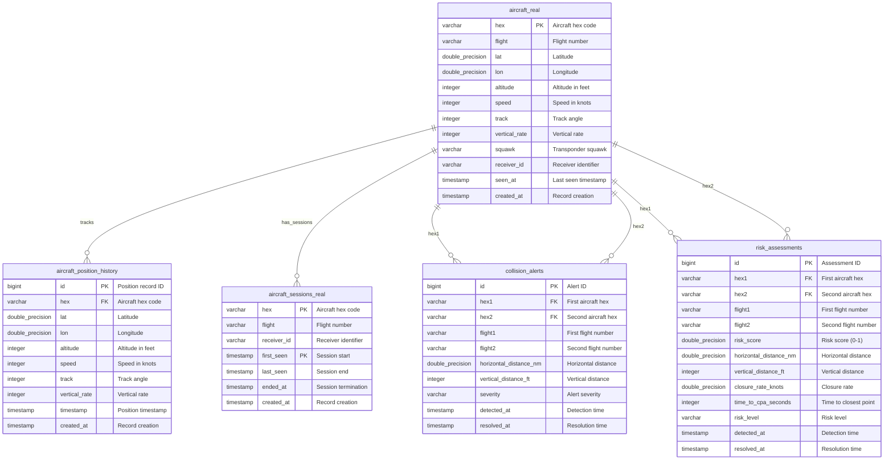

# Database Schema Documentation - db-1

**Database:** Airplane Tracking  
**Created:** 2026-02-09

## Schema Overview

The airplane tracking database consists of 5 main tables designed to store real-time and historical aircraft position data, flight sessions, collision alerts, and risk assessments.

## Entity-Relationship Diagram

## Tables

### aircraft_real
Stores current real-time aircraft positions from ADS-B receivers.

**Key Columns:**
- `hex` (VARCHAR(6), PK) - Aircraft hex code (ICAO 24-bit address)
- `flight` (VARCHAR(10)) - Flight number/callsign
- `lat`, `lon` (DOUBLE PRECISION) - Current position coordinates
- `altitude` (INTEGER) - Altitude in feet
- `speed` (INTEGER) - Ground speed in knots
- `track` (INTEGER) - Track angle in degrees
- `vertical_rate` (INTEGER) - Vertical rate in feet per minute
- `squawk` (VARCHAR(4)) - Transponder squawk code
- `receiver_id` (VARCHAR(255)) - ADS-B receiver identifier
- `seen_at` (TIMESTAMP) - Last update timestamp

### aircraft_position_history
Stores historical aircraft position data for tracking and analysis.

**Key Columns:**
- `id` (BIGINT, PK) - Position record ID
- `hex` (VARCHAR(6), FK) - Aircraft hex code
- `lat`, `lon` (DOUBLE PRECISION) - Position coordinates
- `altitude` (INTEGER) - Altitude in feet
- `speed` (INTEGER) - Ground speed
- `track` (INTEGER) - Track angle
- `vertical_rate` (INTEGER) - Vertical rate
- `timestamp` (TIMESTAMP) - Position timestamp

### aircraft_sessions_real
Tracks flight sessions for each aircraft.

**Key Columns:**
- `hex` (VARCHAR(6), PK) - Aircraft hex code
- `flight` (VARCHAR(10)) - Flight number
- `receiver_id` (VARCHAR(255)) - Receiver identifier
- `first_seen` (TIMESTAMP, PK) - Session start time
- `last_seen` (TIMESTAMP) - Last update time
- `ended_at` (TIMESTAMP) - Session end time

### collision_alerts
Stores collision alerts between aircraft pairs.

**Key Columns:**
- `id` (BIGINT, PK) - Alert ID
- `hex1`, `hex2` (VARCHAR(6), FK) - Aircraft hex codes
- `flight1`, `flight2` (VARCHAR(10)) - Flight numbers
- `horizontal_distance_nm` (DOUBLE PRECISION) - Horizontal separation
- `vertical_distance_ft` (INTEGER) - Vertical separation
- `severity` (VARCHAR(20)) - Alert severity level
- `detected_at` (TIMESTAMP) - Detection timestamp
- `resolved_at` (TIMESTAMP) - Resolution timestamp

### risk_assessments
Stores risk assessments for aircraft pairs.

**Key Columns:**
- `id` (BIGINT, PK) - Assessment ID
- `hex1`, `hex2` (VARCHAR(6), FK) - Aircraft hex codes
- `risk_score` (DOUBLE PRECISION) - Risk score (0-1)
- `horizontal_distance_nm` (DOUBLE PRECISION) - Horizontal separation
- `vertical_distance_ft` (INTEGER) - Vertical separation
- `closure_rate_knots` (DOUBLE PRECISION) - Closure rate
- `time_to_cpa_seconds` (INTEGER) - Time to closest point of approach
- `risk_level` (VARCHAR(20)) - Risk level classification
- `detected_at` (TIMESTAMP) - Detection timestamp
- `resolved_at` (TIMESTAMP) - Resolution timestamp

## Indexes

- `idx_aircraft_real_position` - Index on (lat, lon)
- `idx_aircraft_real_receiver` - Index on receiver_id
- `idx_aircraft_real_seen_at` - Index on seen_at
- `idx_history_hex_time` - Index on (hex, timestamp DESC)
- `idx_history_position` - Index on (lat, lon)
- `idx_collision_alerts_active` - Partial index on active alerts
- `idx_risk_assessments_score` - Index on risk_score DESC

## Relationships

- `aircraft_real` → `aircraft_position_history`: One-to-many (one aircraft has many position records)
- `aircraft_real` → `aircraft_sessions_real`: One-to-many (one aircraft has many sessions)
- `aircraft_real` → `collision_alerts`: One-to-many (aircraft can be in multiple alerts)
- `aircraft_real` → `risk_assessments`: One-to-many (aircraft can be in multiple assessments)

---
**Last Updated:** 2026-02-09
