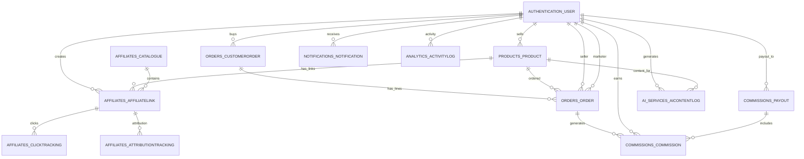

## LinkWay Database Schema Overview

This document describes the **logical schema** of the LinkWay production database as captured in the `linkway_live_2026-01-30.dump` export.

The physical database is PostgreSQL, with all application tables living under the `public` schema.

---

## Main Domains

- **Users & Roles**
  - Single `authentication_user` table with role field (`seller`, `marketer`, `buyer`, `admin`).

- **Products & Categories**
  - `products_productcategory` – category hierarchy.
  - `products_product` – products offered by sellers.

- **Affiliate Links & Catalogues**
  - `affiliates_affiliatelink` – unique referral links per marketer+product.
  - `affiliates_catalogue` – marketer-defined bundles of affiliate links (“package catalogues”).
  - `affiliates_catalogue_links` – join table between catalogues and affiliate links.
  - `affiliates_clicktracking` – click events on affiliate links.
  - `affiliates_attributiontracking` – cookie/session-based attribution for orders.
  - `affiliates_cookieconsent` – cookie consent records.

- **Orders & Checkout**
  - `orders_cart` / `orders_cartitem` – pre-checkout shopping carts for buyers.
  - `orders_customerorder` – top-level customer checkout (a single payment, multiple sellers).
  - `orders_order` – per-seller per-product order lines linked to a `CustomerOrder`.

- **Commissions & Payouts**
  - `commissions_commission` – marketer commissions per order line (earned, approved, paid).
  - `commissions_payout` – payout batches to marketers (bank transfer).
  - `commissions_payoutcommission` – join table between payouts and commissions.

- **Payments**
  - `payments_paymentlog` – raw Paystack webhook events / transaction logs.

- **AI Services**
  - `ai_services_aicontentlog` – AI-generated marketing content per product/user.
  - `ai_services_productrecommendation` – recommended products for marketers to promote.

- **Analytics & Fraud**
  - `analytics_activitylog` – generic activity log (actions, entities, metadata).
  - `analytics_frauddetectionlog` – fraud detection events linked to entities (e.g., orders).

- **Notifications**
  - `notifications_notification` – in-app notifications per user.

Standard Django / infra tables (auth, admin, migrations, Celery, sessions) also exist but are not the focus here.

---

## High-Level Relationships (ERD)

Text ERD (Mermaid syntax – paste into a Mermaid viewer to render):

> Note: Actual table names in the database are lower-cased with app prefixes, e.g. `authentication_user`, `products_product`, etc.

---

## Core Tables and Their Roles

Below is a concise description of each core table and how it fits into the system. Full column-level details are in `DATA_DICTIONARY.md`.

### 1. `authentication_user`

- Single user table for:
  - Sellers (list and fulfil products),
  - Marketers (promote products),
  - Buyers (purchase products),
  - Admins (operate the platform).
- Contains profile, KYC and bank details used for payouts.

### 2. `products_productcategory`

- Hierarchical product categories (`parent_id`).
- Used for browsing and tagging products; can be extended without schema changes.

### 3. `products_product`

- Defines each product sold on the platform:
  - Seller (owner),
  - Category,
  - Descriptions,
  - Pricing (retail, compare-at, cost),
  - Commission configuration (percentage vs fixed),
  - Inventory (`stock_quantity`),
  - Media (`images` JSON),
  - SEO fields and aggregate metrics.

### 4. `affiliates_affiliatelink`

- Core affiliate entity:
  - One marketer + one product = at most one active link.
  - Stores a short slug (`unique_slug`) and full public URL.
  - Tracks click counts, conversions, total revenue and total commission per link.

### 5. `affiliates_catalogue` & `affiliates_catalogue_links`

- `affiliates_catalogue`:
  - Marketer-curated “package catalogues” – named bundles of products they promote.
  - Used for shared catalogue URLs.

- `affiliates_catalogue_links`:
  - Many-to-many join between catalogues and affiliate links.

### 6. `affiliates_clicktracking`

- One row per click on an affiliate link:
  - IP, user agent, device, browser, OS.
  - Referrer, landing page, geo fields.
  - Session/cookie IDs for attribution and fraud detection.

### 7. `affiliates_attributiontracking`

- Tracks the relationship between:
  - A cookie/session,
  - The first and last-clicked affiliate links,
  - The eventual order (if any).
- Stores click chains for more advanced attribution models.

### 8. `orders_cart` & `orders_cartitem`

- `orders_cart`:
  - Active cart per buyer.
- `orders_cartitem`:
  - Individual items in a cart (product, quantity, unit price).

### 9. `orders_customerorder`

- One row per **checkout session**:
  - Buyer details and shipping address.
  - Subtotal, shipping, tax, total.
  - Paystack references and payment status.
- Links to multiple `orders_order` rows (each representing a seller+product line).

### 10. `orders_order`

- Per-seller, per-product line item:
  - References product, seller, and optional marketer (if attributed).
  - Stores quantities, pricing, and status (`pending`, `processing`, `shipped`, `delivered`, etc.).
  - Stores its own payment/Paystack refs and refund status.

### 11. `commissions_commission`

- Represents the marketer’s commission for a single order line:
  - Gross sale amount, commission rate, platform fee, net commission.
  - Status:
    - `earned` → inside hold period,
    - `approved` → eligible for withdrawal,
    - `paid` → included in a payout,
    - `reversed` → clawed back.
  - Links to `Payout` when included in a batch.

### 12. `commissions_payout` & `commissions_payoutcommission`

- `commissions_payout`:
  - One payout batch per marketer.
  - Tracks:
    - Total amount,
    - Number of commissions,
    - Bank details used,
    - Status (`pending`, `processing`, `completed`, `failed`, `cancelled`),
    - Paystack transfer reference.

- `commissions_payoutcommission`:
  - Join table between `Payout` and `Commission`.

### 13. `payments_paymentlog`

- Stores raw Paystack webhook and verification payloads:
  - Provider name,
  - Reference,
  - JSON payload.
- Useful for audit trails and debugging payment flows.

### 14. `ai_services_aicontentlog`

- Logs AI-generated marketing content:
  - Who requested it (user),
  - For which product,
  - Content type (caption, script, etc.),
  - Prompt, generated text and usage metrics.

### 15. `ai_services_productrecommendation`

- Records which products are recommended to which marketers:
  - Score, reason, match factors, and usage flags.

### 16. `analytics_activitylog`

- Generic activity log:
  - Action, entity type/id, user, metadata.
  - Forms the basis for behavioural analytics.

### 17. `analytics_frauddetectionlog`

- Fraud model outputs:
  - Entity type/id, fraud type, score, indicators.
  - Review status (false positive, reviewer and timestamps).

### 18. `notifications_notification`

- Simple per-user notifications:
  - Title, body, read flag, timestamps.

---

For detailed per-column information (types, semantics, constraints), see `DATA_DICTIONARY.md`.

