# Database Schema

This document outlines the tables and relationships within the Seydam AI database.

## Table Structure

### Schema: `auth`
| Table | Description |
| :--- | :--- |
| **[audit_log_entries](DATA_DICTIONARY.md#audit_log_entries)** | Application data table. |
| **[flow_state](DATA_DICTIONARY.md#flow_state)** | Application data table. |
| **[identities](DATA_DICTIONARY.md#identities)** | Application data table. |
| **[instances](DATA_DICTIONARY.md#instances)** | Application data table. |
| **[mfa_amr_claims](DATA_DICTIONARY.md#mfa_amr_claims)** | Application data table. |
| **[mfa_challenges](DATA_DICTIONARY.md#mfa_challenges)** | Application data table. |
| **[mfa_factors](DATA_DICTIONARY.md#mfa_factors)** | Application data table. |
| **[oauth_authorizations](DATA_DICTIONARY.md#oauth_authorizations)** | Application data table. |
| **[oauth_client_states](DATA_DICTIONARY.md#oauth_client_states)** | Application data table. |
| **[oauth_clients](DATA_DICTIONARY.md#oauth_clients)** | Application data table. |
| **[oauth_consents](DATA_DICTIONARY.md#oauth_consents)** | Application data table. |
| **[one_time_tokens](DATA_DICTIONARY.md#one_time_tokens)** | Application data table. |
| **[refresh_tokens](DATA_DICTIONARY.md#refresh_tokens)** | Application data table. |
| **[saml_providers](DATA_DICTIONARY.md#saml_providers)** | Application data table. |
| **[saml_relay_states](DATA_DICTIONARY.md#saml_relay_states)** | Application data table. |
| **[schema_migrations](DATA_DICTIONARY.md#schema_migrations)** | Application data table. |
| **[sessions](DATA_DICTIONARY.md#sessions)** | User login sessions. |
| **[sso_domains](DATA_DICTIONARY.md#sso_domains)** | Application data table. |
| **[sso_providers](DATA_DICTIONARY.md#sso_providers)** | Application data table. |
| **[users](DATA_DICTIONARY.md#users)** | Supabase managed user identities (linked to public.seydam_customuser). |

### Schema: `public`
| Table | Description |
| :--- | :--- |
| **[account_emailaddress](DATA_DICTIONARY.md#account_emailaddress)** | Application data table. |
| **[account_emailconfirmation](DATA_DICTIONARY.md#account_emailconfirmation)** | Application data table. |
| **[auth_group](DATA_DICTIONARY.md#auth_group)** | Application data table. |
| **[auth_group_permissions](DATA_DICTIONARY.md#auth_group_permissions)** | Application data table. |
| **[auth_permission](DATA_DICTIONARY.md#auth_permission)** | Application data table. |
| **[authtoken_token](DATA_DICTIONARY.md#authtoken_token)** | Application data table. |
| **[django_admin_log](DATA_DICTIONARY.md#django_admin_log)** | Application data table. |
| **[django_content_type](DATA_DICTIONARY.md#django_content_type)** | Application data table. |
| **[django_migrations](DATA_DICTIONARY.md#django_migrations)** | Application data table. |
| **[django_session](DATA_DICTIONARY.md#django_session)** | Application data table. |
| **[django_site](DATA_DICTIONARY.md#django_site)** | Application data table. |
| **[seydam_contactus](DATA_DICTIONARY.md#seydam_contactus)** | User contact form submissions. |
| **[seydam_customuser](DATA_DICTIONARY.md#seydam_customuser)** | Core user table, extending the default Django user model. |
| **[seydam_customuser_groups](DATA_DICTIONARY.md#seydam_customuser_groups)** | Application data table. |
| **[seydam_customuser_user_permissions](DATA_DICTIONARY.md#seydam_customuser_user_permissions)** | Application data table. |
| **[seydam_emailotp](DATA_DICTIONARY.md#seydam_emailotp)** | Application data table. |
| **[seydam_jsonreport](DATA_DICTIONARY.md#seydam_jsonreport)** | Stores the full JSON structure of generated reports. |
| **[seydam_outline](DATA_DICTIONARY.md#seydam_outline)** | Application data table. |
| **[seydam_payment](DATA_DICTIONARY.md#seydam_payment)** | Records user payments and credit purchases. |
| **[seydam_rawhtmlcode](DATA_DICTIONARY.md#seydam_rawhtmlcode)** | Stores the rendered HTML version of reports. |
| **[seydam_referencejobid](DATA_DICTIONARY.md#seydam_referencejobid)** | Application data table. |
| **[seydam_references](DATA_DICTIONARY.md#seydam_references)** | Stores citations and references used in report generation. |
| **[seydam_reportdirectory](DATA_DICTIONARY.md#seydam_reportdirectory)** | Application data table. |
| **[seydam_reportjobid](DATA_DICTIONARY.md#seydam_reportjobid)** | Tracks the status of background report generation jobs. |
| **[seydam_reports](DATA_DICTIONARY.md#seydam_reports)** | Stores metadata for AI-generated reports. |
| **[seydam_surveyresponse](DATA_DICTIONARY.md#seydam_surveyresponse)** | Application data table. |
| **[seydam_tokenusage](DATA_DICTIONARY.md#seydam_tokenusage)** | Log of LLM token consumption per user for billing/analytics. |
| **[seydam_uploadedimage](DATA_DICTIONARY.md#seydam_uploadedimage)** | Images uploaded by users for analysis or profile. |
| **[seydam_waitlist](DATA_DICTIONARY.md#seydam_waitlist)** | Email waitlist for pre-launch interest. |
| **[socialaccount_socialaccount](DATA_DICTIONARY.md#socialaccount_socialaccount)** | Linked social login accounts (cached from providers). |
| **[socialaccount_socialapp](DATA_DICTIONARY.md#socialaccount_socialapp)** | Application data table. |
| **[socialaccount_socialapp_sites](DATA_DICTIONARY.md#socialaccount_socialapp_sites)** | Application data table. |
| **[socialaccount_socialtoken](DATA_DICTIONARY.md#socialaccount_socialtoken)** | Application data table. |

### Schema: `realtime`
| Table | Description |
| :--- | :--- |
| **[messages](DATA_DICTIONARY.md#messages)** | Application data table. |
| **[schema_migrations](DATA_DICTIONARY.md#schema_migrations)** | Application data table. |
| **[subscription](DATA_DICTIONARY.md#subscription)** | Active realtime subscriptions for live updates. |

### Schema: `storage`
| Table | Description |
| :--- | :--- |
| **[buckets](DATA_DICTIONARY.md#buckets)** | Configuration for file storage buckets. |
| **[buckets_analytics](DATA_DICTIONARY.md#buckets_analytics)** | Application data table. |
| **[buckets_vectors](DATA_DICTIONARY.md#buckets_vectors)** | Application data table. |
| **[migrations](DATA_DICTIONARY.md#migrations)** | Application data table. |
| **[objects](DATA_DICTIONARY.md#objects)** | Metadata for files stored in buckets. |
| **[prefixes](DATA_DICTIONARY.md#prefixes)** | Application data table. |
| **[s3_multipart_uploads](DATA_DICTIONARY.md#s3_multipart_uploads)** | Application data table. |
| **[s3_multipart_uploads_parts](DATA_DICTIONARY.md#s3_multipart_uploads_parts)** | Application data table. |
| **[vector_indexes](DATA_DICTIONARY.md#vector_indexes)** | Application data table. |

## Entity Relationships (ERD)

The following diagram visualizes the connections between key tables.

```mermaid
erDiagram
    auth_audit_log_entries {
    }
    auth_flow_state {
    }
    auth_identities {
    }
    auth_identities }|--|| auth_users : "user_id"
    auth_instances {
    }
    auth_mfa_amr_claims {
    }
    auth_mfa_amr_claims }|--|| auth_sessions : "session_id"
    auth_mfa_challenges {
    }
    auth_mfa_challenges }|--|| auth_mfa_factors : "factor_id"
    auth_mfa_factors {
    }
    auth_mfa_factors }|--|| auth_users : "user_id"
    auth_oauth_authorizations {
    }
    auth_oauth_authorizations }|--|| auth_oauth_clients : "client_id"
    auth_oauth_authorizations }|--|| auth_users : "user_id"
    auth_oauth_client_states {
    }
    auth_oauth_clients {
    }
    auth_oauth_consents {
    }
    auth_oauth_consents }|--|| auth_oauth_clients : "client_id"
    auth_oauth_consents }|--|| auth_users : "user_id"
    auth_one_time_tokens {
    }
    auth_one_time_tokens }|--|| auth_users : "user_id"
    auth_refresh_tokens {
    }
    auth_refresh_tokens }|--|| auth_sessions : "session_id"
    auth_saml_providers {
    }
    auth_saml_providers }|--|| auth_sso_providers : "sso_provider_id"
    auth_saml_relay_states {
    }
    auth_saml_relay_states }|--|| auth_flow_state : "flow_state_id"
    auth_saml_relay_states }|--|| auth_sso_providers : "sso_provider_id"
    auth_schema_migrations {
    }
    auth_sessions {
    }
    auth_sessions }|--|| auth_oauth_clients : "oauth_client_id"
    auth_sessions }|--|| auth_users : "user_id"
    auth_sso_domains {
    }
    auth_sso_domains }|--|| auth_sso_providers : "sso_provider_id"
    auth_sso_providers {
    }
    auth_users {
    }
    public_account_emailaddress {
    }
    public_account_emailaddress }|--|| public_seydam_customuser : "user_id"
    public_account_emailconfirmation {
    }
    public_account_emailconfirmation }|--|| public_account_emailaddress : "email_address_id"
    public_auth_group {
    }
    public_auth_group_permissions {
    }
    public_auth_group_permissions }|--|| public_auth_permission : "permission_id"
    public_auth_group_permissions }|--|| public_auth_group : "group_id"
    public_auth_permission {
    }
    public_auth_permission }|--|| public_django_content_type : "content_type_id"
    public_authtoken_token {
    }
    public_authtoken_token }|--|| public_seydam_customuser : "user_id"
    public_django_admin_log {
    }
    public_django_admin_log }|--|| public_django_content_type : "content_type_id"
    public_django_admin_log }|--|| public_seydam_customuser : "user_id"
    public_django_content_type {
    }
    public_django_migrations {
    }
    public_django_session {
    }
    public_django_site {
    }
    public_seydam_contactus {
    }
    public_seydam_customuser {
    }
    public_seydam_customuser_groups {
    }
    public_seydam_customuser_groups }|--|| public_seydam_customuser : "customuser_id"
    public_seydam_customuser_groups }|--|| public_auth_group : "group_id"
    public_seydam_customuser_user_permissions {
    }
    public_seydam_customuser_user_permissions }|--|| public_seydam_customuser : "customuser_id"
    public_seydam_customuser_user_permissions }|--|| public_auth_permission : "permission_id"
    public_seydam_emailotp {
    }
    public_seydam_jsonreport {
    }
    public_seydam_jsonreport }|--|| public_seydam_reports : "report_id"
    public_seydam_jsonreport }|--|| public_seydam_customuser : "user_id"
    public_seydam_outline {
    }
    public_seydam_outline }|--|| public_seydam_reports : "report_id"
    public_seydam_outline }|--|| public_seydam_customuser : "user_id"
    public_seydam_payment {
    }
    public_seydam_payment }|--|| public_seydam_customuser : "user_id"
    public_seydam_rawhtmlcode {
    }
    public_seydam_rawhtmlcode }|--|| public_seydam_reports : "report_id"
    public_seydam_rawhtmlcode }|--|| public_seydam_customuser : "user_id"
    public_seydam_referencejobid {
    }
    public_seydam_referencejobid }|--|| public_seydam_reports : "report_id"
    public_seydam_referencejobid }|--|| public_seydam_customuser : "user_id"
    public_seydam_references {
    }
    public_seydam_references }|--|| public_seydam_reports : "report_id"
    public_seydam_references }|--|| public_seydam_customuser : "user_id"
    public_seydam_reportdirectory {
    }
    public_seydam_reportdirectory }|--|| public_seydam_reports : "project_id"
    public_seydam_reportdirectory }|--|| public_seydam_customuser : "user_id"
    public_seydam_reportjobid {
    }
    public_seydam_reportjobid }|--|| public_seydam_reports : "report_id"
    public_seydam_reportjobid }|--|| public_seydam_customuser : "user_id"
    public_seydam_reports {
    }
    public_seydam_reports }|--|| public_seydam_customuser : "user_id"
    public_seydam_surveyresponse {
    }
    public_seydam_surveyresponse }|--|| public_seydam_customuser : "user_id"
    public_seydam_tokenusage {
    }
    public_seydam_tokenusage }|--|| public_seydam_customuser : "user_id"
    public_seydam_uploadedimage {
    }
    public_seydam_uploadedimage }|--|| public_seydam_customuser : "user_id"
    public_seydam_waitlist {
    }
    public_socialaccount_socialaccount {
    }
    public_socialaccount_socialaccount }|--|| public_seydam_customuser : "user_id"
    public_socialaccount_socialapp {
    }
    public_socialaccount_socialapp_sites {
    }
    public_socialaccount_socialapp_sites }|--|| public_django_site : "site_id"
    public_socialaccount_socialapp_sites }|--|| public_socialaccount_socialapp : "socialapp_id"
    public_socialaccount_socialtoken {
    }
    public_socialaccount_socialtoken }|--|| public_socialaccount_socialaccount : "account_id"
    public_socialaccount_socialtoken }|--|| public_socialaccount_socialapp : "app_id"
    realtime_messages {
    }
    realtime_schema_migrations {
    }
    realtime_subscription {
    }
    storage_buckets {
    }
    storage_buckets_analytics {
    }
    storage_buckets_vectors {
    }
    storage_migrations {
    }
    storage_objects {
    }
    storage_prefixes {
    }
    storage_s3_multipart_uploads {
    }
    storage_s3_multipart_uploads }|--|| storage_buckets : "bucket_id"
    storage_s3_multipart_uploads_parts {
    }
    storage_s3_multipart_uploads_parts }|--|| storage_buckets : "bucket_id"
    storage_s3_multipart_uploads_parts }|--|| storage_s3_multipart_uploads : "upload_id"
    storage_vector_indexes {
    }
    storage_vector_indexes }|--|| storage_buckets_vectors : "bucket_id"
```

