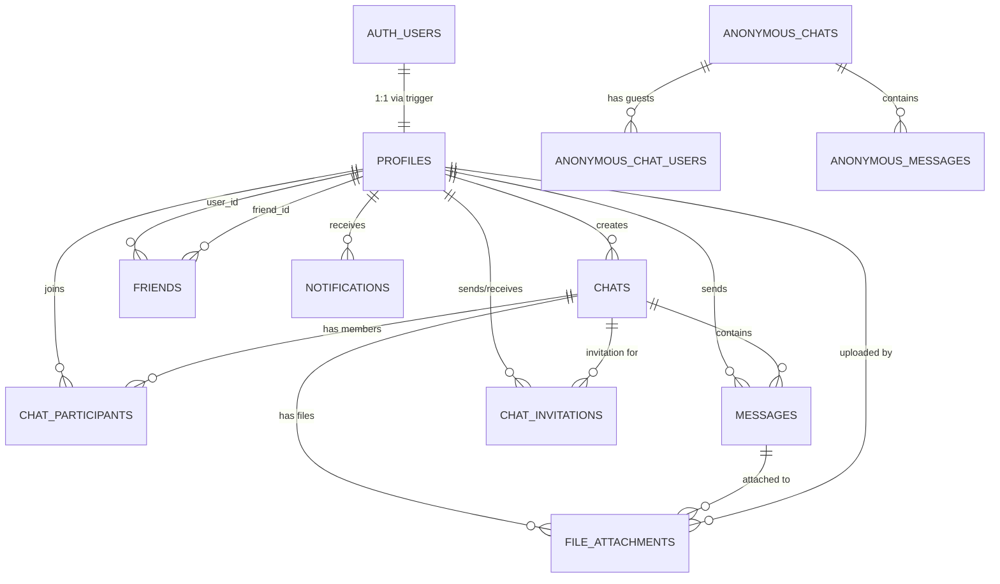

# SharedAI Database Schema Overview

This document describes the **logical schema** of the SharedAI production database as captured in the Supabase export.

The physical database is PostgreSQL 15.8, hosted on Supabase. All application tables live under the `public` schema.

---

## Main Domains

### Users & Profiles
- `profiles` — User accounts with username, display name, avatar, bio, and role.

### Authenticated Chats
- `chats` — Chat rooms created by authenticated users.
- `chat_participants` — Many-to-many relationship between users and chats.
- `messages` — Messages within chats (both user and AI-generated).
- `chat_invitations` — Invitations to join private chats.
- `chat_users` — Legacy/alternate chat membership table.

### Anonymous Chats
- `anonymous_chats` — Temporary chat sessions with join codes.
- `anonymous_chat_users` — Guest participants in anonymous chats.
- `anonymous_messages` — Messages within anonymous chats.

### Social Features
- `friends` — Friend relationships (pending, accepted, declined).
- `notifications` — In-app notifications (mentions, friend requests, chat invites).

### Attachments
- `file_attachments` — Files uploaded to chats.

---

## Data Flow

```
┌─────────────────────────────────────────────────────────────────────────┐
│                           USER AUTHENTICATION                            │
│                    (Supabase Auth / auth.users)                         │
└─────────────────────────────────────┬───────────────────────────────────┘
                                      │
                                      │ Trigger: handle_new_user()
                                      ▼
┌─────────────────────────────────────────────────────────────────────────┐
│                              profiles                                    │
│         (username, display_name, avatar_url, email, bio, role)          │
└─────────────────────────────────────┬───────────────────────────────────┘
                                      │
          ┌───────────────────────────┼───────────────────────────┐
          │                           │                           │
          ▼                           ▼                           ▼
┌─────────────────┐       ┌─────────────────────┐       ┌─────────────────┐
│     chats       │       │      friends        │       │  notifications  │
│  (title, AI)    │       │ (user_id, friend_id)│       │ (type, message) │
└────────┬────────┘       └─────────────────────┘       └─────────────────┘
         │
         │
         ▼
┌─────────────────────────────────────────────────────────────────────────┐
│                         chat_participants                                │
│                      (chat_id, user_id, joined_at)                      │
└─────────────────────────────────────┬───────────────────────────────────┘
                                      │
                                      ▼
┌─────────────────────────────────────────────────────────────────────────┐
│                             messages                                     │
│    (chat_id, sender_id, content, is_ai, ai_character_id, mentions)      │
└─────────────────────────────────────────────────────────────────────────┘


                    ═══════════════════════════════════
                           ANONYMOUS CHAT FLOW
                    ═══════════════════════════════════

┌─────────────────────────────────────────────────────────────────────────┐
│                         anonymous_chats                                  │
│                    (join_code, created_at)                              │
└─────────────────────────────────────┬───────────────────────────────────┘
                                      │
          ┌───────────────────────────┴───────────────────────────┐
          │                                                       │
          ▼                                                       ▼
┌─────────────────────┐                               ┌─────────────────────┐
│ anonymous_chat_users│                               │  anonymous_messages │
│ (display_name,      │                               │  (sender_display,   │
│  guest_id)          │                               │   content, is_ai)   │
└─────────────────────┘                               └─────────────────────┘
```

---

## High-Level Relationships (ERD)



---

## Table Relationships

### Primary Join Keys

```
profiles.id ──────────────┬──── chats.created_by
    (user identity)       │
                          ├──── chat_participants.user_id
                          │
                          ├──── messages.sender_id
                          │
                          ├──── friends.user_id / friend_id
                          │
                          ├──── notifications.user_id
                          │
                          ├──── chat_invitations.inviting_user_id
                          │
                          └──── chat_invitations.invited_user_id


chats.id ─────────────────┬──── chat_participants.chat_id
    (chat identity)       │
                          ├──── messages.chat_id
                          │
                          ├──── chat_invitations.chat_id
                          │
                          └──── file_attachments.chat_id


anonymous_chats.id ───────┬──── anonymous_chat_users.chat_id
    (anon chat identity)  │
                          └──── anonymous_messages.chat_id
```

---

## Core Tables and Their Roles

### 1. `profiles`
- User accounts synced from Supabase Auth via trigger.
- Contains profile info (username, display_name, avatar, bio).
- Supports OAuth (Google) and email/password signup.
- Includes `prompt_username_setup` flag for OAuth users to set username.

### 2. `chats`
- Chat rooms with optional AI character assignment.
- Each chat has a creator (`created_by`) who can manage the room.
- Supports various AI tutors: `math-ai`, `science-ai`, `language-ai`, `physics-professor`, `microsoft-senior-engineer`, etc.

### 3. `chat_participants`
- Many-to-many join between `profiles` and `chats`.
- Tracks when each user joined (`joined_at`).
- Primary key: `(chat_id, user_id)`.

### 4. `messages`
- All chat messages, both human and AI-generated.
- `is_ai` flag indicates AI-generated messages.
- `ai_character_id` identifies which AI tutor responded.
- Supports `@mentions` via `mentions_data` JSONB field.
- Triggers create notifications for mentioned users.

### 5. `chat_invitations`
- Invitations to join private chats.
- Status flow: `pending` → `accepted` / `rejected` / `expired`.
- Expires after 7 days by default.

### 6. `friends`
- Bi-directional friend relationships.
- Status flow: `pending` → `accepted` / `declined`.
- Unique constraint on `(user_id, friend_id)`.

### 7. `notifications`
- In-app notifications for users.
- Types: `friend_request`, `mention`, `chat_invite`.
- Supports `read` flag and `seen_at` timestamp.

### 8. `file_attachments`
- Files uploaded to chats.
- Stores file metadata (name, size, type, path).
- Links to chat, message, and uploading user.

### 9. `anonymous_chats`
- Temporary chat sessions with 6-character join codes.
- Created via `create_anonymous_chat()` function.
- No authentication required to participate.

### 10. `anonymous_chat_users`
- Guest participants in anonymous chats.
- Identified by `guest_id` (client-generated UUID) and `display_name`.

### 11. `anonymous_messages`
- Messages in anonymous chats.
- Identified by `sender_display_name` instead of user ID.
- Supports AI responses via `is_ai` and `ai_character_id`.

---

## Key Functions

| Function | Purpose |
|----------|---------|
| `handle_new_user()` | Trigger that creates a profile when a user signs up |
| `accept_chat_invitation(uuid)` | Accepts an invitation and adds user to chat |
| `leave_chat(uuid)` | Removes user from chat, transfers ownership if needed |
| `create_anonymous_chat()` | Creates new anonymous chat with unique join code |
| `is_user_in_chat(uuid)` | Checks if current user is a chat participant |
| `is_chat_participant(uuid, uuid)` | Checks if a specific user is in a specific chat |
| `handle_new_mention()` | Trigger that creates notifications for @mentions |
| `update_chat_timestamp()` | Updates chat's `updated_at` when new message arrives |

---

## Row Level Security (RLS)

All tables have RLS enabled with policies that ensure:

- Users can only view/modify their own profiles
- Users can only see chats they participate in
- Users can only send messages to chats they're in
- Chat creators can manage participants and delete chats
- Notifications are private to each user
- Anonymous chats/messages are publicly accessible

---

## Real-Time Subscriptions

The following tables are added to Supabase Realtime publication:

- `chats`
- `messages`
- `chat_participants`
- `chat_invitations`
- `friends`
- `notifications`
- `anonymous_chats`
- `anonymous_messages`
- `profiles`
- `file_attachments`

This enables real-time updates in the client application via Supabase's WebSocket API.

---

For detailed per-column information (types, constraints, descriptions), see `DATA_DICTIONARY.md`.
