# Database Schema Documentation - db-8

**Database:** Job Market Intelligence Database  
**Purpose:** Job market intelligence and targeted application system integrating data from USAJobs.gov, BLS, Department of Labor, and state employment boards

## Schema Overview

The Job Market Intelligence Database consists of 12 main tables designed to store job postings, user profiles, companies, skills, applications, recommendations, and market analytics. The database integrates federal job data from USAJobs.gov with private sector jobs and provides AI-powered job matching capabilities similar to jobright.ai.

## Entity-Relationship Diagram

```mermaid
erDiagram
    user_profiles {
        varchar user_id PK "Primary key"
        varchar email UK "Unique email"
        varchar full_name "Full name"
        varchar location_city "City"
        varchar location_state "State (2-letter)"
        varchar location_country "Country code"
        numeric location_latitude "Latitude"
        numeric location_longitude "Longitude"
        varchar current_job_title "Current job title"
        varchar current_company "Current company"
        integer years_experience "Years of experience"
        varchar education_level "Education level"
        varchar resume_text "Resume text"
        varchar preferred_work_model "Work model preference"
        integer salary_expectation_min "Min salary expectation"
        integer salary_expectation_max "Max salary expectation"
        timestamp created_at "Profile creation"
        boolean is_active "Active status"
    }

    companies {
        varchar company_id PK "Primary key"
        varchar company_name UK "Company name"
        varchar company_name_normalized "Normalized name"
        varchar industry "Industry"
        varchar company_size "Company size"
        varchar headquarters_city "HQ city"
        varchar headquarters_state "HQ state"
        boolean is_federal_agency "Federal agency flag"
        varchar agency_code "Agency code (federal)"
        varchar data_source "Data source"
        numeric company_rating "Company rating"
        integer total_reviews "Total reviews"
    }

    job_postings {
        varchar job_id PK "Primary key"
        varchar company_id FK "Company reference"
        varchar job_title "Job title"
        varchar job_title_normalized "Normalized title"
        varchar job_description "Job description"
        varchar job_type "Job type"
        varchar work_model "Work model"
        varchar location_city "City"
        varchar location_state "State"
        integer salary_min "Min salary"
        integer salary_max "Max salary"
        timestamp posted_date "Posted date"
        boolean is_federal_job "Federal job flag"
        varchar usajobs_id "USAJobs.gov ID"
        varchar agency_name "Agency name (federal)"
        varchar data_source "Data source"
        integer view_count "View count"
        integer application_count "Application count"
    }

    skills {
        varchar skill_id PK "Primary key"
        varchar skill_name UK "Skill name"
        varchar skill_category "Skill category"
        varchar skill_type "Skill type"
        varchar parent_skill_id FK "Parent skill (hierarchy)"
        numeric popularity_score "Popularity score"
    }

    job_skills_requirements {
        varchar requirement_id PK "Primary key"
        varchar job_id FK "Job reference"
        varchar skill_id FK "Skill reference"
        varchar requirement_type "Requirement type"
        numeric importance_score "Importance score"
        numeric years_experience_required "Years required"
    }

    user_skills {
        varchar user_skill_id PK "Primary key"
        varchar user_id FK "User reference"
        varchar skill_id FK "Skill reference"
        varchar proficiency_level "Proficiency level"
        numeric proficiency_score "Proficiency score"
        numeric years_experience "Years experience"
        boolean verified "Verified flag"
    }

    job_applications {
        varchar application_id PK "Primary key"
        varchar user_id FK "User reference"
        varchar job_id FK "Job reference"
        varchar application_status "Application status"
        timestamp application_date "Application date"
        timestamp submitted_at "Submission time"
        varchar cover_letter_text "Cover letter"
        numeric match_score "Match score"
        varchar application_method "Application method"
    }

    job_recommendations {
        varchar recommendation_id PK "Primary key"
        varchar user_id FK "User reference"
        varchar job_id FK "Job reference"
        numeric match_score "Overall match score"
        numeric skill_match_score "Skill match score"
        numeric location_match_score "Location match"
        numeric salary_match_score "Salary match"
        numeric experience_match_score "Experience match"
        numeric work_model_match_score "Work model match"
        varchar recommendation_reason "Recommendation reason"
        integer recommendation_rank "Recommendation rank"
        boolean is_liked "Liked flag"
        boolean is_applied "Applied flag"
        timestamp recommendation_date "Recommendation date"
    }

    market_trends {
        varchar trend_id PK "Primary key"
        date trend_date "Trend date"
        varchar geographic_scope "Geographic scope"
        varchar location_state "State"
        varchar location_city "City"
        varchar industry "Industry"
        varchar job_category "Job category"
        integer total_job_postings "Total postings"
        integer new_job_postings "New postings"
        integer active_job_seekers "Active seekers"
        integer average_salary_min "Avg min salary"
        integer average_salary_max "Avg max salary"
        integer median_salary "Median salary"
        varchar top_skills "Top skills (JSON)"
        numeric competition_index "Competition index"
        numeric growth_rate "Growth rate"
        varchar data_source "Data source"
    }

    job_market_analytics {
        varchar analytics_id PK "Primary key"
        date analysis_date "Analysis date"
        varchar analysis_type "Analysis type"
        varchar geographic_scope "Geographic scope"
        varchar location_state "State"
        varchar location_city "City"
        varchar industry "Industry"
        integer total_companies "Total companies"
        integer total_active_jobs "Active jobs"
        numeric remote_job_percentage "Remote job %"
        numeric hybrid_job_percentage "Hybrid job %"
        integer average_time_to_fill_days "Time to fill"
        numeric average_applications_per_job "Avg applications"
        varchar top_employers "Top employers (JSON)"
        varchar emerging_skills "Emerging skills (JSON)"
        varchar salary_trends "Salary trends (JSON)"
    }

    data_source_metadata {
        varchar metadata_id PK "Primary key"
        varchar source_name "Source name"
        varchar source_type "Source type"
        timestamp extraction_date "Extraction date"
        varchar extraction_method "Extraction method"
        integer records_extracted "Records extracted"
        integer records_new "New records"
        integer records_updated "Updated records"
        varchar extraction_status "Extraction status"
        varchar api_endpoint "API endpoint"
        integer api_response_code "API response code"
    }

    user_job_search_history {
        varchar search_id PK "Primary key"
        varchar user_id FK "User reference"
        varchar search_query "Search query"
        varchar search_filters "Search filters (JSON)"
        varchar location_filter "Location filter"
        integer salary_filter_min "Min salary filter"
        integer salary_filter_max "Max salary filter"
        varchar work_model_filter "Work model filter"
        integer results_count "Results count"
        timestamp search_date "Search date"
    }

    user_profiles ||--o{ user_skills : "has"
    user_profiles ||--o{ job_applications : "submits"
    user_profiles ||--o{ job_recommendations : "receives"
    user_profiles ||--o{ user_job_search_history : "performs"

    companies ||--o{ job_postings : "posts"

    job_postings ||--o{ job_skills_requirements : "requires"
    job_postings ||--o{ job_applications : "receives"
    job_postings ||--o{ job_recommendations : "recommended_in"

    skills ||--o{ job_skills_requirements : "required_for"
    skills ||--o{ user_skills : "possessed_by"
    skills ||--o{ skills : "parent_of"
```

## Tables

### user_profiles
Stores user profiles for job matching and application tracking.

**Key Columns:**
- `user_id` (VARCHAR, PK) - Unique user identifier
- `email` (VARCHAR, UNIQUE) - User email address
- `full_name` (VARCHAR) - User's full name
- `location_city`, `location_state`, `location_country` (VARCHAR) - User location
- `location_latitude`, `location_longitude` (NUMERIC) - Geographic coordinates
- `current_job_title`, `current_company` (VARCHAR) - Current employment
- `years_experience` (INTEGER) - Years of professional experience
- `education_level` (VARCHAR) - Highest education level
- `resume_text` (VARCHAR) - Resume content
- `preferred_work_model` (VARCHAR) - 'remote', 'hybrid', 'onsite'
- `salary_expectation_min`, `salary_expectation_max` (INTEGER) - Salary range
- `preferred_locations` (VARCHAR) - JSON array of preferred locations
- `profile_completeness_score` (NUMERIC) - Profile completeness percentage
- `is_active` (BOOLEAN) - Active profile flag

**Business Context:** User profiles enable personalized job matching and recommendation algorithms. The profile completeness score helps prioritize users for better recommendations.

### companies
Stores employer/company information from job postings.

**Key Columns:**
- `company_id` (VARCHAR, PK) - Unique company identifier
- `company_name` (VARCHAR, UNIQUE) - Company name
- `company_name_normalized` (VARCHAR) - Normalized name for matching
- `industry` (VARCHAR) - Industry sector
- `company_size` (VARCHAR) - 'startup', 'small', 'medium', 'large', 'enterprise'
- `headquarters_city`, `headquarters_state`, `headquarters_country` (VARCHAR) - HQ location
- `website_url`, `linkedin_url` (VARCHAR) - Company URLs
- `description` (VARCHAR) - Company description
- `founded_year` (INTEGER) - Year founded
- `employee_count` (INTEGER) - Number of employees
- `revenue_range` (VARCHAR) - Revenue range
- `is_federal_agency` (BOOLEAN) - Federal agency flag
- `agency_code` (VARCHAR) - Agency code for federal agencies (e.g., 'DOD', 'FBI')
- `data_source` (VARCHAR) - 'usajobs', 'bls', 'state_board', 'aggregated'
- `company_rating` (NUMERIC) - Average company rating
- `total_reviews` (INTEGER) - Total review count

**Business Context:** Companies table supports both federal agencies (from USAJobs.gov) and private sector employers. The normalized name field enables matching companies across different data sources.

### job_postings
Stores job listings from various .gov sources and aggregated sources.

**Key Columns:**
- `job_id` (VARCHAR, PK) - Unique job identifier
- `company_id` (VARCHAR, FK) - Company reference
- `job_title` (VARCHAR) - Job title
- `job_title_normalized` (VARCHAR) - Normalized title for matching
- `job_description` (VARCHAR) - Full job description (may contain HTML)
- `job_type` (VARCHAR) - 'full_time', 'part_time', 'contract', 'temporary', 'internship'
- `work_model` (VARCHAR) - 'remote', 'hybrid', 'onsite'
- `location_city`, `location_state`, `location_country` (VARCHAR) - Job location
- `location_latitude`, `location_longitude` (NUMERIC) - Geographic coordinates
- `salary_min`, `salary_max` (INTEGER) - Salary range
- `salary_currency` (VARCHAR) - Currency code (default 'USD')
- `salary_type` (VARCHAR) - 'annual', 'hourly', 'monthly'
- `posted_date` (TIMESTAMP_NTZ) - Job posting date
- `expiration_date` (TIMESTAMP_NTZ) - Job expiration date
- `application_url` (VARCHAR) - Application URL
- `application_method` (VARCHAR) - 'url', 'email', 'ats', 'usajobs'
- `is_active` (BOOLEAN) - Active job flag
- `is_federal_job` (BOOLEAN) - Federal job flag
- `usajobs_id` (VARCHAR) - USAJobs.gov job ID (for federal jobs)
- `agency_name` (VARCHAR) - Agency name (for federal jobs)
- `pay_plan` (VARCHAR) - Pay plan for federal jobs (e.g., 'GS', 'GG')
- `grade_level` (VARCHAR) - Grade level for federal jobs (e.g., 'GS-13')
- `data_source` (VARCHAR) - 'usajobs', 'bls', 'state_board', 'aggregated'
- `source_url` (VARCHAR) - Source URL
- `view_count` (INTEGER) - Number of views
- `application_count` (INTEGER) - Number of applications
- `match_score_avg` (NUMERIC) - Average match score from recommendations

**Business Context:** Job postings integrate federal jobs from USAJobs.gov with private sector jobs. Federal jobs include specific metadata (agency, pay plan, grade level) required for USAJobs.gov applications.

### skills
Master list of skills/technologies/competencies.

**Key Columns:**
- `skill_id` (VARCHAR, PK) - Unique skill identifier
- `skill_name` (VARCHAR, UNIQUE) - Skill name
- `skill_category` (VARCHAR) - 'programming', 'framework', 'tool', 'soft_skill', 'certification'
- `skill_type` (VARCHAR) - 'technical', 'soft', 'certification', 'language'
- `parent_skill_id` (VARCHAR, FK) - Parent skill for hierarchies (self-referential)
- `description` (VARCHAR) - Skill description
- `popularity_score` (NUMERIC) - Popularity based on job posting frequency

**Business Context:** Skills table supports hierarchical skill relationships (e.g., React is a child of JavaScript). Popularity scores help identify trending skills in the job market.

### job_skills_requirements
Links job postings to required/desired skills.

**Key Columns:**
- `requirement_id` (VARCHAR, PK) - Unique requirement identifier
- `job_id` (VARCHAR, FK) - Job reference
- `skill_id` (VARCHAR, FK) - Skill reference
- `requirement_type` (VARCHAR) - 'required', 'preferred', 'nice_to_have'
- `importance_score` (NUMERIC) - 1-10 importance score
- `years_experience_required` (NUMERIC) - Years of experience required
- `extracted_from_description` (BOOLEAN) - Whether skill was extracted from job description

**Business Context:** Job skills requirements enable skill-based matching algorithms. The importance score and requirement type help prioritize skills in match calculations.

### user_skills
Links user profiles to their skills and proficiency levels.

**Key Columns:**
- `user_skill_id` (VARCHAR, PK) - Unique user skill identifier
- `user_id` (VARCHAR, FK) - User reference
- `skill_id` (VARCHAR, FK) - Skill reference
- `proficiency_level` (VARCHAR) - 'beginner', 'intermediate', 'advanced', 'expert'
- `proficiency_score` (NUMERIC) - 1-10 proficiency score
- `years_experience` (NUMERIC) - Years of experience with skill
- `last_used_date` (DATE) - Last date skill was used
- `verified` (BOOLEAN) - Skills verified through assessments/certifications

**Business Context:** User skills enable skill-based job matching. Verified skills (through assessments or certifications) carry more weight in match calculations.

### job_applications
Tracks user applications to job postings.

**Key Columns:**
- `application_id` (VARCHAR, PK) - Unique application identifier
- `user_id` (VARCHAR, FK) - User reference
- `job_id` (VARCHAR, FK) - Job reference
- `application_status` (VARCHAR) - 'draft', 'submitted', 'under_review', 'interview', 'offer', 'rejected', 'withdrawn'
- `application_date` (TIMESTAMP_NTZ) - Application date
- `submitted_at` (TIMESTAMP_NTZ) - Submission timestamp
- `status_updated_at` (TIMESTAMP_NTZ) - Last status update
- `cover_letter_text` (VARCHAR) - Cover letter content
- `resume_version` (VARCHAR) - Resume version used
- `match_score` (NUMERIC) - Calculated match score at time of application
- `application_method` (VARCHAR) - 'direct', 'ats', 'email', 'usajobs'
- `application_reference_id` (VARCHAR) - External application ID
- `notes` (VARCHAR) - Application notes

**Business Context:** Job applications track the application lifecycle and enable analytics on application success rates and match score accuracy.

### job_recommendations
Stores AI-generated job recommendations for users (mirroring jobright.ai).

**Key Columns:**
- `recommendation_id` (VARCHAR, PK) - Unique recommendation identifier
- `user_id` (VARCHAR, FK) - User reference
- `job_id` (VARCHAR, FK) - Job reference
- `match_score` (NUMERIC) - Overall match score (0-100)
- `skill_match_score` (NUMERIC) - Skill alignment score
- `location_match_score` (NUMERIC) - Location preference match
- `salary_match_score` (NUMERIC) - Salary expectation match
- `experience_match_score` (NUMERIC) - Experience level match
- `work_model_match_score` (NUMERIC) - Work model preference match
- `recommendation_reason` (VARCHAR) - Explanation for recommendation
- `recommendation_rank` (INTEGER) - Rank within user's recommendations
- `is_liked` (BOOLEAN) - User liked this recommendation
- `is_applied` (BOOLEAN) - User applied to this job
- `is_dismissed` (BOOLEAN) - User dismissed this recommendation
- `recommendation_date` (TIMESTAMP_NTZ) - Recommendation date
- `expires_at` (TIMESTAMP_NTZ) - Recommendation expiration

**Business Context:** Job recommendations provide personalized job suggestions using multi-dimensional scoring (skills, location, salary, experience, work model). User feedback (liked, applied, dismissed) improves recommendation algorithms.

### market_trends
Aggregated job market trends and statistics.

**Key Columns:**
- `trend_id` (VARCHAR, PK) - Unique trend identifier
- `trend_date` (DATE) - Trend date
- `geographic_scope` (VARCHAR) - 'national', 'state', 'city', 'metro'
- `location_state` (VARCHAR) - State code
- `location_city` (VARCHAR) - City name
- `location_metro` (VARCHAR) - Metropolitan area
- `industry` (VARCHAR) - Industry sector
- `job_category` (VARCHAR) - Job category
- `total_job_postings` (INTEGER) - Total job postings
- `new_job_postings` (INTEGER) - New postings in period
- `active_job_seekers` (INTEGER) - Estimated active job seekers
- `average_salary_min`, `average_salary_max` (INTEGER) - Average salary range
- `median_salary` (INTEGER) - Median salary
- `top_skills` (VARCHAR) - JSON array of top skills
- `skill_demand_trend` (VARCHAR) - JSON object of skill demand changes
- `competition_index` (NUMERIC) - Applications per job ratio
- `growth_rate` (NUMERIC) - Percentage growth in postings
- `data_source` (VARCHAR) - 'bls', 'aggregated', 'usajobs'

**Business Context:** Market trends provide insights into job market dynamics, skill demand, and competition levels. Data sourced from BLS, USAJobs.gov, and aggregated sources.

### job_market_analytics
Detailed analytics for job market intelligence.

**Key Columns:**
- `analytics_id` (VARCHAR, PK) - Unique analytics identifier
- `analysis_date` (DATE) - Analysis date
- `analysis_type` (VARCHAR) - 'daily', 'weekly', 'monthly', 'quarterly'
- `geographic_scope` (VARCHAR) - Geographic scope
- `location_state` (VARCHAR) - State code
- `location_city` (VARCHAR) - City name
- `industry` (VARCHAR) - Industry sector
- `total_companies` (INTEGER) - Total companies
- `total_active_jobs` (INTEGER) - Total active jobs
- `remote_job_percentage` (NUMERIC) - Percentage of remote jobs
- `hybrid_job_percentage` (NUMERIC) - Percentage of hybrid jobs
- `average_time_to_fill_days` (INTEGER) - Average time to fill positions
- `average_applications_per_job` (NUMERIC) - Average applications per job
- `top_employers` (VARCHAR) - JSON array of top employers
- `emerging_skills` (VARCHAR) - JSON array of trending skills
- `declining_skills` (VARCHAR) - JSON array of declining skills
- `salary_trends` (VARCHAR) - JSON object with salary trend data
- `job_type_distribution` (VARCHAR) - JSON object with job type distribution
- `work_model_distribution` (VARCHAR) - JSON object with work model distribution

**Business Context:** Job market analytics provide comprehensive insights into job market dynamics, trends, and patterns. Used for market intelligence and strategic planning.

### data_source_metadata
Tracks data sources and extraction metadata.

**Key Columns:**
- `metadata_id` (VARCHAR, PK) - Unique metadata identifier
- `source_name` (VARCHAR) - 'usajobs', 'bls', 'state_board'
- `source_type` (VARCHAR) - 'api', 'scraper', 'manual', 'aggregated'
- `extraction_date` (TIMESTAMP_NTZ) - Extraction date
- `extraction_method` (VARCHAR) - Extraction method description
- `records_extracted` (INTEGER) - Total records extracted
- `records_new` (INTEGER) - New records
- `records_updated` (INTEGER) - Updated records
- `records_failed` (INTEGER) - Failed records
- `extraction_status` (VARCHAR) - 'success', 'partial', 'failed'
- `error_message` (VARCHAR) - Error message if failed
- `api_endpoint` (VARCHAR) - API endpoint used
- `api_response_code` (INTEGER) - API response code
- `extraction_duration_seconds` (INTEGER) - Extraction duration

**Business Context:** Data source metadata tracks ETL/ELT pipeline execution, enabling monitoring, debugging, and data lineage tracking.

### user_job_search_history
Tracks user search behavior for recommendation improvement.

**Key Columns:**
- `search_id` (VARCHAR, PK) - Unique search identifier
- `user_id` (VARCHAR, FK) - User reference
- `search_query` (VARCHAR) - Search query text
- `search_filters` (VARCHAR) - JSON object of filters applied
- `location_filter` (VARCHAR) - Location filter
- `salary_filter_min`, `salary_filter_max` (INTEGER) - Salary range filter
- `work_model_filter` (VARCHAR) - Work model filter
- `job_type_filter` (VARCHAR) - Job type filter
- `industry_filter` (VARCHAR) - Industry filter
- `results_count` (INTEGER) - Number of results returned
- `search_date` (TIMESTAMP_NTZ) - Search timestamp

**Business Context:** User search history enables recommendation algorithm improvement by understanding user preferences and search patterns.

## Foreign Key Relationships

1. **job_postings.company_id** → **companies.company_id**
2. **job_skills_requirements.job_id** → **job_postings.job_id**
3. **job_skills_requirements.skill_id** → **skills.skill_id**
4. **user_skills.user_id** → **user_profiles.user_id**
5. **user_skills.skill_id** → **skills.skill_id**
6. **job_applications.user_id** → **user_profiles.user_id**
7. **job_applications.job_id** → **job_postings.job_id**
8. **job_recommendations.user_id** → **user_profiles.user_id**
9. **job_recommendations.job_id** → **job_postings.job_id**
10. **user_job_search_history.user_id** → **user_profiles.user_id**
11. **skills.parent_skill_id** → **skills.skill_id** (self-referential)

## Indexes

The database includes indexes on:
- Foreign key columns for join performance
- Location columns (state, city) for geographic queries
- Date columns (posted_date, trend_date) for time-based queries
- Status columns (is_active, application_status) for filtering
- Match score columns for recommendation ranking
- Normalized name columns for text matching

## Data Sources

The database integrates data from:
- **USAJobs.gov API**: Federal job postings (last 2 weeks)
- **BLS Public Data API**: Labor statistics and employment data
- **Department of Labor Open Data Portal**: Job market trends via Data.gov
- **State Employment Boards**: Regional job market data
- **Aggregated Sources**: Private sector job postings

## Business Context

This database powers a job market intelligence platform that:
- Matches users to jobs using multi-dimensional scoring (skills, location, salary, experience, work model)
- Provides AI-powered job recommendations similar to jobright.ai
- Tracks federal jobs from USAJobs.gov alongside private sector opportunities
- Analyzes market trends and provides intelligence on job market dynamics
- Supports targeted job applications with match score tracking

---
**Last Updated:** 2026-02-04
